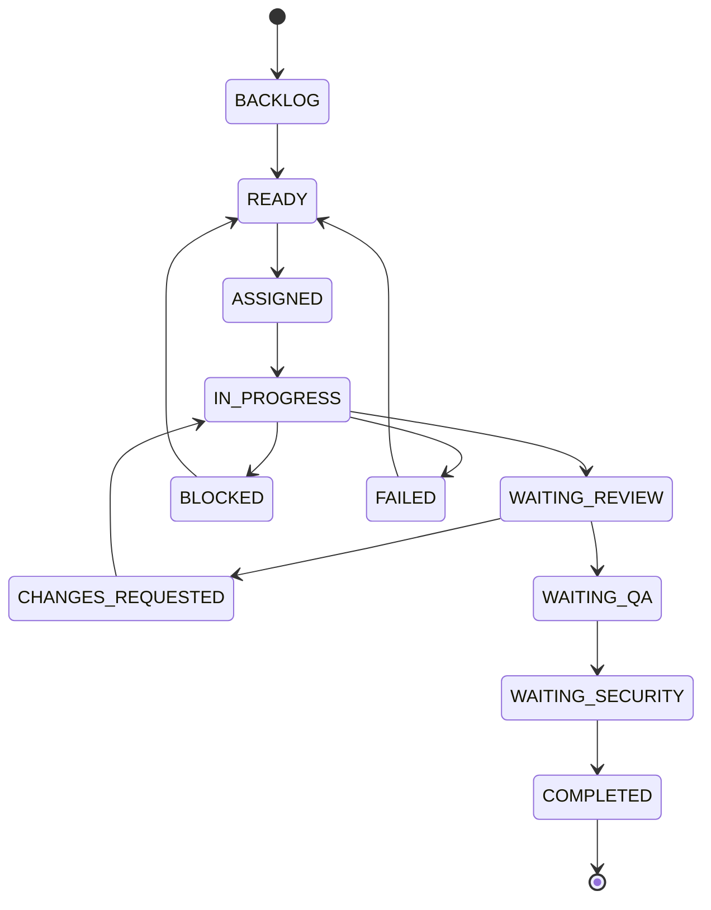
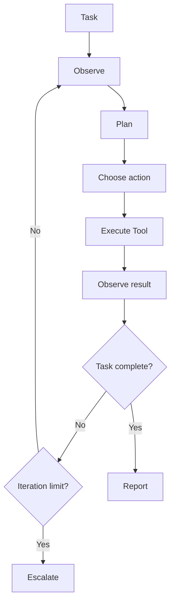
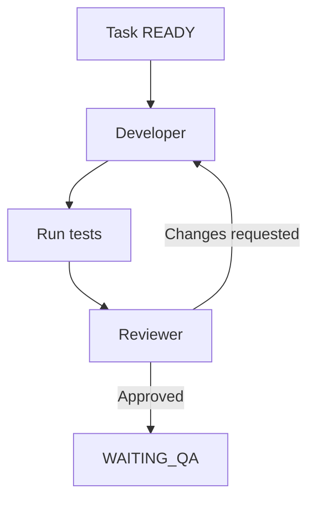
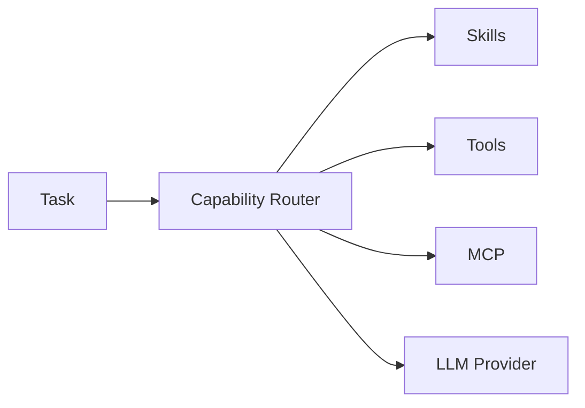
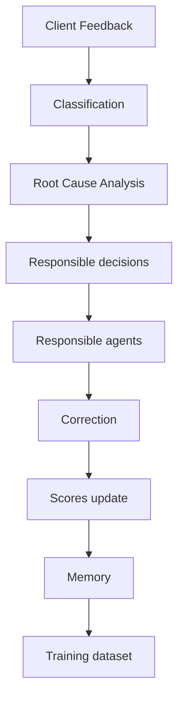
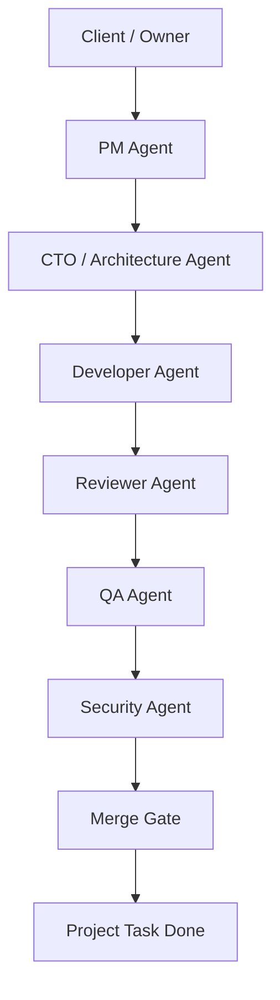

# SynapseOS — Roadmap de développement par étapes

> Objectif : construire SynapseOS progressivement, avec une validation stricte de chaque étape avant de passer à la suivante.
>
> Principe : **une phase = un objectif clair = une PR = une validation**.
>
> Ne jamais demander à Claude Code de construire tout SynapseOS en une seule fois.

---

# 0. Règles générales de développement

## Règles obligatoires

- [ ] Ne jamais implémenter plusieurs phases en même temps.
- [ ] Lire les fichiers existants avant toute modification.
- [ ] Ne pas inventer de fonctionnalités non demandées.
- [ ] Conserver une architecture modulaire.
- [ ] Ajouter des tests pour chaque fonctionnalité importante.
- [ ] Exécuter les tests avant de considérer une tâche terminée.
- [ ] Exécuter le linting et le type-checking.
- [ ] Documenter les décisions d'architecture importantes.
- [ ] Ne jamais stocker de secrets dans Git.
- [ ] Ne jamais donner des permissions système illimitées aux agents.
- [ ] Prévoir les erreurs, timeouts, retries et limites de boucle.
- [ ] Toute action d'un agent doit être auditable.
- [ ] Toute modification du schéma de données doit passer par une migration.
- [ ] Utiliser des identifiants UUID lorsque pertinent.
- [ ] Éviter les dépendances inutiles.
- [ ] Préférer les interfaces/abstractions lorsque plusieurs implémentations sont prévues.
- [ ] Les composants doivent être testables indépendamment.
- [ ] Les appels LLM doivent être encapsulés derrière une interface.
- [ ] Les tools doivent être séparés de la logique de raisonnement.
- [ ] Les permissions doivent être vérifiées avant l'exécution d'un tool.
- [ ] Les erreurs d'un agent doivent être enregistrées.
- [ ] Les scores de confiance ne doivent pas être interprétés comme une vérité absolue.

---

# 1. Stack initiale

## Backend / Runtime

- [ ] Python 3.12+
- [ ] FastAPI
- [ ] Pydantic v2
- [ ] SQLAlchemy 2
- [ ] Alembic
- [ ] PostgreSQL
- [ ] Psycopg
- [ ] pytest
- [ ] Ruff
- [ ] mypy

## LLM

- [ ] Interface générique `LLMProvider`
- [ ] Premier provider : Ollama
- [ ] Architecture prête pour providers cloud plus tard

## Exécution

- [ ] Docker
- [ ] Docker Compose
- [ ] Workspace isolé pour les projets
- [ ] Limites CPU / mémoire / timeout lorsque possible

## Plus tard

- [ ] Redis
- [ ] Queue de jobs
- [ ] pgvector
- [ ] MCP
- [ ] OpenTelemetry
- [ ] Frontend Nuxt

---

# PHASE 1 — Initialisation du repository

## Objectif

Créer une base de projet propre, testable et prête à accueillir le moteur agentique.

## Checklist

- [x] Créer la structure du repository.
- [x] Créer `pyproject.toml`.
- [x] Configurer FastAPI.
- [x] Configurer pytest.
- [x] Configurer Ruff.
- [x] Configurer mypy.
- [x] Ajouter `.env.example`.
- [x] Ajouter `.gitignore`.
- [x] Ajouter Dockerfile.
- [x] Ajouter `docker-compose.yml`.
- [x] Ajouter PostgreSQL.
- [x] Ajouter endpoint `/health`.
- [x] Ajouter test de `/health`.
- [x] Ajouter README minimal.
- [x] Ajouter dossier `docs/adr/`.
- [x] Ajouter commandes Makefile ou scripts équivalents.
- [x] Vérifier que l'application démarre.
- [x] Vérifier que tous les tests passent.

## Structure cible

```text
synapseos/
├── apps/
│   └── api/
├── core/
│   ├── agents/
│   ├── tasks/
│   ├── runtime/
│   ├── memory/
│   ├── skills/
│   ├── tools/
│   ├── scoring/
│   └── permissions/
├── infrastructure/
│   ├── database/
│   ├── llm/
│   └── git/
├── tests/
├── docs/
│   └── adr/
├── .env.example
├── docker-compose.yml
├── Dockerfile
├── pyproject.toml
└── README.md
```

## Critères d'acceptation

- [x] `docker compose up` démarre API + PostgreSQL.
- [x] `/health` retourne HTTP 200.
- [x] `pytest` passe.
- [x] Ruff ne retourne pas d'erreur.
- [x] mypy ne retourne pas d'erreur bloquante.

## Prompt Claude Code — Phase 1

```text
Tu travailles sur SynapseOS, une plateforme d'orchestration d'entreprise composée d'agents IA.

Ta mission concerne UNIQUEMENT la PHASE 1 : initialiser le repository.

Contraintes :
- Python 3.12+
- FastAPI
- Pydantic v2
- SQLAlchemy 2
- Alembic
- PostgreSQL
- psycopg
- pytest
- Ruff
- mypy
- Docker / Docker Compose
- architecture modulaire
- aucune fonctionnalité agentique métier pour le moment

Structure souhaitée :
apps/api
core/agents
core/tasks
core/runtime
core/memory
core/skills
core/tools
core/scoring
core/permissions
infrastructure/database
infrastructure/llm
infrastructure/git
tests
docs/adr

Travail attendu :
1. Inspecte d'abord le repository actuel.
2. Explique brièvement ce qui existe.
3. Propose les fichiers à créer/modifier.
4. Implémente uniquement l'initialisation.
5. Ajoute un endpoint GET /health.
6. Configure PostgreSQL avec Docker Compose.
7. Configure pytest, Ruff et mypy.
8. Ajoute un test pour /health.
9. Ajoute .env.example sans secrets.
10. Ajoute un README minimal contenant les commandes de démarrage/test.
11. Exécute les tests et outils de qualité.
12. Corrige les erreurs jusqu'à réussite.
13. Termine par un rapport :
   - fichiers créés/modifiés
   - commandes exécutées
   - résultats des tests
   - décisions importantes
   - éléments volontairement non implémentés

INTERDICTION :
- Ne crée pas encore d'agents.
- Ne crée pas encore de moteur LLM.
- Ne crée pas de système de skills.
- Ne crée pas de MCP.
- Ne crée pas de frontend.
- Ne passe pas à la phase suivante.
```

---

# PHASE 2 — Modèle de données fondamental

## Objectif

Créer les entités centrales nécessaires au fonctionnement du runtime.

## Entités V1

- [x] `Agent`
- [x] `Project`
- [x] `Task`
- [x] `TaskDependency`
- [x] `AgentRun`
- [x] `Decision`
- [x] `ToolCall`
- [x] `AgentScore`
- [x] `AuditEvent`

## Agent

Champs minimum :

- [x] `id`
- [x] `name`
- [x] `slug`
- [x] `role`
- [x] `department`
- [x] `seniority`
- [x] `status`
- [x] `autonomy_level`
- [x] `reputation_score`
- [x] `reliability_score`
- [x] `created_at`
- [x] `updated_at`

## Project

- [x] `id`
- [x] `name`
- [x] `description`
- [x] `status`
- [x] `client_name`
- [x] `created_at`
- [x] `updated_at`

## Task

- [x] `id`
- [x] `project_id`
- [x] `parent_task_id`
- [x] `title`
- [x] `description`
- [x] `status`
- [x] `priority`
- [x] `assigned_agent_id`
- [x] `acceptance_criteria`
- [x] `max_iterations`
- [x] `iteration_count`
- [x] `created_at`
- [x] `updated_at`

## AgentRun

- [x] `id`
- [x] `agent_id`
- [x] `task_id`
- [x] `status`
- [x] `started_at`
- [x] `finished_at`
- [x] `iteration`
- [x] `confidence`
- [x] `error_message`

## Decision

- [x] décision
- [x] alternatives
- [x] justification
- [x] confidence
- [x] evidence
- [x] agent
- [x] task
- [x] résultat final

## Critères d'acceptation

- [x] Migrations Alembic fonctionnelles.
- [x] Relations SQLAlchemy testées.
- [x] États représentés avec des enums.
- [x] Tests CRUD minimaux.
- [x] Contraintes DB définies.

## Prompt Claude Code — Phase 2

```text
Implémente UNIQUEMENT la PHASE 2 de SynapseOS : modèle de données fondamental.

Avant de modifier quoi que ce soit :
1. Inspecte l'architecture existante.
2. Lis README, pyproject.toml et configuration SQLAlchemy/Alembic.
3. Respecte les conventions déjà établies.

Créer les entités suivantes :
- Agent
- Project
- Task
- TaskDependency
- AgentRun
- Decision
- ToolCall
- AgentScore
- AuditEvent

Exigences :
- SQLAlchemy 2 typé
- UUID comme identifiants principaux lorsque pertinent
- timestamps UTC
- enums explicites
- foreign keys et index utiles
- contraintes d'intégrité
- migrations Alembic
- tests automatisés

Ne crée aucune logique LLM.
Ne crée aucun agent autonome.
Ne crée aucun endpoint CRUD complet sauf si nécessaire pour tester proprement l'infrastructure.
Ne commence pas la phase suivante.

À la fin :
- exécute migrations
- exécute pytest
- exécute Ruff
- exécute mypy
- corrige les erreurs
- fournis un rapport des modèles, relations, migrations et tests.
```

---

# PHASE 3 — Machine à états des tâches

## Objectif

Garantir qu'une tâche suit un cycle déterministe.

## États proposés

```text
BACKLOG
READY
ASSIGNED
IN_PROGRESS
WAITING_REVIEW
CHANGES_REQUESTED
WAITING_QA
WAITING_SECURITY
BLOCKED
COMPLETED
FAILED
CANCELLED
```

## Checklist

- [x] Créer `TaskStateMachine`.
- [x] Définir transitions autorisées.
- [x] Interdire transitions invalides.
- [x] Créer événements d'audit pour chaque transition.
- [x] Ajouter raison du changement.
- [x] Ajouter acteur à l'origine du changement.
- [x] Tests complets des transitions.
- [x] Document Mermaid de la machine à états.

## Mermaid



## Prompt Claude Code — Phase 3

```text
Implémente UNIQUEMENT la machine à états des tâches de SynapseOS.

Objectif :
centraliser toutes les transitions de Task et empêcher les modifications arbitraires de statut.

États :
BACKLOG
READY
ASSIGNED
IN_PROGRESS
WAITING_REVIEW
CHANGES_REQUESTED
WAITING_QA
WAITING_SECURITY
BLOCKED
COMPLETED
FAILED
CANCELLED

Travail attendu :
- créer une TaskStateMachine indépendante de FastAPI
- définir explicitement les transitions autorisées
- refuser toute transition invalide avec une exception métier
- enregistrer chaque transition dans AuditEvent
- accepter actor, reason et metadata
- ajouter tests unitaires exhaustifs
- ajouter docs/task-state-machine.md avec schéma Mermaid

Ne modifie pas directement task.status depuis les services : toute transition doit passer par la machine à états.

Ne crée pas encore de LLM, tools ou agents autonomes.
```

---

# PHASE 4 — Interface LLM et provider Ollama

## Objectif

Découpler SynapseOS du fournisseur de modèle.

## Checklist

- [x] Créer interface `LLMProvider`.
- [x] Créer types `LLMRequest`.
- [x] Créer `LLMResponse`.
- [x] Créer provider Ollama.
- [x] Support system prompt.
- [x] Support messages.
- [x] Timeout.
- [x] Gestion erreurs.
- [x] Nombre de tokens si disponible.
- [x] Métadonnées modèle.
- [x] Mock provider pour tests.
- [x] Tests sans dépendre d'Ollama réel.

## Prompt Claude Code — Phase 4

```text
Implémente UNIQUEMENT l'abstraction LLM de SynapseOS.

Créer :
- LLMProvider (interface/protocole abstrait)
- LLMRequest
- LLMResponse
- OllamaLLMProvider
- FakeLLMProvider pour les tests

Contraintes :
- aucune logique métier agent dans le provider
- provider interchangeable
- timeout configurable
- erreurs normalisées
- aucune dépendance directe à Ollama en dehors de infrastructure/llm
- tests unitaires utilisant FakeLLMProvider
- configuration via variables d'environnement

Le reste de SynapseOS ne doit jamais dépendre directement du SDK/client Ollama.
```

---

# PHASE 5 — Agent Core

## Objectif

Créer la représentation runtime d'un agent.

## Agent V1 doit posséder

- [x] identité
- [x] rôle
- [x] département
- [x] system prompt
- [x] autonomie
- [x] permissions
- [x] liste de tools
- [x] liste de skills
- [x] LLM provider
- [x] score de réputation
- [x] historique minimal
- [x] statut

## Méthodes

- [x] `observe()`
- [x] `plan()`
- [x] `decide()`
- [x] `report()`

## À NE PAS FAIRE

- [x] Pas encore de boucle autonome complète.
- [x] Pas encore de modification de fichiers.
- [x] Pas encore de terminal.

## Prompt Claude Code — Phase 5

```text
Implémente UNIQUEMENT le noyau Agent de SynapseOS.

Un Agent doit encapsuler :
- identité
- rôle
- département
- séniorité
- system prompt
- niveau d'autonomie
- permissions
- tools autorisés
- skills disponibles
- provider LLM
- réputation et fiabilité

Créer des objets typés pour :
Observation
Plan
Decision
AgentReport

Créer les méthodes :
observe
plan
decide
report

Les sorties LLM doivent être structurées et validées avec Pydantic.

Important :
- aucune exécution de shell à ce stade
- aucun accès fichiers
- aucune boucle infinie
- aucun MCP
- pas de multi-agent

Ajouter FakeLLMProvider dans les tests afin de tester les comportements de manière déterministe.
```

---

# PHASE 6 — Tool Registry

## Objectif

Permettre aux agents d'utiliser uniquement des capacités explicitement enregistrées.

## Interface d'un Tool

- [x] nom
- [x] description
- [x] schéma d'entrée
- [x] permissions requises
- [x] niveau de risque
- [x] timeout
- [x] méthode `execute`

## Tools V1

- [x] `read_file`
- [x] `list_files`
- [x] `search_text`
- [x] `git_status`
- [x] `git_diff`

## Sécurité

- [x] path traversal bloqué
- [x] sandbox root obligatoire
- [x] audit automatique
- [x] permissions vérifiées
- [x] timeout

## Prompt Claude Code — Phase 6

```text
Implémente UNIQUEMENT le système de Tools de SynapseOS.

Créer :
Tool
ToolResult
ToolRegistry
ToolExecutionContext

Chaque tool doit définir :
- name
- description
- input schema Pydantic
- permissions requises
- risk level
- timeout
- execute()

Créer uniquement les tools read-only suivants :
- read_file
- list_files
- search_text
- git_status
- git_diff

Sécurité obligatoire :
- tous les chemins doivent rester dans workspace_root
- bloquer path traversal
- vérifier permissions avant exécution
- enregistrer ToolCall et AuditEvent
- timeout
- résultat structuré
- aucune commande shell libre

Ajouter des tests de sécurité et permissions.
```

---

# PHASE 7 — Permission Engine

## Objectif

Empêcher un agent d'utiliser une capacité qu'il ne possède pas.

## Permissions V1

- [x] `filesystem.read`
- [x] `filesystem.write`
- [x] `git.read`
- [x] `git.write`
- [x] `shell.execute`
- [x] `tests.execute`
- [x] `network.access`
- [x] `database.read`
- [x] `database.write`
- [x] `deployment.staging`
- [x] `deployment.production`

## Checklist

- [x] Permission enum.
- [x] Permission policy.
- [x] AgentPermission.
- [x] ToolPermission.
- [x] Deny by default.
- [x] Audit refus.
- [x] Tests.

## Prompt Claude Code — Phase 7

```text
Implémente UNIQUEMENT le moteur de permissions de SynapseOS.

Principe fondamental :
DENY BY DEFAULT.

Créer une abstraction permettant :
- permissions par agent
- permissions requises par tool
- contrôle avant exécution
- refus explicite
- AuditEvent en cas d'autorisation/refus

Permissions initiales :
filesystem.read
filesystem.write
git.read
git.write
shell.execute
tests.execute
network.access
database.read
database.write
deployment.staging
deployment.production

Les agents ne doivent jamais pouvoir s'accorder eux-mêmes une nouvelle permission.
Ajouter tests couvrant allowed / denied / unknown permission.
```

---

# PHASE 8 — Skills Registry

## Objectif

Permettre aux agents de charger des instructions spécialisées selon la mission.

## Structure d'un Skill

```text
skills/
└── backend-api/
    ├── SKILL.md
    └── metadata.yaml
```

## Metadata

- [x] id
- [x] nom
- [x] description
- [x] domaines
- [x] technologies
- [x] tags
- [x] version
- [x] outils recommandés
- [x] permissions nécessaires

## Skills V1

- [x] generic-backend
- [x] generic-frontend
- [x] testing
- [x] git-workflow
- [x] security-review

## Prompt Claude Code — Phase 8

```text
Implémente UNIQUEMENT le Skill Registry de SynapseOS.

Un skill est une capacité documentaire/instructionnelle versionnée.

Structure :
skills/<skill-id>/SKILL.md
skills/<skill-id>/metadata.yaml

Créer :
Skill
SkillMetadata
SkillRegistry
SkillLoader
SkillSelector

Le selector doit pouvoir classer des skills en fonction :
- description de tâche
- rôle de l'agent
- tags
- technologies
- permissions

Ne fais PAS de sélection LLM complexe au départ :
utilise un scoring déterministe simple et testable.

Créer 5 skills exemples :
generic-backend
generic-frontend
testing
git-workflow
security-review

Ajouter tests.
```

---

# PHASE 9 — Workspace et isolation

## Objectif

Donner à chaque projet un espace de travail contrôlé.

## Checklist

- [x] `Workspace`
- [x] workspace par projet
- [x] clonage Git
- [x] racine immutable côté runtime
- [x] validation chemins
- [x] répertoire temporaire
- [x] nettoyage
- [x] limites d'accès

## Prompt Claude Code — Phase 9

```text
Implémente UNIQUEMENT la gestion des workspaces projet.

Créer Workspace et WorkspaceManager.

Fonctions :
- create_workspace(project)
- attach_existing_repository()
- clone_repository()
- validate_path()
- cleanup_workspace()

Contraintes :
- chaque projet possède une racine isolée
- aucun outil fichier ne peut sortir de cette racine
- pas de sudo
- pas d'accès arbitraire au système hôte
- toutes les opérations sont auditées

Ne lance pas encore de conteneurs Docker d'exécution.
Prépare seulement l'abstraction afin qu'un backend Docker puisse être ajouté ensuite.
```

---

# PHASE 10 — Tools d'écriture

## Objectif

Permettre à un Developer Agent de modifier du code.

## Tools

- [x] `write_file`
- [x] `patch_file`
- [x] `create_file`
- [x] `delete_file` avec permission renforcée

## Règles

- [x] sauvegarde avant modification
- [x] diff généré
- [x] audit
- [x] workspace obligatoire
- [x] limite de taille

## Prompt Claude Code — Phase 10

```text
Ajoute UNIQUEMENT les tools d'écriture fichiers.

Créer :
write_file
patch_file
create_file
delete_file

Contraintes :
- workspace obligatoire
- permissions filesystem.write
- delete_file possède un niveau de risque supérieur
- path traversal impossible
- taille maximale configurable
- AuditEvent et ToolCall
- retourner un diff ou résumé des changements

Ajouter tests :
- écriture autorisée
- permission refusée
- path traversal
- suppression
- fichier inexistant
- fichier trop volumineux
```

---

# PHASE 11 — Shell Runner sécurisé

## Objectif

Permettre certaines commandes sans offrir un shell totalement libre.

## Checklist

- [x] `CommandRunner`
- [x] allowlist
- [x] timeout
- [x] cwd workspace
- [x] capture stdout/stderr
- [x] exit code
- [x] limite output
- [x] audit

## Commandes initiales

- [x] tests
- [x] lint
- [x] build
- [x] git

## Prompt Claude Code — Phase 11

```text
Implémente UNIQUEMENT un CommandRunner sécurisé.

IMPORTANT :
ne jamais exposer un shell arbitraire directement au LLM.

Créer :
CommandSpec
CommandResult
CommandPolicy
CommandRunner

Exigences :
- commandes sous forme argv, jamais shell=True
- allowlist configurable
- cwd obligatoirement dans workspace
- timeout
- limite stdout/stderr
- capture exit code
- permissions
- audit
- blocage des commandes inconnues

Ajouter quelques profils :
pytest
ruff
mypy
git
npm-test
npm-build
php-artisan-test

Ne présume pas la stack du projet.
Les profils sont sélectionnables selon les fichiers détectés.
```

---

# PHASE 12 — Test Runner intelligent

## Objectif

Détecter comment tester un projet selon sa stack.

## Détections V1

- [ ] Python
- [ ] PHP/Laravel
- [ ] Node.js
- [ ] Nuxt
- [ ] Java/Maven ou Gradle

## Prompt Claude Code — Phase 12

```text
Implémente UNIQUEMENT TestRunner et ProjectStackDetector.

ProjectStackDetector doit détecter à partir du repository :
- Python
- PHP/Laravel
- Node.js
- Nuxt
- Java Maven
- Java Gradle

Ne lie pas les agents à une technologie particulière.

TestRunner choisit uniquement parmi des commandes déjà autorisées par CommandPolicy.

Sortie structurée :
- stack détectée
- commande
- exit_code
- passed
- summary
- raw output tronqué

Ajouter tests avec fixtures de faux repositories.
```

---

# PHASE 13 — Loop Engineering V1

## Objectif

Construire le premier véritable agent autonome contrôlé.

## Boucle



## Garde-fous

- [x] `max_iterations`
- [x] timeout global
- [x] maximum failures
- [x] tool call budget
- [x] token budget
- [x] loop stagnation detection
- [x] human escalation

## Prompt Claude Code — Phase 13

```text
Implémente UNIQUEMENT Loop Engineering V1 pour un seul agent.

Créer AgentRuntime capable d'exécuter :
OBSERVE
PLAN
DECIDE
ACT
OBSERVE RESULT
VERIFY
RETRY ou COMPLETE

Contraintes obligatoires :
- max_iterations
- timeout global
- max_tool_calls
- max_failures
- token/cost accounting si disponible
- détection simple de stagnation
- cancellation
- audit de chaque étape
- aucune récursion non bornée

Le runtime doit travailler avec FakeLLMProvider dans les tests.

Scénarios de tests :
1. réussite au premier essai
2. tool failure puis correction
3. dépassement max_iterations
4. permission denied
5. LLM malformed response
6. timeout
7. completion normale

Ne crée pas encore de multi-agent.
```

---

# PHASE 14 — Developer Agent

## Objectif

Créer le premier véritable rôle métier.

## Developer Agent

Responsabilités :

- [x] comprendre une tâche
- [x] inspecter repository
- [x] sélectionner skills
- [x] planifier
- [x] modifier code
- [x] exécuter tests
- [x] analyser erreurs
- [x] corriger
- [x] produire rapport

## Prompt Claude Code — Phase 14

```text
Implémente UNIQUEMENT DeveloperAgent.

DeveloperAgent est un rôle utilisant AgentRuntime.

Il doit pouvoir :
- lire la Task
- explorer workspace
- sélectionner Skills pertinents
- inspecter code
- produire un plan
- modifier les fichiers avec les tools autorisés
- lancer les tests via TestRunner
- analyser échec
- corriger dans la limite du loop
- produire AgentReport

Il NE DOIT PAS :
- merger sa propre branche
- déployer
- modifier les permissions
- contourner des tests
- utiliser un outil non autorisé

Ajouter un scénario d'intégration avec un petit repository fixture contenant un bug simple que l'agent doit corriger avec FakeLLMProvider déterministe.
```

---

# PHASE 15 — Reviewer Agent

## Objectif

Séparer auteur et validation.

## Checklist

- [x] Reviewer différent du Developer.
- [x] Lecture du diff.
- [x] Lecture critères d'acceptation.
- [x] Analyse qualité.
- [x] Demande de modifications.
- [x] Approval.
- [x] Score de review.

## Prompt Claude Code — Phase 15

```text
Implémente UNIQUEMENT ReviewerAgent.

ReviewerAgent ne modifie pas directement le code dans V1.

Entrées :
- Task
- acceptance criteria
- git diff
- tests
- DeveloperAgent report

Sortie structurée :
APPROVED
CHANGES_REQUESTED

Inclure :
- findings
- severity
- rationale
- confidence
- recommended changes

Le Reviewer ne peut pas approuver une tâche si les tests obligatoires ont échoué.

Créer tests déterministes avec FakeLLMProvider.
```

---

# PHASE 16 — Workflow Developer ↔ Reviewer

## Objectif

Premier workflow multi-agent réel.



## Checklist

- [x] orchestrateur
- [x] assignation
- [x] handoff
- [x] review cycle
- [x] max review cycles
- [x] état Task
- [x] audit

## Prompt Claude Code — Phase 16

```text
Implémente UNIQUEMENT le premier workflow multi-agent :
DeveloperAgent -> ReviewerAgent.

Créer un WorkflowOrchestrator minimal.

Cycle :
Task READY
-> ASSIGNED
-> IN_PROGRESS
-> WAITING_REVIEW
-> APPROVED => WAITING_QA
ou
-> CHANGES_REQUESTED => retour Developer

Contraintes :
- auteur != reviewer
- max_review_cycles configurable
- transitions via TaskStateMachine
- audit complet
- aucun QA/Security réel encore

Ajouter tests end-to-end avec FakeLLMProvider.
```

---

# PHASE 17 — QA Agent

## Objectif

Valider fonctionnellement le travail.

## Responsabilités

- [x] analyser critères d'acceptation
- [x] vérifier tests existants
- [x] proposer tests manquants
- [x] exécuter suite de tests
- [x] valider ou rejeter

## Prompt Claude Code — Phase 17

```text
Implémente UNIQUEMENT QAAgent.

QAAgent reçoit :
- Task
- acceptance criteria
- diff
- test results
- reviewer report

Il peut utiliser :
- read tools
- TestRunner
- tools de création de tests uniquement si autorisés

Résultat :
PASSED
FAILED

Si FAILED :
- findings
- reproduction steps
- expected behavior
- actual behavior
- severity

Intègre QA au workflow :
WAITING_QA -> WAITING_SECURITY si succès
WAITING_QA -> CHANGES_REQUESTED si échec
```

---

# PHASE 18 — Security Agent V1

## Objectif

Créer le premier contrôle indépendant avec droit de blocage.

## Responsabilités

- [x] review sécurité
- [x] secrets
- [x] auth/authz
- [x] injections
- [x] validation inputs
- [x] dépendances
- [x] configuration dangereuse

## Décisions

- [x] PASS
- [x] WARN
- [x] BLOCK

## Prompt Claude Code — Phase 18

```text
Implémente UNIQUEMENT SecurityAgent V1.

SecurityAgent est indépendant du Developer et possède un droit de veto.

Entrées :
- Task
- diff
- code concerné
- QA report
- tests

Sorties :
PASS
WARN
BLOCK

Chaque finding :
- category
- severity
- file/location
- explanation
- remediation
- confidence

Règle :
un finding CRITICAL ou HIGH confirmé peut produire BLOCK.

Workflow :
WAITING_SECURITY -> COMPLETED si PASS
WAITING_SECURITY -> CHANGES_REQUESTED si BLOCK

Ne lance pas encore de scanners externes complexes.
Prépare des interfaces permettant de brancher Semgrep/Trivy/ZAP plus tard.
```

---

# PHASE 19 — Git Workflow

## Objectif

Faire fonctionner les agents comme une vraie équipe de développement.

## Checklist

- [x] branche par Task
- [x] convention noms
- [x] commits
- [x] status
- [x] diff
- [x] historique
- [x] PR abstraction
- [x] author/reviewer
- [x] protections

## Convention

```text
feature/<task-id>-slug
fix/<task-id>-slug
chore/<task-id>-slug
```

## Prompt Claude Code — Phase 19

```text
Implémente UNIQUEMENT GitWorkflow.

Fonctions :
- create_task_branch
- commit_changes
- get_diff
- get_history
- prepare_pull_request
- validate_merge_requirements

Ne connecte pas encore GitHub/GitLab externe si ce n'est pas nécessaire.
Commence par Git local avec abstraction GitProvider.

Règles :
- branche dédiée par Task
- Developer peut commit
- Developer ne peut pas auto-approve
- protected main conceptuellement
- aucun force push
- audit de toute action

Préparer l'interface pour GitHub/GitLab providers futurs.
```

---

# PHASE 20 — Pull Requests / Merge Requests

## Objectif

Matérialiser le workflow de validation.

## PR contient

- [x] task
- [x] auteur
- [x] résumé
- [x] changements
- [x] tests
- [x] risques
- [x] confidence
- [x] reviewer
- [x] QA
- [x] security
- [x] approvals

## Prompt Claude Code — Phase 20

```text
Implémente UNIQUEMENT le modèle interne de PullRequest/MergeRequest.

Créer :
PullRequest
PullRequestReview
Approval
MergeGate

MergeGate vérifie au minimum :
- reviewer approved
- QA passed
- security not blocked
- tests passed
- branch mergeable
- task correcte

Aucun agent ne doit pouvoir contourner MergeGate.

Ajouter tests complets.
```

---

# PHASE 21 — Confidence Score

## Objectif

Normaliser le niveau de confiance attaché à une décision.

## Important

Le score LLM déclaré seul n'est jamais suffisant.

## Facteurs possibles

- [x] self-confidence du modèle
- [x] expertise agent
- [x] qualité des preuves
- [x] tests
- [ ] historique — deferred to Phase 22 reputation/reliability inputs
- [x] contradictions — represented by the caller-supplied uncertainty penalty
- [x] ambiguïtés — represented by the caller-supplied uncertainty penalty

## Implementation V1 verified

- [x] immutable `ConfidenceAssessment` with bounded decimal inputs
- [x] derived `final_confidence` cannot be supplied or mutated by a caller
- [x] deterministic formula with four-decimal `ROUND_HALF_UP` quantization
- [x] model self-confidence alone contributes at most `0.10`
- [x] evidence and deterministic verification outweigh self-confidence
- [x] uncertainty penalty is subtracted and the result is clamped to `[0.0, 1.0]`
- [x] invalid, non-finite, and out-of-range values are rejected
- [x] unit tests cover formula, bounds, immutability, and input validation
- [x] Phase 22 reputation aggregation is not implemented

Formula:

```text
final_confidence = clamp(
    0.10 * self_reported_confidence
    + 0.30 * evidence_score
    + 0.40 * verification_score
    + 0.20 * expertise_score
    - uncertainty_penalty,
    0.0,
    1.0,
)
```

This is a deterministic decision signal, not a perfectly calibrated mathematical probability.

## Prompt Claude Code — Phase 21

```text
Implémente UNIQUEMENT Confidence Engine V1.

Créer ConfidenceAssessment avec :
- self_reported_confidence
- evidence_score
- verification_score
- expertise_score
- uncertainty_penalty
- final_confidence

Le calcul doit être déterministe et documenté.
Ne présente jamais le score comme une probabilité mathématique parfaitement calibrée.

Créer tests unitaires et documentation expliquant la formule.
```

---

# PHASE 22 — Reputation & Reliability

## Objectif

Évaluer les agents sur leurs résultats réels.

## Métriques

- [x] tasks completed — measurable reliability events
- [x] first pass approvals — measurable review/code-quality events
- [x] corrections — subsequent events lower or improve the derived projection
- [x] regressions — measurable reliability/code-quality events
- [x] security findings — security score events
- [x] customer complaints — customer-satisfaction score events
- [x] rollbacks — measurable reliability events
- [x] escalations — measurable reliability/collaboration events
- [x] collaboration — collaboration score events

## Implementation V1 verified

- [x] confidence remains a per-decision signal and is excluded from reputation
- [x] reputation is a deterministic weighted projection of measurable result events
- [x] reliability is the historical mean of reliability events
- [x] expertise is calculated independently per validated domain
- [x] `AgentScore` remains the append-only source of truth
- [x] current agent reputation and reliability are materialized projections
- [x] every update stages a sanitized append-only audit event in the same transaction
- [x] history processing is explicitly bounded to 1,000 events and fails closed at the limit
- [x] no automatic promotion, demotion, seniority, autonomy, or permission change
- [x] unit and real-PostgreSQL tests cover calculation, history, updates, and auditing

V1 reputation weights are normalized across the measurable categories present:

```text
reliability             0.35
code_quality            0.20
security                0.20
collaboration           0.15
customer_satisfaction   0.10
```

Confidence and domain expertise never enter the global reputation projection.

## Prompt Claude Code — Phase 22

```text
Implémente UNIQUEMENT Agent Reputation Engine V1.

Créer une distinction stricte entre :
- confidence : score d'une décision
- reputation : historique global
- reliability : taux de résultats corrects
- expertise : compétence par domaine

Les scores doivent être calculés à partir d'événements mesurables.

Ne crée pas encore de promotion automatique.
Expose seulement :
- calcul
- historique
- mise à jour
- audit
- tests
```

---

# PHASE 23 — Memory V1

## Objectif

Permettre à l'entreprise de se souvenir.

## Types

- [x] agent memory
- [x] project memory
- [x] company memory
- [x] decision memory
- [x] failure memory

## Implementation V1 verified

- [x] `MemoryEntry`, `MemoryScope`, `MemoryRepository`, and `MemoryService`
- [x] explicit `AGENT`, `PROJECT`, and `COMPANY` scope binding
- [x] bounded title, content, source, tags, confidence, pagination, and result count
- [x] decision and failure memories represented by typed entries
- [x] case-insensitive SQL search over title and content
- [x] filtering by scope, project, agent, and tags
- [x] supersession preserves the old entry and hides it from active search
- [x] PostgreSQL constraints, indexes, foreign keys, and Alembic migration
- [x] no automatic prompt, response, or conversation persistence
- [x] no embeddings, pgvector, vector search, or complex RAG
- [x] real-PostgreSQL tests cover creation, search, scope validation, and supersession

## Prompt Claude Code — Phase 23

```text
Implémente UNIQUEMENT Memory V1 sans embeddings.

Créer :
MemoryEntry
MemoryScope
MemoryRepository
MemoryService

Scopes :
AGENT
PROJECT
COMPANY

Chaque entrée :
- type
- title
- content
- source
- project
- agent
- tags
- confidence
- created_at
- superseded_by

Créer recherche simple SQL/textuelle.
Pas encore pgvector.
Pas encore RAG complexe.
```

---

# PHASE 24 — Audit Log immuable

## Objectif

Pouvoir reconstruire toute l'histoire d'une décision.

## Événements

- [x] task transitions
- [x] LLM calls — supported through the standard bounded audit interface
- [x] tool calls
- [x] permissions
- [x] decisions
- [x] Git actions
- [x] reviews
- [x] security
- [x] score changes

## Implementation verified

- [x] central validated `AuditLogService` exposes append/get/search/reconstruct only
- [x] timestamp, actor, project/task/run, action, resource, result, correlation, metadata
- [x] actor/resource/result/correlation filters with bounded pagination
- [x] deterministic chronological reconstruction by correlation ID
- [x] shallow bounded metadata rejects sensitive keys and oversized values
- [x] repositories and service expose no update or delete operations
- [x] global SQLAlchemy append-only guard still blocks direct Session updates/deletes
- [x] corrections remain new events linked through `corrects_event_id`
- [x] real-PostgreSQL tests cover append, filtering, reconstruction, and rejection
- [x] no Phase 25 intake functionality

## Prompt Claude Code — Phase 24

```text
Renforce UNIQUEMENT le système AuditEvent.

Objectif :
obtenir un journal append-only retraçant les actions importantes.

Chaque événement doit contenir :
- timestamp
- actor_type
- actor_id
- project_id
- task_id
- action
- resource
- result
- correlation_id
- metadata

Interdire les updates/delete via le service applicatif standard.
Ajouter filtres de lecture et tests.
```

---

# PHASE 25 — PM / Intake Agent

## Objectif

Recevoir un cahier des charges et produire un cadrage structuré.

## Capacités

- [x] lire cahier des charges
- [x] accept bounded client documents through a provider-neutral document-ingestion boundary
- [x] convert approved PDF and Office formats to structured Markdown in an isolated worker
- [x] validate file type, size, conversion limits, sensitivity, and prompt-injection risk
- [x] preserve source provenance and require an explicit retention policy
- [x] identifier objectifs
- [x] identifier ambiguïtés
- [x] générer questions
- [x] classifier questions
- [x] produire requirements
- [x] produire epics/tasks

## Questions

- [x] BLOCKING
- [x] IMPORTANT
- [x] OPTIONAL

## Text intake V1 verified

- [x] immutable bounded request, analysis, question, and result contracts
- [x] exactly one provider-neutral LLM request with no retry or fallback
- [x] bounded input bytes, response bytes, generation tokens, and timeout
- [x] immediate cancellation propagation and caller-owned provider lifecycle
- [x] strict structured output with closed question classifications
- [x] deterministic local readiness gate that blocks implementation on any `BLOCKING` question
- [x] sanitized public failures without client specification content
- [x] deterministic tests using `FakeLLMProvider`
- [x] secure PDF and Office ingestion adapter and isolated conversion worker
- [x] local-only MarkItDown `convert_local()` adapter for PDF, DOCX, PPTX, and XLSX
- [x] ephemeral temporary-file lifecycle with SHA-256 provenance and no content persistence
- [x] separate worker process with CPU, file-size, descriptor, timeout, and output limits
- [x] explicit provider-processing consent and rejection of `RESTRICTED` documents
- [x] known prompt-injection marker defense before provider calls, while all document content remains
      untrusted and unable to grant authority

## Prompt Claude Code — Phase 25

```text
Implémente UNIQUEMENT IntakeAgent / ProjectManagerAgent V1.

Entrée :
texte d'un cahier des charges.

Sortie structurée :
- project summary
- goals
- actors
- functional requirements
- non-functional requirements
- constraints
- assumptions
- risks
- unanswered questions

Questions classées :
BLOCKING
IMPORTANT
OPTIONAL

Le PM Agent ne doit PAS démarrer l'implémentation tant que des questions BLOCKING restent sans réponse.

Ajouter tests utilisant FakeLLMProvider avec sorties déterministes.
```

---

# PHASE 26 — Architecture Agent / CTO

## Objectif

Transformer les requirements en proposition technique.

## Sorties

- [x] architecture
- [x] stack candidates
- [x] choix argumenté
- [x] domaines
- [x] services/modules
- [x] risques
- [x] ADR

## Prompt Claude Code — Phase 26

```text
Implémente UNIQUEMENT ArchitectureAgent / CTOAgent V1.

Important :
l'agent ne doit pas être lié à Laravel, React, Python ou autre technologie.

Il reçoit :
- requirements
- contraintes
- non-functional requirements
- contexte projet

Il retourne :
- options techniques
- trade-offs
- recommendation
- confidence
- risks
- domain decomposition
- proposed stack
- ADR draft

Il doit pouvoir dire qu'une information manque et demander une escalade.
```

---

# PHASE 27 — Domain Decomposition

## Objectif

Créer des équipes temporaires selon les domaines du projet.

## Verified outputs

- [x] Identify functional domains from requirements and architecture
- [x] Validate dependencies between identified domains
- [x] Propose the capabilities required by each domain
- [x] Produce bounded, business-level `DomainWorkstream` proposals

Exemples :

```text
Identity
Payments
Search
Notifications
Catalog
Orders
Analytics
```

## Prompt Claude Code — Phase 27

```text
Implémente UNIQUEMENT DomainDecomposer.

À partir des requirements et de l'architecture :
- identifier les domaines fonctionnels
- identifier leurs dépendances
- proposer les capacités nécessaires
- créer des DomainWorkstreams

Ne crée pas un agent par fichier/page.
Le découpage doit rester au niveau métier/service pertinent.

Ajouter tests avec plusieurs exemples de cahiers des charges.
```

---

# PHASE 28 — Agent Registry & Matching

## Objectif

Affecter les meilleurs agents aux tâches.

## Implementation plan

- [x] Define immutable registry and matching contracts with strict bounds
- [x] Persist explicit agent capabilities independently of projects
- [x] Read bounded candidate snapshots from PostgreSQL without assignment side effects
- [x] Reject unavailable, incapable, under-permissioned, or under-autonomy candidates
- [x] Rank eligible candidates deterministically by expertise, reputation, reliability, seniority, and task cost
- [x] Return bounded scores and explanations without changing agents or permissions
- [x] Verify unit, PostgreSQL, migration, Ruff, format, and mypy checks

## Critères

- [x] expertise
- [x] reputation
- [x] disponibilité
- [x] séniorité
- [x] permissions
- [x] risque
- [x] coût

## Prompt Claude Code — Phase 28

```text
Implémente UNIQUEMENT AgentRegistry et AgentMatcher.

Un agent existe indépendamment d'un projet et peut être réaffecté à plusieurs projets.

Matcher doit considérer :
- required capabilities
- expertise
- reputation
- reliability
- seniority
- permissions
- availability
- risk level

Retourner :
- candidats classés
- score
- explication du matching

Algorithme V1 déterministe.
```

---

# PHASE 29 — Escalation Engine

## Objectif

Permettre à un agent de reconnaître ses limites.

## Conditions

- [x] faible confiance
- [x] manque de compétence
- [x] permissions insuffisantes (critical denial)
- [x] conflit (unresolved contradiction)
- [x] boucle stagnante (maximum iterations)
- [x] décision critique (irreversible or high-risk)

## Implementation plan

- [x] Define bounded immutable escalation contracts and approved targets
- [x] Select one deterministic escalation trigger with explicit precedence
- [x] Create one clear escalation action for the receiving authority
- [x] Emit one sanitized audit event for every escalation
- [x] Keep audit and task sinks injected with no implicit persistence or retry
- [x] Verify unit tests, full tests, Ruff, formatting, and strict mypy

## Prompt Claude Code — Phase 29

```text
Implémente UNIQUEMENT EscalationEngine.

Types :
- HUMAN
- SENIOR_AGENT
- SECURITY
- ARCHITECTURE_REVIEW
- PM
- FINANCE

Déclencheurs :
- confidence sous seuil
- expertise insuffisante
- permission denied critique
- max iterations
- contradiction non résolue
- décision irréversible
- risque élevé

Chaque escalade doit être auditée et créer une tâche/action claire.
```

---

# PHASE 30 — Security Tooling

## Objectif

Connecter des outils déterministes de cybersécurité.

## Candidats

- [x] Semgrep
- [x] Trivy
- [x] secret scanner
- [x] dependency audit
- [ ] OWASP ZAP plus tard

## Implementation plan

- [x] Define one provider-neutral SecurityScanner contract
- [x] Add bounded, non-destructive command runner input contracts
- [x] Implement Semgrep, Trivy, secret-scanning, and dependency-audit adapters
- [x] Normalize scanner output into the existing immutable Finding format
- [x] Reject malformed, unsafe, or unbounded scanner output without retry
- [x] Verify focused and full tests, Ruff, formatting, and strict mypy

## Prompt Claude Code — Phase 30

```text
Étends UNIQUEMENT le Security Department avec des scanners déterministes.

Créer une interface SecurityScanner.

Implémenter progressivement :
- Semgrep adapter
- Trivy adapter
- secret scanning adapter
- dependency audit adapter

Chaque scanner retourne un format Finding commun.

Le SecurityAgent interprète les findings mais ne remplace jamais le résultat brut.

Aucun scan destructif.
Aucun pentest externe non autorisé.
```

---

# PHASE 31 — MCP Registry

## Objectif

Permettre la découverte et l'utilisation contrôlée de serveurs MCP.

## Checklist

- [x] MCPServer registry
- [x] capabilities
- [x] permissions
- [x] health
- [x] routing
- [x] audit
- [x] allowlist

## Implementation plan

- [x] Define immutable MCP server and capability contracts
- [x] Register only explicit, bounded, allowlisted server definitions
- [x] Discover capabilities through permission and health filters
- [x] Route capability requests without exposing server identity to callers
- [x] Enforce per-server timeout limits and propagate cancellation safely
- [x] Emit metadata-only audit events for success and failure outcomes
- [x] Provide deterministic mock client and audit sink tests
- [x] Verify full tests, Ruff, formatting, and strict mypy

## Prompt Claude Code — Phase 31

```text
Implémente UNIQUEMENT l'abstraction MCP de SynapseOS.

Créer :
MCPServerDefinition
MCPCapability
MCPRegistry
MCPRouter

Objectif :
permettre à un agent de demander une capacité sans connaître directement le serveur.

Contraintes :
- allowlist
- permissions
- health status
- audit
- timeout
- aucune connexion arbitraire à un MCP inconnu

Créer une implémentation mock pour tests.
```

---

# PHASE 32 — Capability Router

## Objectif

Choisir Skills + Tools + MCP + éventuellement modèle.



## Prompt Claude Code — Phase 32

```text
Implémente UNIQUEMENT CapabilityRouter.

Entrées :
- Task
- Agent
- project context

Sortie :
CapabilityPlan contenant :
- selected skills
- selected tools
- selected MCP capabilities
- required permissions
- rationale

V1 :
scoring déterministe.
Ne laisse pas un agent contourner les permissions en choisissant une capacité.
```

## Implementation plan

- [x] Define bounded task, agent, and project routing context
- [x] Select skills through the existing deterministic skill selector
- [x] Select only explicitly registered and permission-compatible tools
- [x] Select only healthy, allowlisted, permission-compatible MCP capabilities
- [x] Return a bounded CapabilityPlan with required permissions and rationale
- [x] Reject unknown requested tools and prevent permission bypasses
- [x] Verify full tests, Ruff, formatting, and strict mypy

---

# PHASE 33 — Feedback client

## Objectif

Transformer les plaintes en données exploitables.

## Workflow



## Prompt Claude Code — Phase 33

```text
Implémente UNIQUEMENT le pipeline ClientFeedback.

Créer :
ClientFeedback
FeedbackCategory
FeedbackClassifier
RootCauseAnalysis
ResponsibilityAssessment
CorrectiveAction

Catégories :
BUG
UX
PERFORMANCE
SECURITY
BUSINESS_LOGIC
MISSING_FEATURE
DOCUMENTATION
OTHER

Important :
ne jamais pénaliser automatiquement un agent uniquement à partir du texte du client.
Une plainte doit être confirmée/analysée avant impact réputationnel.
```

## Implementation plan

- [x] Define bounded ClientFeedback and FeedbackCategory contracts
- [x] Classify feedback deterministically without model or reputation side effects
- [x] Keep root-cause analysis and responsibility assessment separate from client text
- [x] Create corrective actions only after independent confirmation
- [x] Prevent automatic reputation impact for unconfirmed complaints
- [x] Verify full tests, Ruff, formatting, and strict mypy

---

# PHASE 34 — Promotions, rétrogradations et autonomie

## Objectif

Adapter les responsabilités selon les performances.

## Niveaux

- [x] Trainee
- [x] Junior
- [x] Engineer
- [x] Senior
- [x] Staff
- [x] Principal

## Actions possibles

- [x] promotion
- [x] rétrogradation
- [x] autonomie réduite
- [x] review obligatoire
- [x] perte d'une capability
- [x] mentoring

## Implementation plan

- [x] Define bounded observed career metrics
- [x] Produce deterministic promotion and demotion recommendations
- [x] Produce autonomy increase and reduction recommendations
- [x] Produce mandatory review, capability restriction, and mentoring recommendations
- [x] Require human approval for every recommendation
- [x] Keep the engine non-mutating and auditable through evidence fields
- [x] Verify full tests, Ruff, formatting, and strict mypy

## Prompt Claude Code — Phase 34

```text
Implémente UNIQUEMENT Career & Autonomy Policy Engine.

Créer des recommandations de :
- promotion
- demotion
- autonomy increase
- autonomy reduction
- mandatory review
- capability restriction

IMPORTANT :
V1 ne doit pas appliquer automatiquement une promotion/rétrogradation critique.
Produire une recommandation auditable fondée sur des métriques observées.

Ajouter règles et tests.
```

---

# PHASE 35 — Knowledge & Lessons Learned

## Objectif

Transformer les expériences projet en connaissances d'entreprise.

## Cycle

```text
Incident / feedback / review
→ lesson
→ validation
→ company knowledge
→ éventuellement nouveau skill
```

## Prompt Claude Code — Phase 35

```text
Implémente UNIQUEMENT LessonsLearnedService.

Entrées :
- completed project
- incidents
- feedback
- reviews
- failed decisions
- successful decisions

Sorties :
- lessons
- recommended process changes
- candidate company memories
- candidate skills

Aucune connaissance ne devient globale sans validation explicite dans V1.
```

## Implementation plan

- [x] Define bounded project evidence and lesson contracts
- [x] Generate lessons from validated incidents, feedback, reviews, and decisions
- [x] Produce deterministic process-change recommendations
- [x] Produce company-memory and skill candidates without global persistence
- [x] Keep every candidate explicitly unvalidated until a later approval flow
- [x] Verify full tests, Ruff, formatting, and strict mypy

---

# PHASE 36 — Project Closure

## Objectif

Clôturer un projet comme dans une vraie entreprise.

## Conditions

- [x] client approval
- [x] QA final
- [x] security final
- [x] livraison
- [x] documentation
- [x] retrospective
- [x] performance review
- [x] lessons learned
- [x] celebration
- [x] agents AVAILABLE

## Prompt Claude Code — Phase 36

```text
Implémente UNIQUEMENT ProjectClosureWorkflow.

Préconditions :
- client approved
- delivery complete
- QA sign-off
- Security sign-off

Étapes :
1. mark delivery accepted
2. final metrics
3. retrospective
4. lessons learned
5. agent contribution summary
6. recognition/celebration messages
7. archive project
8. release agents to AVAILABLE

Les messages de célébration doivent refléter les contributions réelles enregistrées.
Ne modifie pas les scores uniquement pour produire des félicitations.
```

---

# PHASE 37 — Budget & Cost Control

## Objectif

Éviter une entreprise agentique qui consomme sans limite.

## Mesures

- [x] tokens
- [x] appels LLM
- [x] temps
- [x] tool calls
- [x] CPU/GPU
- [x] provider cost
- [x] budget projet
- [x] budget agent

## Prompt Claude Code — Phase 37

```text
Implémente UNIQUEMENT Cost & Budget Engine.

Créer :
UsageRecord
Budget
BudgetPolicy
CostCalculator

Suivre :
- LLM requests
- input/output tokens si disponibles
- estimated provider cost
- runtime duration
- tool calls

Appliquer :
- project budget
- task budget
- run budget

Dépassement :
- stop safe
- audit
- escalation
```

---

# PHASE 38 — Observabilité

## Objectif

Voir ce que fait réellement l'entreprise.

## Métriques

- [x] task throughput
- [x] success rate
- [x] average iterations
- [x] agent reliability
- [x] review rejection
- [x] QA failures
- [x] security blocks
- [x] cost
- [x] latency
- [x] escalations
- [x] project progress

## Prompt Claude Code — Phase 38

```text
Implémente UNIQUEMENT Observability V1.

Ajouter métriques applicatives internes pour :
tasks
agent runs
LLM calls
tool calls
errors
loop iterations
reviews
QA
security
cost
escalations

Créer une abstraction MetricsSink.
V1 peut utiliser logs structurés + endpoint métriques interne.
Préparer OpenTelemetry sans rendre le projet dépendant d'un backend externe.
```

---

# PHASE 39 — Incidents et SRE

## Objectif

Gérer les incidents de production.

## Cycle

```text
DETECTED
ACKNOWLEDGED
INVESTIGATING
MITIGATING
RESOLVED
POSTMORTEM
CLOSED
```

## Phase 39 implementation checklist

- [x] Add bounded incident contracts and severity classification.
- [x] Enforce the DETECTED → ACKNOWLEDGED → INVESTIGATING → MITIGATING → RESOLVED → POSTMORTEM → CLOSED lifecycle.
- [x] Record immutable incident timeline events with append-only application protection.
- [x] Require owner, affected service, mitigation, resolution, root cause, and follow-up actions.
- [x] Persist incidents, timeline events, and postmortems through PostgreSQL and Alembic.
- [x] Add read/append repositories without update or delete operations for incident events.
- [x] Verify unit tests, real-PostgreSQL integration tests, Ruff, formatting, mypy, and diff hygiene.
- [x] Keep production deployment automation and frontend work out of Phase 39.

## Prompt Claude Code — Phase 39

```text
Implémente UNIQUEMENT Incident Management V1.

Créer :
Incident
IncidentSeverity
IncidentStateMachine
IncidentEvent
Postmortem

Inclure :
- owner
- affected service
- severity
- timeline
- mitigation
- resolution
- root cause
- follow-up actions

Ne crée pas encore de déploiement production autonome.
```

---

# PHASE 40 — Frontend Dashboard

## Objectif

Donner une interface humaine pour piloter SynapseOS.

## Écrans V1

- [x] Dashboard
- [x] Projects
- [x] Project detail
- [x] Tasks
- [x] Agents
- [x] Agent details
- [x] Runs
- [x] Audit
- [x] Feedback
- [x] Security findings
- [x] Costs
- [x] Settings

## Prompt Claude Code — Phase 40

```text
Implémente UNIQUEMENT le frontend V1 de SynapseOS.

Stack :
Nuxt 4 + TypeScript.

Before implementing any frontend feature or selecting a UI library, read and follow
`docs/frontend-architecture-roadmap.md`. This document is the authoritative implementation
specification for the frontend. Any intentional divergence requires an explicit ADR and a
corresponding checklist update.

The frontend is a client of the SynapseOS backend runtime. It must not duplicate, weaken, or bypass
backend permissions, state machines, audit rules, security vetoes, workspace isolation, or tool
authority. The browser must never receive direct shell, filesystem, database, or provider-secret
access.

Créer d'abord :
- app shell
- navigation
- dashboard
- project list/detail
- task list/detail
- agent list/detail

Utiliser l'API existante.
Pas de logique agentique dans le frontend.
Pas de données mockées permanentes si les endpoints existent.
```

---

# PHASE 40.1 — Frontend Backend API Contracts

## Objective

Connect the Phase 40 dashboard to authoritative backend data through bounded, read-only contracts.

## Checklist

- [x] Add authenticated read-only FastAPI contracts for projects, tasks, agents, runs, audit,
  feedback, security findings, and costs.
- [x] Enforce private service-token authentication without exposing the token in OpenAPI or browser
  runtime configuration.
- [x] Bound pagination and user-authored free text at the HTTP boundary.
- [x] Exclude prompts, raw errors, arbitrary metadata, audit payloads, and task acceptance criteria
  from dashboard responses.
- [x] Read exclusively from authoritative PostgreSQL models without mock business data.
- [x] Export a deterministic FastAPI OpenAPI document and generate the TypeScript client with Orval.
- [x] Route browser requests through the Nuxt server proxy; never call FastAPI directly from the
  browser.
- [x] Configure TanStack Query with no implicit retries and bounded cache lifetime.
- [x] Use the generated typed query client on the Projects screen.
- [x] Cover API contracts with real PostgreSQL initialized through Alembic.
- [x] Verify the PostgreSQL → FastAPI → Nuxt → browser path with Playwright.
- [x] Pass backend pytest, Ruff, mypy, frontend unit tests, lint, typecheck, and production build.

## Explicit exclusions

- No frontend mutation authority.
- No direct browser access to database, filesystem, shell, tools, agents, or provider credentials.
- No GitHub or GitLab provider implementation from Phase 41.

---

# PHASE 41 — GitHub / GitLab Provider réel

## Objectif

Connecter le workflow interne aux vraies PR/MR.

## Checklist

- [x] Git provider abstraction
- [x] GitHub App recommandé
- [ ] GitLab provider plus tard
- [x] create branch
- [x] create PR
- [x] review
- [x] status checks
- [x] merge gates
- [ ] webhooks plus tard

## Prompt Claude Code — Phase 41

```text
Implémente UNIQUEMENT un GitHubProvider conforme à l'interface GitProvider existante.

Préférer une GitHub App ou token de service côté backend.

Fonctions minimales :
- repository metadata
- branch
- commit/push
- create PR
- read PR
- review status
- merge après MergeGate

Aucun secret dans Git.
Toutes les actions doivent être auditables avec l'identité logique de l'agent.
```

---

# PHASE 42 — Queue & Concurrence

## Objectif

Permettre à plusieurs agents de travailler en parallèle.

## Checklist

- [x] queue
- [x] workers
- [x] locking
- [x] task ownership
- [x] cancellation
- [x] retries
- [x] idempotency
- [x] heartbeats

## Prompt Claude Code — Phase 42

```text
Implémente UNIQUEMENT l'exécution asynchrone des AgentRuns.

Choisir une solution cohérente avec le projet existant.

Exigences :
- jobs idempotents
- lock de Task
- heartbeat
- retry contrôlé
- cancellation
- timeout
- recovery worker crash
- audit

Ne modifie pas la logique métier du runtime.
```

---

# PHASE 43 — Multi-project scheduling

## Objectif

Permettre aux agents de finir un projet puis d'être affectés ailleurs.

## États Agent

```text
AVAILABLE
ASSIGNED
WORKING
WAITING
BLOCKED
OFFLINE
```

## Checklist

- [x] availability-aware selection
- [x] deterministic multi-project priority
- [x] incompatible double-assignment prevention
- [x] project release
- [x] assignment history

## Prompt Claude Code — Phase 43

```text
Implémente UNIQUEMENT AgentScheduler multi-project.

Un agent appartient à l'entreprise, pas à un projet.

Le scheduler doit :
- connaître availability
- éviter double assignment incompatible
- considérer expertise/reputation
- considérer priorité projet
- libérer les agents après ProjectClosure
- conserver historique des affectations

V1 : algorithme déterministe.
```

---

# PHASE 44 — Fine-tuning / RL Dataset Pipeline

## Objectif

Préparer l'apprentissage sans entraîner automatiquement le modèle.

## Données possibles

- [x] prompt/context
- [x] décision
- [x] alternatives
- [x] résultat
- [x] review
- [x] user feedback
- [x] corrected answer
- [x] reward candidate

## Prompt Claude Code — Phase 44

```text
Implémente UNIQUEMENT TrainingDatasetPipeline.

IMPORTANT :
ne lance aucun fine-tuning.
ne lance aucun RL.

Le pipeline transforme des expériences VALIDÉES en exemples versionnés pour entraînement futur.

Créer :
TrainingExample
PreferencePair
TrainingDataset
DatasetExporter

Exclure :
- secrets
- PII
- données non autorisées
- événements non validés

Ajouter provenance et consent/usage metadata.
```

---

# PHASE 45 — V1 complète de l'entreprise Engineering

## Objectif

Avoir un flux utilisable de bout en bout.



## Validation finale V1

- [x] cahier des charges analysé
- [x] questions bloquantes identifiées
- [x] architecture proposée
- [x] tâches générées
- [x] agent affecté
- [x] repository inspecté
- [x] code modifié
- [x] tests exécutés
- [x] review indépendante
- [x] QA
- [x] sécurité
- [x] merge gate
- [x] audit complet
- [x] scoring
- [x] mémoire
- [x] feedback
- [x] clôture

---

# FUTURE ARCHITECTURE BACKLOG — Context Intelligence Layer

## Status and scheduling

This is an approved central SynapseOS capability, not a Phase 5 deliverable and not an optional
provider plugin. Its implementation phase must be scheduled through an ADR after the Tool Registry,
LLM Router, storage policy, and permission boundaries required by the layer are available. Until
then, every item below remains unchecked and no production dependency is added.

## Responsibilities

- [ ] Context classification
- [ ] Context budgeting with model-aware tokenizers, output reserve, and safety margin
- [ ] Deterministic deduplication and structural compression
- [ ] Policy-controlled extractive compression and summarization
- [ ] Bounded chunking and retrieval
- [ ] Provider-neutral context metrics
- [ ] Structured, evidence-preserving agent handoffs

## Core contracts

- [ ] Define typed `ContextInput`, `ContextPolicy`, `TokenBudget`, and `OptimizedContext` models
- [ ] Define injectable optimizer, tokenizer, context-store, retrieval, and metrics ports
- [ ] Keep concrete compressors, document converters, tokenizers, and stores in infrastructure
- [ ] Support interchangeable strategies: `NONE`, `DEDUPLICATE`, `STRUCTURAL`, `EXTRACTIVE`,
      `SUMMARIZE`, and `HYBRID`
- [ ] Evaluate the open-source Headroom engine as one optional infrastructure adapter
- [ ] Evaluate MarkItDown as one optional document-conversion adapter for client intake

## Mandatory invariants

- [ ] Classify content and sensitivity before optimization
- [ ] Never perform an implicit LLM call, retry, duplicate call, or provider-specific operation
- [ ] Preserve user instructions, requirements, acceptance criteria, API contracts, architecture
      decisions, security findings, active errors, and deterministic evidence conservatively
- [ ] Never persist raw prompts, responses, or tool output without an explicit retention policy
- [ ] Make raw references optional, opaque, scoped, expiring, revocable, and non-enumerable
- [ ] Authorize, bound, audit, and redact every raw-content retrieval
- [ ] Enforce input size, output size, token, time, memory, and retrieval limits
- [ ] Propagate cancellation immediately through optimization, storage, and retrieval
- [ ] Keep sensitive content out of errors, logs, metrics, and provider metadata
- [ ] Record hashes, provenance, strategy, tokenizer, and algorithm versions without recording content
- [ ] Ensure injected clients and stores retain caller-owned lifecycle semantics

## Verification and metrics

- [ ] Measure original, optimized, sent, retrieved, and avoided tokens
- [ ] Measure latency, compression ratio, retrieval rate, truncation, failures, and estimated savings
- [ ] Aggregate only content-free metrics by agent, project, provider, model, tool, department, and run
- [ ] Benchmark representative SynapseOS workloads before enabling any compressor by default
- [ ] Test critical-fact recall, requirement preservation, retrieval correctness, isolation, expiration,
      cancellation, and prompt-injection resistance
- [ ] Require a conservative no-op fallback when optimization cannot be proven safe

## Target flow

```text
Agent / Runtime
    -> Tool / MCP / Shell / Git / Search
    -> bounded raw output
    -> Context Intelligence Layer
       (classification, budgeting, optimization, storage, retrieval, metrics)
    -> LLM Router
    -> provider
```

---

# V2 BACKEND ARCHITECTURE BACKLOG — Agent Governance Extensions

## Status and source of truth

This backlog is approved as the future backend governance direction for SynapseOS, but remains
deferred until the current V1 roadmap has been completed and reconciled. It is not a frontend or UI
specification. Do not mark any V2 extension complete and do not implement it implicitly inside a V1
phase.

Before planning or implementing any V2 governance extension, read and follow
`docs/synapseos v2-agent-governance-extensions.md`. That document is the authoritative architecture
and implementation specification for the entities, evidence, rules, decisions, persistence,
runtime controls, auditing, and sequencing described below. Any intentional divergence requires an
explicit ADR and a corresponding checklist update.

## Strategic components

- [ ] Agent Genome — maintain a versioned, evidence-based profile of demonstrated capabilities,
      strengths, weaknesses, efficiency, historical outcomes, and normal behavior
- [ ] Agent Trust Score — derive auditable historical and runtime trust signals from outcomes,
      failures, incidents, reviews, QA, security, and observed behavior
- [ ] Autonomy Governor — lease bounded, scoped, observable, and revocable autonomy for a specific
      task and action
- [ ] AI Manager — assign and reassign work, coordinate agents, and react to cost, risk, blockers,
      trust, and runtime conditions without expanding authority

## Mandatory authority hierarchy

```text
Security veto
    ↓
Permission Engine
    ↓
Autonomy Governor
    ↓
AI Manager
    ↓
Agent Runtime
```

Agent Genome and Agent Trust Score provide decision signals only. Trust must never grant a
permission. The Autonomy Governor must never bypass the Permission Engine or a security veto. The
AI Manager must never directly grant, broaden, or override authority. Existing backend security,
permission, human-approval, audit, runtime-bound, and least-privilege invariants remain superior
constraints.

## Required implementation order

```text
1. Agent Genome
2. Agent Trust Score
3. Autonomy Governor
4. AI Manager
```

The future extension phase families are reserved as follows:

```text
EXT-GEN-01 → EXT-GEN-10
EXT-GEN-12
EXT-TRUST-01 → EXT-TRUST-11
EXT-TRUST-13
EXT-GOV-01 → EXT-GOV-14
EXT-GOV-17
EXT-MGR-01 → EXT-MGR-15
EXT-MGR-22
EXT-MGR-23
```

## EXT-GEN-01 — Agent Genome contracts and entities

### Objective

Introduce the persistent, versioned Agent Genome data foundation without changing agent
selection, permissions, trust, autonomy, or runtime behavior.

### Checklist

- [x] Define typed Genome statuses, metric windows, failure severities, and creation sources
- [x] Add `AgentGenome` and immutable `AgentGenomeVersion` PostgreSQL models
- [x] Add immutable `AgentCapabilityMetric` and `AgentPerformanceMetric` models
- [x] Add append-only `AgentFailurePattern` observations
- [x] Enforce agent ownership, version uniqueness, score bounds, non-negative counters, and UTC dates
- [x] Add indexes for bounded agent, version, capability, metric, and failure-pattern reads
- [x] Add repositories exposing only approved create/get/list operations
- [x] Add an Alembic migration and downgrade path
- [x] Add real-PostgreSQL migration, constraint, isolation, immutability, and repository tests
- [x] Run the complete test suite, Ruff, formatting, and mypy

### Explicit exclusions

- evidence ingestion
- capability or performance scoring formulas
- behavioral baseline or deviation detection
- capability matching or agent ranking
- Trust Score, Autonomy Governor, and AI Manager integration
- any permission, routing, frontend, or runtime behavior change

## EXT-GEN-02 — Agent Genome evidence ingestion

### Objective

Collect immutable, provenance-bound evidence from existing trusted execution records without
computing capability scores or changing runtime decisions.

### Checklist

- [x] Define typed evidence source, signal, outcome, value, and provenance contracts
- [x] Add append-only `AgentGenomeEvidence` PostgreSQL persistence
- [x] Deduplicate ingestion by source type, source identifier, and signal
- [x] Add bounded adapters for AgentRun, independent Review, QA, Security, and Usage records
- [x] Reject agent self-scores, unverified free-form claims, raw prompts, and raw provider output
- [x] Filter evidence metadata through a strict allowlist before persistence
- [x] Add bounded create/get/list repository operations without update or delete
- [x] Add reversible Alembic migration
- [x] Add unit and real-PostgreSQL tests for provenance, isolation, bounds, and append-only behavior
- [x] Run the complete test suite, Ruff, formatting, and mypy

### Explicit exclusions

- capability or performance score calculation
- evidence weighting, recency, decay, or task-similarity formulas
- Genome version activation or snapshot generation
- behavioral baselines and deviation detection
- matching, Trust Score, Governor, Manager, permissions, or routing changes

## EXT-GEN-03 — Agent Genome capability scoring

### Objective

Calculate deterministic, conservative, and fully attributable capability metrics from explicitly
selected trusted GEN-2 evidence without activating Genome versions or changing agent selection,
permissions, trust, autonomy, routing, or runtime behavior.

### Checklist

- [x] Define strict bounded capability evidence, scoring request, contribution, result, and policy
      contracts
- [x] Implement the versioned deterministic `BAYESIAN_V1` policy with conservative priors
- [x] Weight independent Review, QA, and Security evidence above self-execution evidence
- [x] Exclude usage evidence and cancelled runs from capability score contributions
- [x] Require an active persisted agent capability and a `CANDIDATE` Genome version
- [x] Reject missing, duplicated, cross-agent, malformed, or unscorable evidence sets
- [x] Persist scoring policy, total evidence weight, and immutable per-evidence contributions
- [x] Make repeated and concurrent recording idempotent for the same canonical evidence set
- [x] Reject replacement of an existing metric with a different evidence set
- [x] Add bounded provenance reads without update or delete operations
- [x] Add a reversible Alembic migration
- [x] Add unit and real-PostgreSQL tests for formulas, validation, provenance, append-only behavior,
      idempotence, concurrency, constraints, and migration lifecycle
- [x] Run the complete test suite, Ruff, changed-file formatting, and mypy

### Explicit exclusions

- performance profiles, cost efficiency, token efficiency, duration, or tool-usage scoring
- recency decay, time windows, task similarity, or capability matching
- automatic or LLM-based task-to-capability attribution
- Genome snapshot generation, status transitions, or current-version activation
- Trust Score, Autonomy Governor, AI Manager, permissions, routing, API, frontend, or runtime changes

These identifiers must not be merged into or substituted for existing V1 phase numbers. Before V2
implementation begins, reconcile their exact placement and dependencies against the completed V1
roadmap. Delivery retains the repository rule: one extension phase = one clear objective = one PR =
one validation.

## EXT-GEN-04 — Agent Genome performance profiles

### Objective

Compute deterministic, evidence-backed performance metrics for a candidate Genome version without
changing capability matching, trust, autonomy, manager, permission, routing, API, frontend, or
runtime behavior.

### Checklist

- [x] Define strict performance profile requests, observations, metric names, results, and windows
- [x] Compute success rate, review acceptance, QA pass rate, and failure rate
- [x] Compute median iterations, median tokens, and median wall-clock duration deterministically
- [x] Exclude cancelled runs and ignore evidence outside the requested time window
- [x] Require a candidate Genome version and same-agent trusted evidence
- [x] Persist immutable performance metrics with exact evidence provenance
- [x] Make repeated profile recording idempotent and reject conflicting evidence sets
- [x] Add bounded repository reads without update or delete operations
- [x] Add a reversible Alembic migration for performance provenance
- [x] Add unit and real-PostgreSQL tests for formulas, sparse evidence, windows, isolation,
      idempotence, append-only behavior, and migration lifecycle
- [x] Run the complete test suite, Ruff, formatting, and mypy

### Explicit exclusions

- capability matching, failure-pattern tracking, Genome snapshots, or version activation
- Trust Score, Autonomy Governor, AI Manager, permissions, routing, API, frontend, or runtime changes

## EXT-GEN-05 — Agent Genome capability matching

### Objective

Expose a deterministic, read-only ranking service for eligible agents using persisted Genome
capability metrics without assigning work or changing permissions.

### Checklist

- [x] Define bounded matching requests, candidate snapshots, ranked matches, and rejection reasons
- [x] Rank candidates by conservative capability score adjusted by metric confidence
- [x] Require available agents, active declared capabilities, and matching Genome evidence
- [x] Reject duplicate candidates and duplicate Genome versions for one agent
- [x] Keep matching read-only with no assignment, permission, routing, or manager side effects
- [x] Add a bounded PostgreSQL adapter for candidate and metric reads
- [x] Add unit and real-PostgreSQL tests for ranking, ties, missing capability declarations,
      missing evidence, unavailable agents, bounds, and read-only behavior
- [x] Run the complete test suite, Ruff, formatting, mypy, and diff hygiene checks

### Explicit exclusions

- task assignment, workload scheduling, cost routing, or AI Manager integration
- Trust Score, Autonomy Governor, permission grants, API, frontend, or runtime changes

## EXT-GEN-06 — Agent Genome failure-pattern tracking

### Objective

Classify trusted Agent Genome failure evidence into deterministic, severity-aware, append-only
failure-pattern observations without changing reputation, autonomy, permissions, routing, or runtime
behavior.

### Checklist

- [x] Define bounded failure-pattern observations, requests, results, and deterministic analysis
- [x] Classify trusted agent-run, review, QA, and security failure outcomes with fixed severities
- [x] Ignore successful and cancelled outcomes without LLM interpretation
- [x] Persist grouped patterns with evidence provenance, counts, severity, and last-seen timestamps
- [x] Preserve append-only history and reuse identical evidence revisions idempotently
- [x] Validate evidence existence and requested-agent ownership before persistence
- [x] Add unit and real-PostgreSQL tests for grouping, ignored outcomes, severity, idempotence,
      revisions, cross-agent rejection, and append-only behavior
- [x] Run the complete test suite, Ruff, formatting checks on changed files, mypy, and diff hygiene

### Explicit exclusions

- Trust Score, reputation calculation, autonomy, permissions, routing, API, frontend, or runtime
  changes
- aggregation across agents, promotion or demotion, behavioral baselines, or anomaly detection
- PostgreSQL triggers, RLS, database permissions, or external provider integrations

## EXT-GEN-07 — Agent Genome version snapshots

### Objective

Freeze the active immutable Agent Genome version once for each Agent Run, preserving a reproducible
point-in-time binding without changing existing runtime orchestration.

### Checklist

- [x] Define a strict bounded request for capturing one agent's Genome snapshot for one Agent Run
- [x] Persist an append-only snapshot binding agent, run, Genome, and active Genome version
- [x] Enforce one snapshot per Agent Run and database-level ownership consistency across agent,
      run, Genome, and version
- [x] Capture only the currently active Genome version for the requested agent
- [x] Reuse an existing run snapshot idempotently after later Genome version changes
- [x] Add an Alembic migration and downgrade path for the snapshot table and ownership key
- [x] Add unit and real-PostgreSQL tests for capture, immutability, idempotence, version freezing,
      cross-agent rejection, migration, and constraints
- [x] Run the complete test suite, Ruff, formatting checks on changed files, mypy, and diff hygiene

### Explicit exclusions

- automatic runtime capture hooks, Agent Runtime changes, task assignment, or Manager integration
- Trust Score, autonomy, permissions, routing, API, frontend, or runtime behavior changes
- snapshot aggregation, behavioral baselines, anomaly detection, or PostgreSQL RLS and triggers

## EXT-GEN-08 — AI Manager selection signal

### Objective

Allow the future AI Manager to read active Agent Genome capability evidence as one bounded,
reproducible input to existing read-only candidate ranking. Genome evidence must only reduce a
declared capability fit; it must never create capabilities, grant permissions, expand autonomy, or
assign work.

### Checklist

- [x] Define immutable bounded Genome capability and manager-signal contracts
- [x] Add a conservative matcher that delegates final eligibility and ranking to `AgentMatcher`
- [x] Preserve existing capability, permission, autonomy, cost, and assignment authority boundaries
- [x] Add a bounded PostgreSQL read adapter for current active Genome capability metrics
- [x] Exclude stale, inactive, missing, and non-candidate Genome signals
- [x] Verify unit and real-PostgreSQL behavior, bounds, and session non-mutation
- [x] Run the complete test suite, Ruff, formatting checks, mypy, and diff hygiene

### Explicit exclusions

- Agent Trust Score, Autonomy Governor, or a complete AI Manager
- permissions, autonomy leases, assignment, routing, or runtime changes
- Genome score generation, aggregation, recency, or reputation formulas
- persistence of selection decisions or automatic reassignment

---

## EXT-GEN-09 — Behavioral baseline

### Objective

Derive a bounded, versioned behavioral expectation from trusted historical observations and expose
explainable runtime deviations without making the baseline an authority policy.

### Checklist

- [x] Define strict immutable bounded runtime behavior observations and baseline metric ranges
- [x] Build versioned per-agent baselines from unique historical evidence identifiers
- [x] Represent cold start explicitly when no historical behavior is available
- [x] Detect explainable elevated and critical deviations from established metric ranges
- [x] Expose critical deviations as a Governor re-evaluation signal only
- [x] Keep deviation detection non-authorizing with no permission, task, or runtime mutation
- [x] Add a unit test proving a large tool-call deviation requests Governor re-evaluation
- [x] Run the complete real-PostgreSQL test suite, Ruff for changed files, mypy, and diff hygiene

### Explicit exclusions

- Persistent baseline storage, behavioral event ingestion, Trust scoring, Governor evaluation or
  enforcement, permission changes, task mutation, automatic containment, API, frontend, or LLM use

---

## EXT-GEN-10 — Collaboration behavioral baseline

### Objective

Derive a bounded, versioned description of an agent's normal peers, channels, message frequency,
delegation usage, and shared data classes without treating historical behavior as authorization.

### Checklist

- [x] Define strict immutable collaboration observations, enums, states, and baseline contracts
- [x] Require project, task, agent, peer, channel, data class, evidence, and UTC provenance
- [x] Represent cold start explicitly and bound all historical observations
- [x] Derive deterministic normal peers, channels, data classes, frequency range, and delegation rate
- [x] Reject duplicate evidence, cross-agent observations, and future observations
- [x] Keep the baseline unable to grant communication authority or mutate permissions
- [x] Add a unit test preserving normal collaboration patterns and delegation frequency
- [x] Run the complete real-PostgreSQL test suite, Ruff for changed files, mypy, and diff hygiene

### Explicit exclusions

- Communication-event persistence, Trust or collusion signals, communication policy enforcement,
  Manager coordination graphs, permissions, runtime messaging, API, frontend, or LLM inference

---

## EXT-GEN-12 — Outcome integrity metrics

### Objective

Derive bounded, versioned Agent Genome measures from independently verified task outcomes so local
metric success cannot hide objective failure, escaped acceptance criteria, or reopened work.

### Checklist

- [x] Define strict immutable outcome observations, verification sources, and profile contracts
- [x] Require explicit agent, task, run, evidence, verification-source, and UTC provenance
- [x] Represent cold start explicitly instead of treating missing evidence as perfect integrity
- [x] Calculate objective alignment, metric-gaming incidents, acceptance-criteria escapes, and
  post-completion reopen rates deterministically
- [x] Bound observations, reject duplicate evidence, and reject cross-agent or future observations
- [x] Keep outcome metrics unable to grant authority or mutate Trust or runtime state
- [x] Add a unit test proving green proxy metrics cannot hide objective and completion failures
- [x] Run the complete real-PostgreSQL test suite, Ruff for changed files, mypy, and diff hygiene

### Explicit exclusions

- Outcome event persistence, task completion, Manager gates, Trust or reputation calculation,
  permissions, autonomy, runtime mutation, API, frontend, LLM inference, or cross-agent aggregation

---

## EXT-TRUST-01 — Agent Trust data model

### Objective

Introduce an immutable, multi-dimensional Trust history foundation without calculating trust,
altering permissions, changing autonomy, or affecting assignment or runtime behavior.

### Checklist

- [x] Define closed Trust classes, dimensions, event severities, and source event types
- [x] Add append-only `AgentTrustSnapshot`, `AgentTrustDimension`, and `AgentTrustEvent` models
- [x] Store algorithm version and explicit evidence-window boundaries on every snapshot
- [x] Enforce score, weight, timestamp-window, nonblank, relationship, and uniqueness constraints
- [x] Add indexes for bounded agent-history, class, dimension, and event queries
- [x] Add a reversible Alembic migration and bounded append/read repository operations
- [x] Add unit and real-PostgreSQL tests for persistence, constraints, repository bounds, and immutability
- [x] Run the complete test suite, Ruff, changed-file formatting, mypy, and diff hygiene

### Explicit exclusions

- evidence adapters, deterministic dimension scoring, overall-score calculation, or trust classes policy
- decay, recovery, critical-event handling, explainability, or Governor integration
- permission, autonomy, assignment, routing, API, frontend, or runtime changes

## EXT-TRUST-02 — Trust evidence adapters

### Objective

Derive append-only Trust events exclusively from existing immutable, vetted Agent Genome evidence,
without calculating Trust scores or changing authority.

### Checklist

- [x] Adapt trusted Agent Run, Review, QA, and Security outcomes through a closed mapping
- [x] Ignore usage-only and cancelled evidence instead of inferring a Trust outcome
- [x] Preserve source references and deterministic impact/severity values for later aggregation
- [x] Add database-enforced source-event deduplication and idempotent event ingestion
- [x] Add unit and real-PostgreSQL tests for mapping, rejection, persistence, and idempotency
- [x] Run the complete test suite, Ruff, mypy, and diff hygiene

### Explicit exclusions

- dimension or overall-score calculation, class thresholds, decay, recovery, or explainability
- permission, autonomy, assignment, routing, API, frontend, or runtime changes
- raw prompts, provider output, agent self-reports, and untrusted free-form content

## EXT-TRUST-03 — Deterministic Trust dimension scores

### Objective

Calculate bounded, deterministic per-dimension Trust scores exclusively from immutable
`AgentTrustEvent` history, without calculating an overall score, assigning Trust classes, or
changing any operational authority.

### Checklist

- [x] Define immutable strict observation and dimension-score contracts
- [x] Map each supported Trust event type to exactly one explainable Trust dimension
- [x] Calculate each evidence-backed dimension as `clamp(100 + sum(event.impact), 0, 100)`
- [x] Keep event identifiers unique, input bounded, outputs bounded, and result order stable
- [x] Keep `QA_OUTCOME` explicitly within the `RELIABILITY` dimension
- [x] Add unit tests for grouping, isolation, clamping, empty history, invalid input, and stable order
- [x] Run the complete real-PostgreSQL test suite, Ruff, mypy, and diff hygiene

### Explicit exclusions

- overall-score aggregation, dimension weights, Trust classes, decay, recovery, critical-event
  handling, or explainability
- persistence of calculated dimensions or snapshots
- permission, autonomy, assignment, routing, API, frontend, or runtime changes

## EXT-TRUST-04 — Overall Trust score and classes

### Objective

Calculate a reproducible overall Trust score from already-calculated dimensions using an explicit,
versioned policy, then classify the result without altering operational authority.

### Checklist

- [x] Define immutable strict contracts for dimension weights, ordered class thresholds, policy, and result
- [x] Calculate a normalized weighted mean from exactly the dimensions covered by the supplied policy
- [x] Classify the bounded overall score through injected policy thresholds rather than global constants
- [x] Preserve algorithm version and dimension count on every calculated result
- [x] Add unit tests for aggregation, configurable thresholds, normalized weights, and invalid policies
- [x] Run the complete real-PostgreSQL test suite, Ruff for changed files, mypy, and diff hygiene

### Explicit exclusions

- default global policies, persistence of calculated dimensions or snapshots, decay, recovery,
  critical-event handling, or explainability
- permission, autonomy, assignment, routing, API, frontend, or runtime changes

## EXT-TRUST-05 — Trust decay

### Objective

Apply a deterministic, versioned recency factor to immutable historical Trust-event impact without
modifying event history or changing any operational authority.

### Checklist

- [x] Define immutable strict decay-policy, observation, and derived-event contracts
- [x] Apply a bounded discrete half-life factor to historical positive and negative event impact
- [x] Preserve source-event identity and reject future, duplicate, malformed, or unbounded inputs
- [x] Keep decay derived and non-persistent; immutable historical events are never updated
- [x] Add unit tests for half-life boundaries, negative signals, and invalid history
- [x] Run the complete real-PostgreSQL test suite, Ruff for changed files, mypy, and diff hygiene

### Explicit exclusions

- recovery, critical-event handling, overall-score recomputation, persistence, or explainability
- permission, autonomy, assignment, routing, API, frontend, or runtime changes

## EXT-TRUST-06 — Critical-event handling

### Objective

Classify configured critical Trust evidence deterministically and emit a bounded restriction
recommendation for future Governor handling, without directly changing an agent's authority.

### Checklist

- [x] Define immutable strict policy, event-observation, disposition, and result contracts
- [x] Require a configured event type, critical severity, and negative impact before triggering
- [x] Emit a non-mutating restriction recommendation and Governor-recomputation signal
- [x] Preserve event identity and algorithm version in every result
- [x] Add unit tests for configured critical security events and ignored noncritical or unconfigured events
- [x] Run the complete real-PostgreSQL test suite, Ruff for changed files, mypy, and diff hygiene

### Explicit exclusions

- direct permission or autonomy changes, suspension, quarantine, cancellation, or Governor integration
- persistence, overall-score recomputation, recovery, explainability, API, frontend, or runtime changes

## EXT-TRUST-07 — Explainability

### Objective

Produce reproducible, content-free Trust score explanations from calculated dimensions and the
explicit scoring policy, without an LLM-generated judgment or any authority change.

### Checklist

- [x] Define immutable strict contribution and explanation contracts
- [x] Recompute the overall score from dimensions and the supplied policy before explaining it
- [x] Return stable dimension scores, event counts, normalized weights, and weighted contributions
- [x] Preserve Trust class and algorithm version without exposing raw event content
- [x] Reject a supplied overall result that does not match the evidence and policy
- [x] Add unit tests for stable contributions and inconsistent result rejection
- [x] Run the complete real-PostgreSQL test suite, Ruff for changed files, mypy, and diff hygiene

### Explicit exclusions

- raw-event retrieval, natural-language generation, persistence, API, frontend, or runtime changes
- permission, autonomy, assignment, Governor integration, suspension, or quarantine

## EXT-TRUST-08 — Governor integration signal

### Objective

Expose a typed, non-authorizing Trust signal for a future Autonomy Governor so that critical Trust
evidence can recommend restriction without granting or directly changing authority.

### Checklist

- [x] Define immutable strict Governor-signal contracts and dispositions
- [x] Carry the bounded overall Trust score, class, algorithm version, and critical-event provenance
- [x] Emit a restriction recommendation only from a critical Trust restriction result
- [x] Make non-authorizing behavior explicit: Trust signals can never expand authority
- [x] Add unit tests for critical restriction signals and high-Trust neutral signals
- [x] Run the complete real-PostgreSQL test suite, Ruff for changed files, mypy, and diff hygiene

### Explicit exclusions

- Autonomy Governor policies, leases, permissions, approval gates, suspension, quarantine, or runtime action
- persistence, API, frontend, AI Manager integration, or direct authority changes

---

## EXT-TRUST-09 — Runtime Trust engine

### Objective

Compute bounded, ephemeral Trust for one active agent run from explicit runtime evidence without
altering historical Trust, permissions, autonomy, or workflow state.

### Checklist

- [x] Define closed runtime signal types and strict immutable signal, policy, and snapshot contracts
- [x] Calculate a bounded current-run score from unique explicit penalty signals
- [x] Classify ephemeral runtime Trust as healthy, degraded, or critical through versioned thresholds
- [x] Require UTC calculation and expiry timestamps with a bounded time-to-live
- [x] Retain only bounded opaque evidence references and closed reason codes
- [x] Keep the engine non-authorizing with no persistence, historical-score mutation, or enforcement
- [x] Add a unit test for critical runtime signals and deterministic expiry
- [x] Run the complete real-PostgreSQL test suite, Ruff for changed files, mypy, and diff hygiene

### Explicit exclusions

- Runtime Trust degradation or recovery, explanations, persistent snapshots, historical/effective
  score combination, Governor evaluation, permission or autonomy changes, containment, API, or LLM use

---

## EXT-TRUST-10 — Runtime Trust degradation and recovery

### Objective

Support temporary, bounded recovery of a current-run Trust snapshot while preserving the prior
snapshot and without altering historical Trust or authority.

### Checklist

- [x] Define strict immutable recovery signals, policy, and result contracts
- [x] Require unique evidence-backed recovery credits with UTC provenance
- [x] Create a new runtime snapshot instead of mutating the previous snapshot
- [x] Cap cumulative recovery and recovered runtime score through a versioned policy
- [x] Reclassify the recovered state using explicit bounded thresholds
- [x] Preserve previous snapshot and recovery signal identifiers for future audit storage
- [x] Add a unit test proving recovery respects both score caps and prior-snapshot preservation
- [x] Run the complete real-PostgreSQL test suite, Ruff for changed files, mypy, and diff hygiene

### Explicit exclusions

- Automatic recovery, persistent recovery records, runtime explanations, historical/effective score
  combination, Governor evaluation, permission or autonomy changes, containment, API, or LLM use

---

## EXT-TRUST-11 — Runtime Trust explanations

### Objective

Explain each transient Runtime Trust change with structured score, reason, signal, and expiry
provenance without free-form generation, persistence, or authority changes.

### Checklist

- [x] Define a strict immutable bounded Runtime Trust change-explanation contract
- [x] Preserve previous and current snapshots for same-agent, same-run comparison
- [x] Calculate the exact bounded score delta deterministically
- [x] Retain closed reason codes, unique source signal identifiers, and current expiry
- [x] Reject cross-agent, cross-run, reversed-time, duplicate-source, and expiry-inconsistent input
- [x] Keep explanations content-free and non-authorizing with no persistence or enforcement
- [x] Add a unit test proving score, reason, signal, and expiry provenance are preserved
- [x] Run the complete real-PostgreSQL test suite, Ruff for changed files, mypy, and diff hygiene

### Explicit exclusions

- Natural-language or LLM explanations, persistent explanation records, effective Trust calculation,
  Governor evaluation, permission or autonomy changes, containment, API, or frontend

---

## EXT-TRUST-13 — Delegation integrity signals

### Objective

Validate bounded root-to-leaf delegation provenance and emit restrictive Trust signals whenever a
child exceeds its parent's scope, capabilities, lifetime, identity chain, or active grant state.

### Checklist

- [x] Define strict immutable delegation snapshots, integrity signals, dispositions, and results
- [x] Require principal, project, task, agents, scope, capabilities, evidence, and UTC provenance
- [x] Validate unique bounded chains with explicit root and parent/delegator continuity
- [x] Enforce child scope, capabilities, and lifetime as subsets of the parent grant
- [x] Detect revoked, expired, identity-mismatched, and broken delegation chains deterministically
- [x] Keep integrity signals unable to grant authority or mutate Trust or permissions
- [x] Add a unit test proving a child cannot introduce a capability absent from its parent
- [x] Run the complete real-PostgreSQL test suite, Ruff for changed files, mypy, and diff hygiene

### Explicit exclusions

- Delegation persistence or issuance, permission decisions, Governor enforcement, credential leases,
  runtime action, Manager chain creation, Trust-score mutation, API, frontend, or LLM inference

---

## EXT-GOV-01 — Autonomy levels and contracts

### Objective

Define immutable, bounded Autonomy Governor decision contracts without evaluating policy or changing
an agent's real permissions or runtime authority.

### Checklist

- [x] Define the six bounded Autonomy levels from disabled to high autonomy
- [x] Define closed reason codes for future policy, risk, approval, security, and Trust decisions
- [x] Define a temporary, provenance-bearing `AutonomyDecision` contract
- [x] Enforce bounded risk, nonblank action/policy version, unique reasons, and timezone-aware expiry
- [x] Reject internally inconsistent disabled, denied, or approval-required decisions
- [x] Add unit tests for valid approval-gated decisions and invalid contract combinations
- [x] Run the complete real-PostgreSQL test suite, Ruff for changed files, mypy, and diff hygiene

### Explicit exclusions

- risk classification, policy evaluation, Trust/Genome integration, approval workflow, security veto,
  persistence, API, frontend, or runtime action

---

## EXT-GOV-02 — Task/action risk classification

### Objective

Classify the bounded risk of one proposed task/action deterministically before future Governor
policy evaluation, without making any permission or authority decision.

### Checklist

- [x] Define immutable strict contexts for action, tool, environment, data, blast-radius,
  reversibility, cost, external-side-effect, and production-impact risk inputs
- [x] Define closed action, environment, severity, reversibility, risk-level, and reason-code enums
- [x] Implement a deterministic, conservative classifier with a bounded `0.00..1.00` score
- [x] Escalate critical action categories in production to `CRITICAL`
- [x] Return stable, content-free reason codes for every contributing factor
- [x] Add unit tests for low-risk reads, critical production migrations, every required input, and
  strict input validation
- [x] Run the complete real-PostgreSQL test suite, Ruff for changed files, mypy, and diff hygiene

### Explicit exclusions

- policy evaluation, permission or autonomy decisions, Trust/Genome integration, approvals, leases,
  security-veto integration, persistence, API, frontend, or runtime enforcement

---

## EXT-GOV-03 — Policy engine

### Objective

Apply deterministic, non-authorizing autonomy ceilings from verified risk evidence without
duplicating the Permission Engine or executing runtime actions.

### Checklist

- [x] Define immutable strict policy recommendation and closed reason-code contracts
- [x] Recompute and verify the supplied risk assessment against its complete risk context
- [x] Apply monotonic default autonomy ceilings from low through critical risk
- [x] Cap a production database migration at `LEVEL_2_RECOMMEND`
- [x] Keep policy output non-authorizing: no permission, approval, execution, or final decision fields
- [x] Add unit tests for the production-migration ceiling, monotonic risk ceilings, and inconsistent
  risk evidence rejection
- [x] Run the complete real-PostgreSQL test suite, Ruff for changed files, mypy, and diff hygiene

### Explicit exclusions

- Permission Engine duplication or bypass, Trust/Genome integration, security-veto integration,
  approval workflow, leases, persistence, API, frontend, or runtime enforcement

---

## EXT-GOV-04 — Trust integration

### Objective

Consume the existing non-authorizing Trust signal only to reduce a Governor policy ceiling when
critical, traceable Trust evidence recommends restriction.

### Checklist

- [x] Accept the canonical immutable Trust Governor signal as optional policy evidence
- [x] Keep neutral Trust signals unable to expand the risk-policy autonomy ceiling
- [x] Cap a traceable Trust restriction signal at `LEVEL_1_OBSERVE`
- [x] Preserve Trust algorithm and critical-event provenance in the recommendation
- [x] Reject restriction signals that lack mandatory critical-event provenance
- [x] Add unit tests for restrictive, neutral, and malformed Trust signals
- [x] Run the complete real-PostgreSQL test suite, Ruff for changed files, mypy, and diff hygiene

### Explicit exclusions

- Trust-score calculation, direct permission or autonomy changes, security veto, approvals, leases,
  persistence, API, frontend, runtime enforcement, or AI Manager integration

---

## EXT-GOV-05 — Genome integration

### Objective

Consume versioned, evidence-backed Agent Genome capability signals only as a restrictive Governor
constraint; strong Genome evidence must never enlarge an autonomy ceiling.

### Checklist

- [x] Accept canonical active Genome capability signals and bounded required-capability inputs
- [x] Evaluate capability evidence from the score-confidence bound rather than a raw declared skill
- [x] Cap the policy recommendation at `LEVEL_1_OBSERVE` for missing or insufficient evidence
- [x] Preserve Genome-version provenance in every Genome-informed recommendation
- [x] Keep strong Genome evidence unable to expand a risk or Trust policy ceiling
- [x] Add unit tests for weak evidence restriction and strong-evidence non-escalation
- [x] Run the complete real-PostgreSQL test suite, Ruff for changed files, mypy, and diff hygiene

### Explicit exclusions

- Genome scoring or persistence, direct permission or autonomy changes, Trust calculation, security
  veto, approvals, leases, API, frontend, runtime enforcement, or AI Manager integration

---

## EXT-GOV-06 — Approval gate integration

### Objective

Emit a deterministic, non-mutating human-approval requirement from the Governor policy output
without creating, recording, resolving, or bypassing an approval.

### Checklist

- [x] Add an explicit immutable `approval_required` policy-output field
- [x] Emit a closed `APPROVAL_REQUIRED` reason for autonomy ceilings that cannot execute alone
- [x] Require approval for `LEVEL_3_ACT_WITH_APPROVAL` and more restrictive policy ceilings
- [x] Keep bounded low-risk autonomy free of an unnecessary approval gate
- [x] Add unit tests for production migrations, medium-risk actions, and low-risk actions
- [x] Run the complete real-PostgreSQL test suite, Ruff for changed files, mypy, and diff hygiene

### Explicit exclusions

- Creating, persisting, resolving, or expiring approvals; Permission Engine changes; security veto;
  direct runtime execution; API, frontend, or AI Manager integration

---

## EXT-GOV-07 — Security veto / quarantine

### Objective

Apply the authoritative Security veto to disable Governor autonomy immediately; no Trust, Genome,
risk, or approval result can override a blocking Security decision.

### Checklist

- [x] Accept the closed canonical Security decision as restrictive policy evidence
- [x] Force `LEVEL_0_DISABLED` when Security returns `BLOCK`
- [x] Clear approval requirements under a Security veto
- [x] Record an explicit closed `SECURITY_VETO` reason after all other policy reasons
- [x] Preserve nonblocking Security decisions without changing an existing policy ceiling
- [x] Add unit tests for blocking and nonblocking Security decisions
- [x] Run the complete real-PostgreSQL test suite, Ruff for changed files, mypy, and diff hygiene

### Explicit exclusions

- Persistent quarantine state, credential revocation, permission mutation, security scanning,
  approval workflows, API, frontend, runtime enforcement, or AI Manager integration

---

## EXT-GOV-08 — Dynamic policy recomputation

### Objective

Re-evaluate a previously produced Governor policy recommendation against current, canonical risk
evidence and expose a deterministic, side-effect-free policy delta.

### Checklist

- [x] Add strict immutable recomputation result contracts retaining the previous and current policy
- [x] Re-evaluate current canonical risk evidence through the existing deterministic policy engine
- [x] Expose a bounded deterministic list of changed policy-output fields
- [x] Preserve recomputation as a pure operation with no persistence, permission, or runtime side effect
- [x] Add tests for changed and unchanged policy evaluations
- [x] Run the complete real-PostgreSQL test suite, Ruff for changed files, mypy, and diff hygiene

### Explicit exclusions

- Persistence, polling or event-bus triggers, permission changes, runtime enforcement, API,
  frontend, security scanning, approval workflows, or AI Manager integration

---

## EXT-GOV-09 — Per-action evaluation

### Objective

Re-evaluate every proposed runtime action independently from its complete bounded risk context while
preserving Security, Trust, Genome, approval, and Permission Engine authority boundaries.

### Checklist

- [x] Define strict immutable per-action request and result contracts with UTC provenance
- [x] Require bounded opaque action references instead of raw arguments or tool output
- [x] Recompute risk and Governor policy from scratch for every proposed action
- [x] Preserve existing Trust, Genome, approval, and authoritative Security constraints
- [x] Make non-execution explicit and require a separate Permission Engine check
- [x] Keep evaluation stateless with no inherited authorization from earlier actions
- [x] Add a unit test proving a sensitive action is restricted after a low-risk action
- [x] Run the complete real-PostgreSQL test suite, Ruff for changed files, mypy, and diff hygiene

### Explicit exclusions

- Permission decisions, tool execution, persistence, event subscriptions, runtime interception,
  scope/intent detection, Runtime Trust integration, economic governance, API, or frontend

---

## EXT-GOV-10 — Scope and intent guard

### Objective

Detect whether each proposed action remains inside an explicit authorized task mission using
deterministic action, tool, and resource constraints without relying on an LLM security boundary.

### Checklist

- [x] Define strict immutable authorized-scope and scope-evaluation contracts
- [x] Bind every scope policy and evaluated action to the same task identifier
- [x] Validate unique bounded allowed action types, tool references, and resource prefixes
- [x] Detect action, tool, and resource mismatches in stable deterministic order
- [x] Fail closed when a required resource does not match an authorized prefix
- [x] Keep scope results non-authorizing and require a separate Permission Engine check
- [x] Add a unit test rejecting a production customer export from an authentication task
- [x] Run the complete real-PostgreSQL test suite, Ruff for changed files, mypy, and diff hygiene

### Explicit exclusions

- Semantic or LLM classification, permission decisions, tool execution, persistence, Runtime Trust
  integration, economic governance, quarantine, automatic containment, API, or frontend

---

## EXT-GOV-11 — Runtime Trust integration

### Objective

Apply fresh Runtime Trust as a restrictive per-action autonomy ceiling during an active run without
allowing Trust to grant authority or bypass existing Governor and Permission Engine constraints.

### Checklist

- [x] Define strict immutable Runtime Trust Governor evaluation contracts and reason codes
- [x] Require Runtime Trust to match the evaluated agent and active run
- [x] Reject future-dated and expired Runtime Trust snapshots
- [x] Cap degraded Runtime Trust at approval-gated autonomy and critical Trust at observe-only
- [x] Preserve stricter existing risk, Security, historical Trust, Genome, and approval ceilings
- [x] Keep Runtime Trust unable to authorize or execute an action
- [x] Add a unit test proving a critical snapshot restricts the same active-run action
- [x] Run the complete real-PostgreSQL test suite, Ruff for changed files, mypy, and diff hygiene

### Explicit exclusions

- Runtime Trust calculation or persistence, permission decisions, tool execution, economic
  governance, quarantine, automatic containment, API, frontend, or AI Manager reassignment

---

## EXT-GOV-12 — Economic governance

### Objective

Apply bounded run-budget evidence as a restrictive per-action autonomy signal without reserving,
spending, or changing provider, permission, or runtime state.

### Checklist

- [x] Define strict immutable economic context, policy, disposition, and result contracts
- [x] Validate bounded Decimal budgets and exact remaining-budget consistency
- [x] Compute projected spend without reserving or spending funds
- [x] Expose deterministic budget-pressure evidence without expanding authority
- [x] Cap projected overspend at approval-gated autonomy while preserving stricter ceilings
- [x] Keep economic evaluation unable to authorize or execute an action
- [x] Add a unit test proving projected overspend requires approval without spending funds
- [x] Run the complete real-PostgreSQL test suite, Ruff for changed files, mypy, and diff hygiene

### Explicit exclusions

- Provider calls or selection, price discovery, financial transactions, budget reservation or
  persistence, permission decisions, tool execution, runtime cancellation, quarantine, API,
  frontend, or AI Manager cost optimization

---

## EXT-GOV-13 — Runtime downgrade and quarantine

### Objective

Apply immediate run- and action-bound autonomy reduction from explicit runtime containment evidence
without directly mutating permissions, credentials, agent state, or executing the action.

### Checklist

- [x] Define strict immutable runtime containment dispositions, reasons, signals, and results
- [x] Bind every containment signal to the evaluated agent, run, and action sequence
- [x] Reject non-UTC and future containment observations
- [x] Apply downgrade and quarantine as monotone autonomy ceilings only
- [x] Reduce quarantine to disabled autonomy and expose write restriction and reassignment signals
- [x] Require a fresh Permission Engine check and make non-execution explicit
- [x] Add a unit test proving a critical incident quarantines the active run without side effects
- [x] Run the complete real-PostgreSQL test suite, Ruff for changed files, mypy, and diff hygiene

### Explicit exclusions

- Permission mutation, credential revocation, persisted quarantine state, task cancellation,
  runtime interception, tool execution, automatic reassignment, event subscriptions, API, or
  frontend

---

## EXT-GOV-14 — Automatic containment and kill switch

### Objective

Create a deterministic fail-closed containment order from canonical critical quarantine evidence
without transferring enforcement authority to the Governor or destroying forensic evidence.

### Checklist

- [x] Define strict immutable automatic-containment request, control, and order contracts
- [x] Require a canonical quarantine that already reduced the active run to disabled autonomy
- [x] Validate UTC trigger provenance and preserve the originating quarantine evidence reference
- [x] Order prevention, temporary credential/capability revocation, cancellable-action cancellation,
  workspace freezing, and child-process isolation controls
- [x] Require forensic evidence preservation and Security and Manager notifications
- [x] Fail closed, require explicit recovery, and prohibit destructive cleanup, resume, authority
  grants, and direct Governor execution
- [x] Add a unit test proving critical quarantine produces the complete evidence-preserving order
- [x] Run the complete real-PostgreSQL test suite, Ruff for changed files, mypy, and diff hygiene

### Explicit exclusions

- Permission mutation, credential or capability backends, process termination, workspace mutation,
  event-bus delivery, persisted containment state, recovery execution, automatic reassignment, API,
  or frontend

---

## EXT-GOV-17 — Delegated authority validation

### Objective

Fail closed on each proposed action unless a valid delegation chain binds the acting agent to the
same project and task and explicitly contains the required scope and capability.

### Checklist

- [x] Define strict immutable delegated-authority requests, reasons, dispositions, and results
- [x] Consume canonical per-action Governor evaluation and TRUST-13 delegation integrity evidence
- [x] Bind delegation leaf, agent, project, task, and evaluation chronology
- [x] Require the action scope and capability to exist explicitly on the leaf delegation
- [x] Deny any chain-integrity violation before the Permission Engine check
- [x] Keep validation unable to execute or mutate permissions and require authoritative rechecking
- [x] Add a unit test proving an agent cannot use a capability omitted from its delegation
- [x] Run the complete real-PostgreSQL test suite, Ruff for changed files, mypy, and diff hygiene

### Explicit exclusions

- Delegation issuance or persistence, Permission Engine decisions, credential leases, action
  execution, Trust mutation, Manager chain creation, API, frontend, or LLM inference

---

## EXT-MGR-01 — AI Manager contracts

### Objective

Introduce strict, immutable, provider-neutral contracts for explainable AI Manager recommendations
without selecting, assigning, or executing work.

### Checklist

- [x] Define closed Manager decision types and explainable reason codes
- [x] Add a strict immutable Manager decision contract with project, task, selected agent,
  alternatives, evidence, confidence, and UTC provenance
- [x] Bound and validate alternatives, evidence references, confidence, and timestamps
- [x] Require a selected agent for assignment and reassignment recommendations
- [x] Prevent a selected agent from appearing among its fallback alternatives
- [x] Add unit tests for invalid assignment recommendations and ambiguous alternatives
- [x] Run the complete real-PostgreSQL test suite, Ruff for changed files, mypy, and diff hygiene

### Explicit exclusions

- Persistent Manager decisions, workload accounting, candidate ranking, Genome, Trust, or Governor
  integration, assignment execution, reassignment, escalation, human override, API, frontend, or
  optional LLM planning

---

## EXT-MGR-02 — AI Manager workload model

### Objective

Introduce an immutable, bounded workload snapshot for Manager decision inputs without computing
load, persisting workload state, or assigning work.

### Checklist

- [x] Add a strict immutable `AgentWorkload` contract
- [x] Represent active and queued task counts, remaining work estimate, current run, and capacity
- [x] Bound task counts, remaining duration, and normalized capacity score
- [x] Require UTC provenance for workload snapshots
- [x] Add a unit test for invalid normalized capacity
- [x] Run the complete real-PostgreSQL test suite, Ruff for changed files, mypy, and diff hygiene

### Explicit exclusions

- Workload persistence or aggregation, reservations, capacity calculation, candidate ranking,
  Genome, Trust, or Governor integration, assignment execution, reassignment, escalation, API,
  frontend, or optional LLM planning

---

## EXT-MGR-03 — Deterministic candidate selection

### Objective

Select a capacity-available agent from the existing deterministic registry ranking without
recomputing eligibility, scores, or permissions and without assigning work.

### Checklist

- [x] Compose the existing ordered, eligible `AgentMatchingResult` instead of duplicating matching
- [x] Add a strict immutable selection result with an optional winner and bounded fallback order
- [x] Fail closed when a ranked candidate has no workload snapshot or no remaining capacity
- [x] Select the first capacity-available candidate while preserving matcher order for alternatives
- [x] Add a unit test proving overloaded candidates are skipped without reordering
- [x] Run the complete real-PostgreSQL test suite, Ruff for changed files, mypy, and diff hygiene

### Explicit exclusions

- Recomputing candidate eligibility or ranking, workload persistence or calculation, Genome, Trust,
  or Governor integration, assignment execution, reassignment, escalation, API, frontend, or
  optional LLM planning

---

## EXT-MGR-04 — Genome-aware ranking

### Objective

Compose the existing conservative Agent Genome matcher with the Manager capacity selector so that
evidence-backed capability signals can deterministically influence a recommendation.

### Checklist

- [x] Reuse the existing conservative `AgentGenomeManagerSignalMatcher` without duplicating scoring
- [x] Compose Genome-adjusted matching with the bounded Manager capacity selection contract
- [x] Preserve the Matcher’s capability, permission, and autonomy eligibility checks
- [x] Preserve the selection layer’s fail-closed workload handling
- [x] Add a unit test showing low Genome evidence promotes a capacity-available fallback
- [x] Run the complete real-PostgreSQL test suite, Ruff for changed files, mypy, and diff hygiene

### Explicit exclusions

- New Genome scoring or persistence, Trust or Governor integration, workload persistence or
  calculation, assignment execution, reassignment, escalation, API, frontend, or optional LLM
  planning

---

## EXT-MGR-05 — Trust-aware ranking

### Objective

Use immutable agent-bound Trust signals to remove restricted candidates and deterministically
prefer higher Trust among otherwise eligible candidates before capacity selection.

### Checklist

- [x] Add a strict immutable association between an agent and its non-authorizing Trust signal
- [x] Require complete, unique Trust coverage for the currently ranked candidates
- [x] Exclude candidates carrying a Trust restriction recommendation
- [x] Rank neutral Trust candidates by overall Trust while preserving deterministic tie order
- [x] Reuse the existing fail-closed capacity selector after Trust filtering
- [x] Add a unit test proving a restricted candidate cannot be selected
- [x] Run the complete real-PostgreSQL test suite, Ruff for changed files, mypy, and diff hygiene

### Explicit exclusions

- Trust scoring or persistence, Trust decay, Governor integration, workload persistence or
  calculation, assignment execution, reassignment, escalation, API, frontend, or optional LLM
  planning

---

## EXT-MGR-06 — Governor integration

### Objective

Apply agent-bound Autonomy Governor policy ceilings as fail-closed constraints on automatic
Manager selection without changing Governor, permissions, or task state.

### Checklist

- [x] Add a strict immutable association between an agent and its Governor recommendation
- [x] Require complete, unique Governor coverage for the currently ranked candidates
- [x] Exclude disabled candidates from automatic Manager selection
- [x] Exclude approval-gated candidates from automatic Manager selection
- [x] Reuse the existing fail-closed capacity selector after Governor filtering
- [x] Add a unit test proving an approval-gated candidate is not selected automatically
- [x] Run the complete real-PostgreSQL test suite, Ruff for changed files, mypy, and diff hygiene

### Explicit exclusions

- Governor policy evaluation or persistence, permission changes, approval resolution, workload
  persistence or calculation, assignment execution, reassignment, escalation, API, frontend, or
  optional LLM planning

---

## EXT-MGR-07 — Blocker detection

### Objective

Derive closed, explainable Manager blocker codes from bounded observed state without executing a
recovery action, persisting state, or mutating workflow state.

### Checklist

- [x] Define closed blocker codes for progress, dependency, review, provider, security, approval,
  and candidate availability conditions
- [x] Add a strict immutable bounded blocker snapshot and report contract
- [x] Detect no progress and reviewer backlog at deterministic thresholds
- [x] Detect dependency, provider, security, approval, and no-eligible-agent blockers directly
- [x] Preserve a stable deterministic blocker-code order
- [x] Add a unit test for concurrent no-progress and provider blockers
- [x] Run the complete real-PostgreSQL test suite, Ruff for changed files, mypy, and diff hygiene

### Explicit exclusions

- Polling, event subscriptions, persistence, task mutation, reassignment, escalation, approval
  resolution, API, frontend, or optional LLM planning

---

## EXT-MGR-08 — Reassignment and escalation recommendations

### Objective

Derive immutable, deterministic recovery recommendations from canonical blocker reports without
executing reassignment or escalation, mutating tasks, or resolving approvals.

### Checklist

- [x] Define closed non-executing recovery actions and a strict immutable recommendation contract
- [x] Prioritize escalation for dependency, provider, security, approval, and eligibility blockers
- [x] Recommend reassignment only for safe progress or reviewer-backlog blockers
- [x] Preserve stable blocker ordering and return no action when no recovery is warranted
- [x] Keep planning side-effect-free with no persistence, task mutation, or external execution
- [x] Add a unit test proving a security hold escalates instead of recommending reassignment
- [x] Run the complete real-PostgreSQL test suite, Ruff for changed files, mypy, and diff hygiene

### Explicit exclusions

- Persistence, actual reassignment or escalation, task mutation, approval resolution, polling,
  event subscriptions, API, frontend, or optional LLM planning

---

## EXT-MGR-09 — Human override contract

### Objective

Represent an auditable, immutable human replacement of a Manager recommendation without executing
the replacement, changing authority, or mutating tasks.

### Checklist

- [x] Add a strict immutable human override record with bounded actor and justification fields
- [x] Retain both the original and replacement Manager recommendations as audit evidence
- [x] Require a UTC timestamp and bind both recommendations to the same project and task
- [x] Reject no-op replacements so every override expresses a material human choice
- [x] Keep the record non-authorizing and side-effect-free
- [x] Add a unit test proving the auditable recommendation pair is preserved
- [x] Run the complete real-PostgreSQL test suite, Ruff for changed files, mypy, and diff hygiene

### Explicit exclusions

- Persistence, AuditEvent writes, approval resolution, actual reassignment or escalation, task
  mutation, permission or Governor changes, API, frontend, or optional LLM planning

---

## EXT-MGR-10 — Optional advisory LLM planning

### Objective

Represent bounded optional LLM-shaped planning advice without calling a provider, persisting prompt
or response data, or allowing model output to replace deterministic Manager recommendations.

### Checklist

- [x] Add strict immutable bounded advisory proposal and result contracts
- [x] Require UTC provenance and bounded non-blank rationale entries
- [x] Retain provider reference as an opaque bounded identifier
- [x] Preserve the deterministic recommendation as the sole authoritative output
- [x] Keep advisory planning side-effect-free with no provider invocation or execution authority
- [x] Add a unit test proving an advisory proposal cannot replace a security escalation
- [x] Run the complete real-PostgreSQL test suite, Ruff for changed files, mypy, and diff hygiene

### Explicit exclusions

- Provider calls, prompt or response persistence, routing, retries, task mutation, permission or
  Governor changes, approval resolution, actual reassignment or escalation, API, or frontend

---

## EXT-MGR-11 — Runtime Trust monitoring

### Objective

Detect meaningful Runtime Trust state transitions for one active agent run and emit a bounded
Manager signal without polling, persistence, Trust mutation, or reassignment.

### Checklist

- [x] Define strict immutable Runtime Trust transition direction and Manager signal contracts
- [x] Require previous and current snapshots to belong to the same agent and run
- [x] Require the current snapshot to be strictly newer than the previous snapshot
- [x] Ignore score noise when the canonical Runtime Trust state is unchanged
- [x] Distinguish degradation from recovery deterministically
- [x] Request Governor recomputation and flag critical transitions for reassignment evaluation only
- [x] Add a unit test proving a critical transition emits a non-executing Manager signal
- [x] Run the complete real-PostgreSQL test suite, Ruff for changed files, mypy, and diff hygiene

### Explicit exclusions

- Event-bus subscriptions, polling, persistence, Trust calculation or mutation, Governor
  enforcement, actual reassignment, task mutation, permissions, provider calls, API, or frontend

---

## EXT-MGR-12 — Trust-triggered reassignment

### Objective

Produce a deterministic reassignment or escalation recommendation when fresh Runtime Trust makes
the currently assigned agent ineligible, without changing assignments or task state.

### Checklist

- [x] Define strict immutable Trust reassignment dispositions and recommendation contracts
- [x] Consume the canonical meaningful Runtime Trust transition from MGR-11
- [x] Require a fresh, unexpired critical Runtime Trust snapshot before reassignment evaluation
- [x] Require replacement candidates to exclude the ineligible current agent
- [x] Recommend the upstream-selected eligible replacement without recomputing candidate ranking
- [x] Escalate when no eligible replacement exists and return no action for non-critical changes
- [x] Add a unit test proving critical Runtime Trust recommends an eligible replacement
- [x] Run the complete real-PostgreSQL test suite, Ruff for changed files, mypy, and diff hygiene

### Explicit exclusions

- Candidate discovery or ranking, actual reassignment, task or assignment mutation, Trust or
  Governor mutation, event subscriptions, persistence, permissions, provider calls, API, or
  frontend

---

## EXT-MGR-13 — Cost-aware routing

### Objective

Select the lowest-cost evidence-backed execution route only after upstream Permission, Budget,
Governor, approval, and provider-availability constraints have all admitted the route.

### Checklist

- [x] Define strict immutable route candidate, policy, and selection contracts
- [x] Carry explicit Permission, Budget, Governor, approval, and provider-availability outcomes
- [x] Require bounded projected cost and measurable historical success evidence
- [x] Exclude every non-compliant route before economic ranking
- [x] Rank eligible routes deterministically by cost, observed success, and stable reference
- [x] Escalate when no compliant evidence-backed route remains
- [x] Add a unit test proving a denied cheaper route cannot outrank compliant routes
- [x] Run the complete real-PostgreSQL test suite, Ruff for changed files, mypy, and diff hygiene

### Explicit exclusions

- Permission, Budget, Governor, or Trust evaluation; provider price discovery or calls; route
  execution; retries; persistence; task mutation; API; or frontend

---

## EXT-MGR-14 — Budget pressure handling

### Objective

Convert canonical Governor economic evidence and compliant route selection into a deterministic
continue, route-switch, pause, or approval recommendation without spending or executing.

### Checklist

- [x] Define strict immutable budget-pressure actions and recommendation contracts
- [x] Consume canonical GOV-12 economic evidence and MGR-13 compliant route selection
- [x] Recommend switching only to a different route with lower projected cost
- [x] Request human approval for projected overspend without a cheaper compliant route
- [x] Pause for approval under budget pressure when no cheaper compliant route exists
- [x] Continue unchanged only when the economic disposition remains within budget
- [x] Add a unit test proving budget pressure recommends a compliant cheaper route
- [x] Run the complete real-PostgreSQL test suite, Ruff for changed files, mypy, and diff hygiene

### Explicit exclusions

- Budget reservation or mutation, provider calls or switching, approval resolution, runtime
  execution, retries, persistence, task mutation, permissions, API, or frontend

---

## EXT-MGR-15 — Runtime coordination loop

### Objective

Coordinate one meaningful runtime event from already computed Security, Trust, Budget, and blocker
recommendations without blind polling, retained history, or execution authority.

### Checklist

- [x] Define strict immutable event-bound coordination request and result contracts
- [x] Require project, task, run, event reference, sequence, and UTC provenance
- [x] Validate nested Trust and Budget recommendations against the coordination scope
- [x] Apply deterministic Security-first, then Trust, Budget, and blocker priority
- [x] Emit one bounded action and human-attention requirement per meaningful event
- [x] Make polling, execution, and state mutation explicitly impossible
- [x] Add a unit test proving a Security hold escalates from one event without polling
- [x] Run the complete real-PostgreSQL test suite, Ruff for changed files, mypy, and diff hygiene

### Explicit exclusions

- Event-bus infrastructure, polling loops, persistence, retained event history, action execution,
  reassignment, route switching, approval resolution, task mutation, permissions, API, or frontend

---

## EXT-MGR-22 — Outcome integrity completion gate

### Objective

Prevent task-completion recommendations unless backend state, acceptance criteria, independent
review, required QA/Security checks, and project-bound objective integrity are all verified.

### Checklist

- [x] Define strict immutable completion checks, blocker codes, requests, and result contracts
- [x] Require backend, acceptance-criteria, and review verification for every completion decision
- [x] Support explicit required or not-required QA and Security checks without implicit bypasses
- [x] Bind independent outcome evidence to the same project, task, and run as the gate
- [x] Reject future outcome evidence and local metric success with unmet objectives or criteria
- [x] Emit deterministic blockers and correction requirements without mutating the task
- [x] Preserve Security and Permission authority and make bypasses explicitly impossible
- [x] Add a unit test proving green local metrics cannot close a task with an unmet objective
- [x] Run the complete real-PostgreSQL test suite, Ruff for changed files, mypy, and diff hygiene

### Explicit exclusions

- Task-state mutation, workflow completion, evidence persistence, QA/Security execution, outcome
  inference, Trust or reputation changes, permissions, autonomy, API, frontend, or LLM use

---

## EXT-MGR-23 — Delegation chain management

### Objective

Plan one explicit bounded child delegation from an integrity-verified parent chain without issuing
authority, widening parent scope or capabilities, or mutating permissions.

### Checklist

- [x] Define strict immutable delegation-plan requests, drafts, reasons, dispositions, and results
- [x] Consume canonical TRUST-13 parent-chain integrity evidence
- [x] Preserve principal, project, task, delegator, parent, and evidence provenance in drafts
- [x] Enforce bounded chain depth and scope, capability, and lifetime subsets
- [x] Reject invalid, expired, revoked, over-broad, or integrity-violating parent delegation
- [x] Keep planning unable to issue delegations, mutate permissions, or execute actions
- [x] Add a unit test proving Manager cannot delegate a capability absent from the parent grant
- [x] Run the complete real-PostgreSQL test suite, Ruff for changed files, mypy, and diff hygiene

### Explicit exclusions

- Delegation persistence or issuance, Permission Engine decisions, Governor validation, credential
  leases, task assignment, runtime execution, Trust mutation, API, frontend, or LLM inference

---

# Ordre recommandé réel

Ne saute pas directement aux phases avancées.

```text
1  Repository
2  Data Model
3  Task State Machine
4  LLM Abstraction
5  Agent Core
6  Tool Registry
7  Permissions
8  Skills
9  Workspace
10 Write Tools
11 Command Runner
12 Test Runner
13 Loop Engineering
14 Developer Agent
15 Reviewer
16 Developer/Reviewer Workflow
17 QA
18 Security
19 Git
20 PR/Merge Gate

=== MVP technique majeur ===

21 Confidence
22 Reputation
23 Memory
24 Audit
25 PM Intake
26 Architecture/CTO
27 Domain decomposition
28 Agent matching
29 Escalation
30 Security scanners
31 MCP
32 Capability Router
33 Feedback
34 Career/autonomy
35 Knowledge
36 Project closure
37 Cost
38 Observability
39 Incidents/SRE
40 Frontend
41 GitHub/GitLab
42 Queue
43 Multi-project scheduling
44 Training dataset
45 Engineering V1 complète
```

---

# Définition de DONE pour chaque phase

Une phase n'est terminée que si :

- [ ] le code est implémenté
- [ ] les tests correspondants existent
- [ ] tous les tests passent
- [ ] Ruff passe
- [ ] mypy passe
- [ ] les migrations passent si nécessaire
- [ ] la documentation est mise à jour
- [ ] aucune fonctionnalité de la phase suivante n'a été ajoutée prématurément
- [ ] un rapport de fin a été produit
- [ ] les décisions importantes sont enregistrées dans un ADR si nécessaire
- [ ] une branche/PR dédiée peut être créée
- [ ] validation humaine avant la phase suivante

---

# Prompt maître à placer dans CLAUDE.md

```text
# SynapseOS Engineering Rules

Tu participes au développement de SynapseOS, une plateforme d'orchestration d'entreprise composée d'agents IA.

## Principe fondamental

Travaille exclusivement sur la phase ou la tâche qui t'est explicitement confiée.

N'anticipe jamais une phase future en ajoutant des fonctionnalités non demandées.

## Avant toute modification

1. Inspecte le repository.
2. Lis les fichiers de documentation pertinents.
3. Identifie les conventions existantes.
4. Vérifie les tests existants.
5. Présente brièvement ton plan.

## Architecture

- séparation stricte domaine / infrastructure
- dépendances orientées vers les abstractions
- LLM providers interchangeables
- Tools indépendants des agents
- Permissions vérifiées avant chaque action sensible
- aucune dépendance à une stack projet spécifique dans le cœur
- les agents peuvent travailler sur plusieurs technologies selon le cahier des charges

## Sécurité

- deny by default
- aucun secret hardcodé
- aucun sudo
- aucun shell=True
- aucune commande système arbitraire
- workspace obligatoire
- path traversal interdit
- production protégée
- audit des actions sensibles

## Agent runtime

Tout comportement autonome doit être borné par :
- max_iterations
- timeout
- max_failures
- tool budget
- cost/token budget lorsque disponible
- cancellation
- escalation

## Qualité

Après modification :
1. tests
2. lint
3. type-checking
4. analyse des erreurs
5. correction
6. nouveau test

Ne prétends jamais qu'une tâche est terminée si les tests requis échouent.

## Git

- une tâche = une branche
- commits atomiques
- pas de force push
- auteur != reviewer
- aucun merge si MergeGate échoue

## Décisions

Une décision importante doit enregistrer :
- options considérées
- décision
- justification
- risques
- confidence
- preuves disponibles

Le confidence score n'est jamais une preuve en lui-même.

## Rapport de fin de tâche

Toujours fournir :
- résumé
- fichiers modifiés
- tests exécutés
- résultats
- risques/restes
- éventuelles décisions d'architecture
- ce qui n'a volontairement pas été fait
```

---

# Premier objectif concret

La première étape de développement est :

> **PHASE 1 — Initialisation du repository**

Ne commence aucune autre phase tant que celle-ci n'est pas validée.

Une fois la Phase 1 terminée, passer à :

> **PHASE 2 — Modèle de données fondamental**

Puis continuer strictement dans l'ordre, sauf décision d'architecture documentée justifiant un changement.
