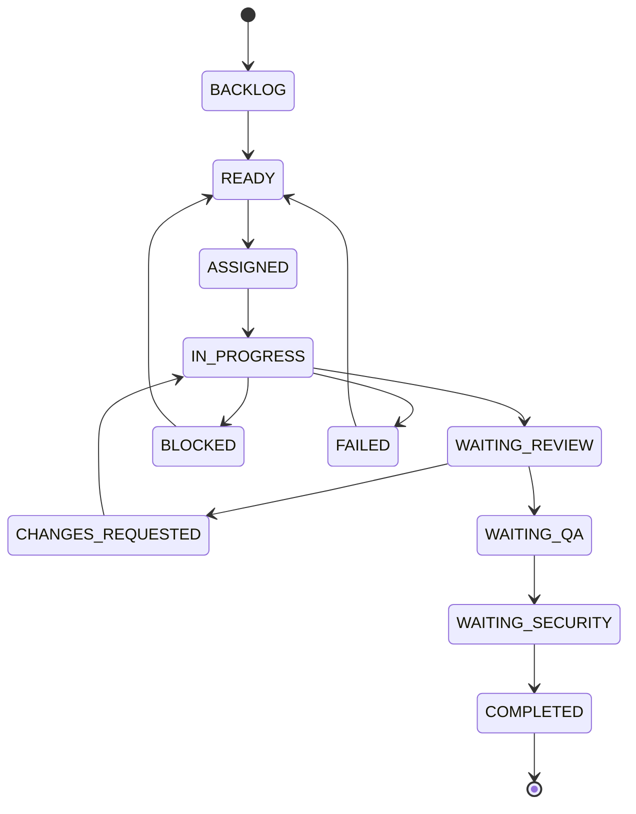
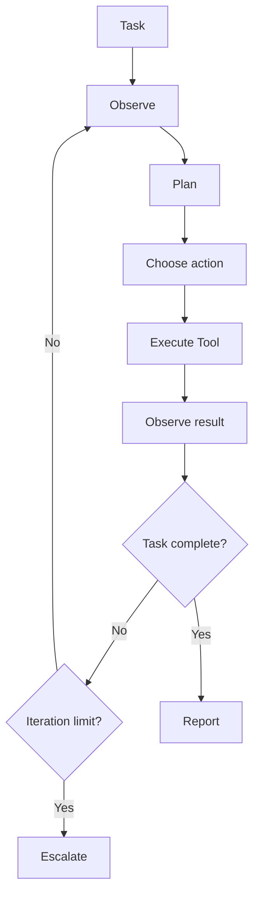
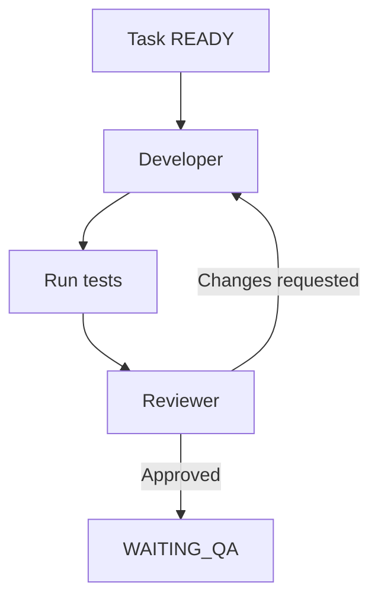
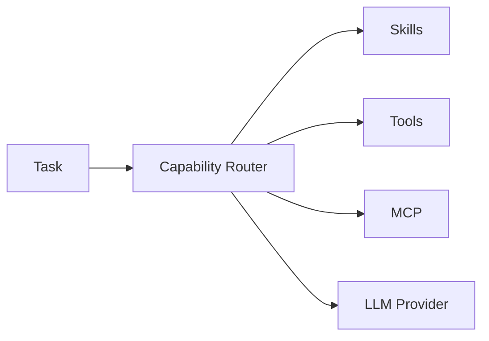
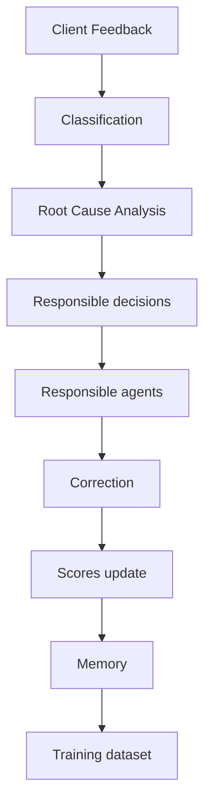
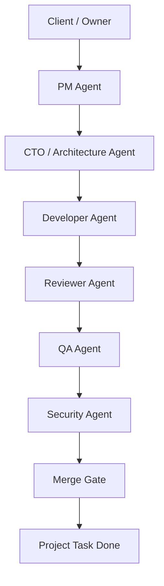

# SynapseOS — Roadmap de développement par étapes

> Objectif : construire SynapseOS progressivement, avec une validation stricte de chaque étape avant de passer à la suivante.
>
> Principe : **une phase = un objectif clair = une PR = une validation**.
>
> Ne jamais demander à Claude Code de construire tout SynapseOS en une seule fois.

---

# 0. Règles générales de développement

## Règles obligatoires

- [ ] Ne jamais implémenter plusieurs phases en même temps.
- [ ] Lire les fichiers existants avant toute modification.
- [ ] Ne pas inventer de fonctionnalités non demandées.
- [ ] Conserver une architecture modulaire.
- [ ] Ajouter des tests pour chaque fonctionnalité importante.
- [ ] Exécuter les tests avant de considérer une tâche terminée.
- [ ] Exécuter le linting et le type-checking.
- [ ] Documenter les décisions d'architecture importantes.
- [ ] Ne jamais stocker de secrets dans Git.
- [ ] Ne jamais donner des permissions système illimitées aux agents.
- [ ] Prévoir les erreurs, timeouts, retries et limites de boucle.
- [ ] Toute action d'un agent doit être auditable.
- [ ] Toute modification du schéma de données doit passer par une migration.
- [ ] Utiliser des identifiants UUID lorsque pertinent.
- [ ] Éviter les dépendances inutiles.
- [ ] Préférer les interfaces/abstractions lorsque plusieurs implémentations sont prévues.
- [ ] Les composants doivent être testables indépendamment.
- [ ] Les appels LLM doivent être encapsulés derrière une interface.
- [ ] Les tools doivent être séparés de la logique de raisonnement.
- [ ] Les permissions doivent être vérifiées avant l'exécution d'un tool.
- [ ] Les erreurs d'un agent doivent être enregistrées.
- [ ] Les scores de confiance ne doivent pas être interprétés comme une vérité absolue.

---

# 1. Stack initiale

## Backend / Runtime

- [ ] Python 3.12+
- [ ] FastAPI
- [ ] Pydantic v2
- [ ] SQLAlchemy 2
- [ ] Alembic
- [ ] PostgreSQL
- [ ] Psycopg
- [ ] pytest
- [ ] Ruff
- [ ] mypy

## LLM

- [ ] Interface générique `LLMProvider`
- [ ] Premier provider : Ollama
- [ ] Architecture prête pour providers cloud plus tard

## Exécution

- [ ] Docker
- [ ] Docker Compose
- [ ] Workspace isolé pour les projets
- [ ] Limites CPU / mémoire / timeout lorsque possible

## Plus tard

- [ ] Redis
- [ ] Queue de jobs
- [ ] pgvector
- [ ] MCP
- [ ] OpenTelemetry
- [ ] Frontend Nuxt

---

# PHASE 1 — Initialisation du repository

## Objectif

Créer une base de projet propre, testable et prête à accueillir le moteur agentique.

## Checklist

- [x] Créer la structure du repository.
- [x] Créer `pyproject.toml`.
- [x] Configurer FastAPI.
- [x] Configurer pytest.
- [x] Configurer Ruff.
- [x] Configurer mypy.
- [x] Ajouter `.env.example`.
- [x] Ajouter `.gitignore`.
- [x] Ajouter Dockerfile.
- [x] Ajouter `docker-compose.yml`.
- [x] Ajouter PostgreSQL.
- [x] Ajouter endpoint `/health`.
- [x] Ajouter test de `/health`.
- [x] Ajouter README minimal.
- [x] Ajouter dossier `docs/adr/`.
- [x] Ajouter commandes Makefile ou scripts équivalents.
- [x] Vérifier que l'application démarre.
- [x] Vérifier que tous les tests passent.

## Structure cible

```text
synapseos/
├── apps/
│   └── api/
├── core/
│   ├── agents/
│   ├── tasks/
│   ├── runtime/
│   ├── memory/
│   ├── skills/
│   ├── tools/
│   ├── scoring/
│   └── permissions/
├── infrastructure/
│   ├── database/
│   ├── llm/
│   └── git/
├── tests/
├── docs/
│   └── adr/
├── .env.example
├── docker-compose.yml
├── Dockerfile
├── pyproject.toml
└── README.md
```

## Critères d'acceptation

- [x] `docker compose up` démarre API + PostgreSQL.
- [x] `/health` retourne HTTP 200.
- [x] `pytest` passe.
- [x] Ruff ne retourne pas d'erreur.
- [x] mypy ne retourne pas d'erreur bloquante.

## Prompt Claude Code — Phase 1

```text
Tu travailles sur SynapseOS, une plateforme d'orchestration d'entreprise composée d'agents IA.

Ta mission concerne UNIQUEMENT la PHASE 1 : initialiser le repository.

Contraintes :
- Python 3.12+
- FastAPI
- Pydantic v2
- SQLAlchemy 2
- Alembic
- PostgreSQL
- psycopg
- pytest
- Ruff
- mypy
- Docker / Docker Compose
- architecture modulaire
- aucune fonctionnalité agentique métier pour le moment

Structure souhaitée :
apps/api
core/agents
core/tasks
core/runtime
core/memory
core/skills
core/tools
core/scoring
core/permissions
infrastructure/database
infrastructure/llm
infrastructure/git
tests
docs/adr

Travail attendu :
1. Inspecte d'abord le repository actuel.
2. Explique brièvement ce qui existe.
3. Propose les fichiers à créer/modifier.
4. Implémente uniquement l'initialisation.
5. Ajoute un endpoint GET /health.
6. Configure PostgreSQL avec Docker Compose.
7. Configure pytest, Ruff et mypy.
8. Ajoute un test pour /health.
9. Ajoute .env.example sans secrets.
10. Ajoute un README minimal contenant les commandes de démarrage/test.
11. Exécute les tests et outils de qualité.
12. Corrige les erreurs jusqu'à réussite.
13. Termine par un rapport :
   - fichiers créés/modifiés
   - commandes exécutées
   - résultats des tests
   - décisions importantes
   - éléments volontairement non implémentés

INTERDICTION :
- Ne crée pas encore d'agents.
- Ne crée pas encore de moteur LLM.
- Ne crée pas de système de skills.
- Ne crée pas de MCP.
- Ne crée pas de frontend.
- Ne passe pas à la phase suivante.
```

---

# PHASE 2 — Modèle de données fondamental

## Objectif

Créer les entités centrales nécessaires au fonctionnement du runtime.

## Entités V1

- [x] `Agent`
- [x] `Project`
- [x] `Task`
- [x] `TaskDependency`
- [x] `AgentRun`
- [x] `Decision`
- [x] `ToolCall`
- [x] `AgentScore`
- [x] `AuditEvent`

## Agent

Champs minimum :

- [x] `id`
- [x] `name`
- [x] `slug`
- [x] `role`
- [x] `department`
- [x] `seniority`
- [x] `status`
- [x] `autonomy_level`
- [x] `reputation_score`
- [x] `reliability_score`
- [x] `created_at`
- [x] `updated_at`

## Project

- [x] `id`
- [x] `name`
- [x] `description`
- [x] `status`
- [x] `client_name`
- [x] `created_at`
- [x] `updated_at`

## Task

- [x] `id`
- [x] `project_id`
- [x] `parent_task_id`
- [x] `title`
- [x] `description`
- [x] `status`
- [x] `priority`
- [x] `assigned_agent_id`
- [x] `acceptance_criteria`
- [x] `max_iterations`
- [x] `iteration_count`
- [x] `created_at`
- [x] `updated_at`

## AgentRun

- [x] `id`
- [x] `agent_id`
- [x] `task_id`
- [x] `status`
- [x] `started_at`
- [x] `finished_at`
- [x] `iteration`
- [x] `confidence`
- [x] `error_message`

## Decision

- [x] décision
- [x] alternatives
- [x] justification
- [x] confidence
- [x] evidence
- [x] agent
- [x] task
- [x] résultat final

## Critères d'acceptation

- [x] Migrations Alembic fonctionnelles.
- [x] Relations SQLAlchemy testées.
- [x] États représentés avec des enums.
- [x] Tests CRUD minimaux.
- [x] Contraintes DB définies.

## Prompt Claude Code — Phase 2

```text
Implémente UNIQUEMENT la PHASE 2 de SynapseOS : modèle de données fondamental.

Avant de modifier quoi que ce soit :
1. Inspecte l'architecture existante.
2. Lis README, pyproject.toml et configuration SQLAlchemy/Alembic.
3. Respecte les conventions déjà établies.

Créer les entités suivantes :
- Agent
- Project
- Task
- TaskDependency
- AgentRun
- Decision
- ToolCall
- AgentScore
- AuditEvent

Exigences :
- SQLAlchemy 2 typé
- UUID comme identifiants principaux lorsque pertinent
- timestamps UTC
- enums explicites
- foreign keys et index utiles
- contraintes d'intégrité
- migrations Alembic
- tests automatisés

Ne crée aucune logique LLM.
Ne crée aucun agent autonome.
Ne crée aucun endpoint CRUD complet sauf si nécessaire pour tester proprement l'infrastructure.
Ne commence pas la phase suivante.

À la fin :
- exécute migrations
- exécute pytest
- exécute Ruff
- exécute mypy
- corrige les erreurs
- fournis un rapport des modèles, relations, migrations et tests.
```

---

# PHASE 3 — Machine à états des tâches

## Objectif

Garantir qu'une tâche suit un cycle déterministe.

## États proposés

```text
BACKLOG
READY
ASSIGNED
IN_PROGRESS
WAITING_REVIEW
CHANGES_REQUESTED
WAITING_QA
WAITING_SECURITY
BLOCKED
COMPLETED
FAILED
CANCELLED
```

## Checklist

- [x] Créer `TaskStateMachine`.
- [x] Définir transitions autorisées.
- [x] Interdire transitions invalides.
- [x] Créer événements d'audit pour chaque transition.
- [x] Ajouter raison du changement.
- [x] Ajouter acteur à l'origine du changement.
- [x] Tests complets des transitions.
- [x] Document Mermaid de la machine à états.

## Mermaid



## Prompt Claude Code — Phase 3

```text
Implémente UNIQUEMENT la machine à états des tâches de SynapseOS.

Objectif :
centraliser toutes les transitions de Task et empêcher les modifications arbitraires de statut.

États :
BACKLOG
READY
ASSIGNED
IN_PROGRESS
WAITING_REVIEW
CHANGES_REQUESTED
WAITING_QA
WAITING_SECURITY
BLOCKED
COMPLETED
FAILED
CANCELLED

Travail attendu :
- créer une TaskStateMachine indépendante de FastAPI
- définir explicitement les transitions autorisées
- refuser toute transition invalide avec une exception métier
- enregistrer chaque transition dans AuditEvent
- accepter actor, reason et metadata
- ajouter tests unitaires exhaustifs
- ajouter docs/task-state-machine.md avec schéma Mermaid

Ne modifie pas directement task.status depuis les services : toute transition doit passer par la machine à états.

Ne crée pas encore de LLM, tools ou agents autonomes.
```

---

# PHASE 4 — Interface LLM et provider Ollama

## Objectif

Découpler SynapseOS du fournisseur de modèle.

## Checklist

- [x] Créer interface `LLMProvider`.
- [x] Créer types `LLMRequest`.
- [x] Créer `LLMResponse`.
- [x] Créer provider Ollama.
- [x] Support system prompt.
- [x] Support messages.
- [x] Timeout.
- [x] Gestion erreurs.
- [x] Nombre de tokens si disponible.
- [x] Métadonnées modèle.
- [x] Mock provider pour tests.
- [x] Tests sans dépendre d'Ollama réel.

## Prompt Claude Code — Phase 4

```text
Implémente UNIQUEMENT l'abstraction LLM de SynapseOS.

Créer :
- LLMProvider (interface/protocole abstrait)
- LLMRequest
- LLMResponse
- OllamaLLMProvider
- FakeLLMProvider pour les tests

Contraintes :
- aucune logique métier agent dans le provider
- provider interchangeable
- timeout configurable
- erreurs normalisées
- aucune dépendance directe à Ollama en dehors de infrastructure/llm
- tests unitaires utilisant FakeLLMProvider
- configuration via variables d'environnement

Le reste de SynapseOS ne doit jamais dépendre directement du SDK/client Ollama.
```

---

# PHASE 5 — Agent Core

## Objectif

Créer la représentation runtime d'un agent.

## Agent V1 doit posséder

- [ ] identité
- [ ] rôle
- [ ] département
- [ ] system prompt
- [ ] autonomie
- [ ] permissions
- [ ] liste de tools
- [ ] liste de skills
- [ ] LLM provider
- [ ] score de réputation
- [ ] historique minimal
- [ ] statut

## Méthodes

- [ ] `observe()`
- [ ] `plan()`
- [ ] `decide()`
- [ ] `report()`

## À NE PAS FAIRE

- [ ] Pas encore de boucle autonome complète.
- [ ] Pas encore de modification de fichiers.
- [ ] Pas encore de terminal.

## Prompt Claude Code — Phase 5

```text
Implémente UNIQUEMENT le noyau Agent de SynapseOS.

Un Agent doit encapsuler :
- identité
- rôle
- département
- séniorité
- system prompt
- niveau d'autonomie
- permissions
- tools autorisés
- skills disponibles
- provider LLM
- réputation et fiabilité

Créer des objets typés pour :
Observation
Plan
Decision
AgentReport

Créer les méthodes :
observe
plan
decide
report

Les sorties LLM doivent être structurées et validées avec Pydantic.

Important :
- aucune exécution de shell à ce stade
- aucun accès fichiers
- aucune boucle infinie
- aucun MCP
- pas de multi-agent

Ajouter FakeLLMProvider dans les tests afin de tester les comportements de manière déterministe.
```

---

# PHASE 6 — Tool Registry

## Objectif

Permettre aux agents d'utiliser uniquement des capacités explicitement enregistrées.

## Interface d'un Tool

- [ ] nom
- [ ] description
- [ ] schéma d'entrée
- [ ] permissions requises
- [ ] niveau de risque
- [ ] timeout
- [ ] méthode `execute`

## Tools V1

- [ ] `read_file`
- [ ] `list_files`
- [ ] `search_text`
- [ ] `git_status`
- [ ] `git_diff`

## Sécurité

- [ ] path traversal bloqué
- [ ] sandbox root obligatoire
- [ ] audit automatique
- [ ] permissions vérifiées
- [ ] timeout

## Prompt Claude Code — Phase 6

```text
Implémente UNIQUEMENT le système de Tools de SynapseOS.

Créer :
Tool
ToolResult
ToolRegistry
ToolExecutionContext

Chaque tool doit définir :
- name
- description
- input schema Pydantic
- permissions requises
- risk level
- timeout
- execute()

Créer uniquement les tools read-only suivants :
- read_file
- list_files
- search_text
- git_status
- git_diff

Sécurité obligatoire :
- tous les chemins doivent rester dans workspace_root
- bloquer path traversal
- vérifier permissions avant exécution
- enregistrer ToolCall et AuditEvent
- timeout
- résultat structuré
- aucune commande shell libre

Ajouter des tests de sécurité et permissions.
```

---

# PHASE 7 — Permission Engine

## Objectif

Empêcher un agent d'utiliser une capacité qu'il ne possède pas.

## Permissions V1

- [ ] `filesystem.read`
- [ ] `filesystem.write`
- [ ] `git.read`
- [ ] `git.write`
- [ ] `shell.execute`
- [ ] `tests.execute`
- [ ] `network.access`
- [ ] `database.read`
- [ ] `database.write`
- [ ] `deployment.staging`
- [ ] `deployment.production`

## Checklist

- [ ] Permission enum.
- [ ] Permission policy.
- [ ] AgentPermission.
- [ ] ToolPermission.
- [ ] Deny by default.
- [ ] Audit refus.
- [ ] Tests.

## Prompt Claude Code — Phase 7

```text
Implémente UNIQUEMENT le moteur de permissions de SynapseOS.

Principe fondamental :
DENY BY DEFAULT.

Créer une abstraction permettant :
- permissions par agent
- permissions requises par tool
- contrôle avant exécution
- refus explicite
- AuditEvent en cas d'autorisation/refus

Permissions initiales :
filesystem.read
filesystem.write
git.read
git.write
shell.execute
tests.execute
network.access
database.read
database.write
deployment.staging
deployment.production

Les agents ne doivent jamais pouvoir s'accorder eux-mêmes une nouvelle permission.
Ajouter tests couvrant allowed / denied / unknown permission.
```

---

# PHASE 8 — Skills Registry

## Objectif

Permettre aux agents de charger des instructions spécialisées selon la mission.

## Structure d'un Skill

```text
skills/
└── backend-api/
    ├── SKILL.md
    └── metadata.yaml
```

## Metadata

- [ ] id
- [ ] nom
- [ ] description
- [ ] domaines
- [ ] technologies
- [ ] tags
- [ ] version
- [ ] outils recommandés
- [ ] permissions nécessaires

## Skills V1

- [ ] generic-backend
- [ ] generic-frontend
- [ ] testing
- [ ] git-workflow
- [ ] security-review

## Prompt Claude Code — Phase 8

```text
Implémente UNIQUEMENT le Skill Registry de SynapseOS.

Un skill est une capacité documentaire/instructionnelle versionnée.

Structure :
skills/<skill-id>/SKILL.md
skills/<skill-id>/metadata.yaml

Créer :
Skill
SkillMetadata
SkillRegistry
SkillLoader
SkillSelector

Le selector doit pouvoir classer des skills en fonction :
- description de tâche
- rôle de l'agent
- tags
- technologies
- permissions

Ne fais PAS de sélection LLM complexe au départ :
utilise un scoring déterministe simple et testable.

Créer 5 skills exemples :
generic-backend
generic-frontend
testing
git-workflow
security-review

Ajouter tests.
```

---

# PHASE 9 — Workspace et isolation

## Objectif

Donner à chaque projet un espace de travail contrôlé.

## Checklist

- [ ] `Workspace`
- [ ] workspace par projet
- [ ] clonage Git
- [ ] racine immutable côté runtime
- [ ] validation chemins
- [ ] répertoire temporaire
- [ ] nettoyage
- [ ] limites d'accès

## Prompt Claude Code — Phase 9

```text
Implémente UNIQUEMENT la gestion des workspaces projet.

Créer Workspace et WorkspaceManager.

Fonctions :
- create_workspace(project)
- attach_existing_repository()
- clone_repository()
- validate_path()
- cleanup_workspace()

Contraintes :
- chaque projet possède une racine isolée
- aucun outil fichier ne peut sortir de cette racine
- pas de sudo
- pas d'accès arbitraire au système hôte
- toutes les opérations sont auditées

Ne lance pas encore de conteneurs Docker d'exécution.
Prépare seulement l'abstraction afin qu'un backend Docker puisse être ajouté ensuite.
```

---

# PHASE 10 — Tools d'écriture

## Objectif

Permettre à un Developer Agent de modifier du code.

## Tools

- [ ] `write_file`
- [ ] `patch_file`
- [ ] `create_file`
- [ ] `delete_file` avec permission renforcée

## Règles

- [ ] sauvegarde avant modification
- [ ] diff généré
- [ ] audit
- [ ] workspace obligatoire
- [ ] limite de taille

## Prompt Claude Code — Phase 10

```text
Ajoute UNIQUEMENT les tools d'écriture fichiers.

Créer :
write_file
patch_file
create_file
delete_file

Contraintes :
- workspace obligatoire
- permissions filesystem.write
- delete_file possède un niveau de risque supérieur
- path traversal impossible
- taille maximale configurable
- AuditEvent et ToolCall
- retourner un diff ou résumé des changements

Ajouter tests :
- écriture autorisée
- permission refusée
- path traversal
- suppression
- fichier inexistant
- fichier trop volumineux
```

---

# PHASE 11 — Shell Runner sécurisé

## Objectif

Permettre certaines commandes sans offrir un shell totalement libre.

## Checklist

- [ ] `CommandRunner`
- [ ] allowlist
- [ ] timeout
- [ ] cwd workspace
- [ ] capture stdout/stderr
- [ ] exit code
- [ ] limite output
- [ ] audit

## Commandes initiales

- [ ] tests
- [ ] lint
- [ ] build
- [ ] git

## Prompt Claude Code — Phase 11

```text
Implémente UNIQUEMENT un CommandRunner sécurisé.

IMPORTANT :
ne jamais exposer un shell arbitraire directement au LLM.

Créer :
CommandSpec
CommandResult
CommandPolicy
CommandRunner

Exigences :
- commandes sous forme argv, jamais shell=True
- allowlist configurable
- cwd obligatoirement dans workspace
- timeout
- limite stdout/stderr
- capture exit code
- permissions
- audit
- blocage des commandes inconnues

Ajouter quelques profils :
pytest
ruff
mypy
git
npm-test
npm-build
php-artisan-test

Ne présume pas la stack du projet.
Les profils sont sélectionnables selon les fichiers détectés.
```

---

# PHASE 12 — Test Runner intelligent

## Objectif

Détecter comment tester un projet selon sa stack.

## Détections V1

- [ ] Python
- [ ] PHP/Laravel
- [ ] Node.js
- [ ] Nuxt
- [ ] Java/Maven ou Gradle

## Prompt Claude Code — Phase 12

```text
Implémente UNIQUEMENT TestRunner et ProjectStackDetector.

ProjectStackDetector doit détecter à partir du repository :
- Python
- PHP/Laravel
- Node.js
- Nuxt
- Java Maven
- Java Gradle

Ne lie pas les agents à une technologie particulière.

TestRunner choisit uniquement parmi des commandes déjà autorisées par CommandPolicy.

Sortie structurée :
- stack détectée
- commande
- exit_code
- passed
- summary
- raw output tronqué

Ajouter tests avec fixtures de faux repositories.
```

---

# PHASE 13 — Loop Engineering V1

## Objectif

Construire le premier véritable agent autonome contrôlé.

## Boucle



## Garde-fous

- [ ] `max_iterations`
- [ ] timeout global
- [ ] maximum failures
- [ ] tool call budget
- [ ] token budget
- [ ] loop stagnation detection
- [ ] human escalation

## Prompt Claude Code — Phase 13

```text
Implémente UNIQUEMENT Loop Engineering V1 pour un seul agent.

Créer AgentRuntime capable d'exécuter :
OBSERVE
PLAN
DECIDE
ACT
OBSERVE RESULT
VERIFY
RETRY ou COMPLETE

Contraintes obligatoires :
- max_iterations
- timeout global
- max_tool_calls
- max_failures
- token/cost accounting si disponible
- détection simple de stagnation
- cancellation
- audit de chaque étape
- aucune récursion non bornée

Le runtime doit travailler avec FakeLLMProvider dans les tests.

Scénarios de tests :
1. réussite au premier essai
2. tool failure puis correction
3. dépassement max_iterations
4. permission denied
5. LLM malformed response
6. timeout
7. completion normale

Ne crée pas encore de multi-agent.
```

---

# PHASE 14 — Developer Agent

## Objectif

Créer le premier véritable rôle métier.

## Developer Agent

Responsabilités :

- [ ] comprendre une tâche
- [ ] inspecter repository
- [ ] sélectionner skills
- [ ] planifier
- [ ] modifier code
- [ ] exécuter tests
- [ ] analyser erreurs
- [ ] corriger
- [ ] produire rapport

## Prompt Claude Code — Phase 14

```text
Implémente UNIQUEMENT DeveloperAgent.

DeveloperAgent est un rôle utilisant AgentRuntime.

Il doit pouvoir :
- lire la Task
- explorer workspace
- sélectionner Skills pertinents
- inspecter code
- produire un plan
- modifier les fichiers avec les tools autorisés
- lancer les tests via TestRunner
- analyser échec
- corriger dans la limite du loop
- produire AgentReport

Il NE DOIT PAS :
- merger sa propre branche
- déployer
- modifier les permissions
- contourner des tests
- utiliser un outil non autorisé

Ajouter un scénario d'intégration avec un petit repository fixture contenant un bug simple que l'agent doit corriger avec FakeLLMProvider déterministe.
```

---

# PHASE 15 — Reviewer Agent

## Objectif

Séparer auteur et validation.

## Checklist

- [ ] Reviewer différent du Developer.
- [ ] Lecture du diff.
- [ ] Lecture critères d'acceptation.
- [ ] Analyse qualité.
- [ ] Demande de modifications.
- [ ] Approval.
- [ ] Score de review.

## Prompt Claude Code — Phase 15

```text
Implémente UNIQUEMENT ReviewerAgent.

ReviewerAgent ne modifie pas directement le code dans V1.

Entrées :
- Task
- acceptance criteria
- git diff
- tests
- DeveloperAgent report

Sortie structurée :
APPROVED
CHANGES_REQUESTED

Inclure :
- findings
- severity
- rationale
- confidence
- recommended changes

Le Reviewer ne peut pas approuver une tâche si les tests obligatoires ont échoué.

Créer tests déterministes avec FakeLLMProvider.
```

---

# PHASE 16 — Workflow Developer ↔ Reviewer

## Objectif

Premier workflow multi-agent réel.



## Checklist

- [ ] orchestrateur
- [ ] assignation
- [ ] handoff
- [ ] review cycle
- [ ] max review cycles
- [ ] état Task
- [ ] audit

## Prompt Claude Code — Phase 16

```text
Implémente UNIQUEMENT le premier workflow multi-agent :
DeveloperAgent -> ReviewerAgent.

Créer un WorkflowOrchestrator minimal.

Cycle :
Task READY
-> ASSIGNED
-> IN_PROGRESS
-> WAITING_REVIEW
-> APPROVED => WAITING_QA
ou
-> CHANGES_REQUESTED => retour Developer

Contraintes :
- auteur != reviewer
- max_review_cycles configurable
- transitions via TaskStateMachine
- audit complet
- aucun QA/Security réel encore

Ajouter tests end-to-end avec FakeLLMProvider.
```

---

# PHASE 17 — QA Agent

## Objectif

Valider fonctionnellement le travail.

## Responsabilités

- [ ] analyser critères d'acceptation
- [ ] vérifier tests existants
- [ ] proposer tests manquants
- [ ] exécuter suite de tests
- [ ] valider ou rejeter

## Prompt Claude Code — Phase 17

```text
Implémente UNIQUEMENT QAAgent.

QAAgent reçoit :
- Task
- acceptance criteria
- diff
- test results
- reviewer report

Il peut utiliser :
- read tools
- TestRunner
- tools de création de tests uniquement si autorisés

Résultat :
PASSED
FAILED

Si FAILED :
- findings
- reproduction steps
- expected behavior
- actual behavior
- severity

Intègre QA au workflow :
WAITING_QA -> WAITING_SECURITY si succès
WAITING_QA -> CHANGES_REQUESTED si échec
```

---

# PHASE 18 — Security Agent V1

## Objectif

Créer le premier contrôle indépendant avec droit de blocage.

## Responsabilités

- [ ] review sécurité
- [ ] secrets
- [ ] auth/authz
- [ ] injections
- [ ] validation inputs
- [ ] dépendances
- [ ] configuration dangereuse

## Décisions

- [ ] PASS
- [ ] WARN
- [ ] BLOCK

## Prompt Claude Code — Phase 18

```text
Implémente UNIQUEMENT SecurityAgent V1.

SecurityAgent est indépendant du Developer et possède un droit de veto.

Entrées :
- Task
- diff
- code concerné
- QA report
- tests

Sorties :
PASS
WARN
BLOCK

Chaque finding :
- category
- severity
- file/location
- explanation
- remediation
- confidence

Règle :
un finding CRITICAL ou HIGH confirmé peut produire BLOCK.

Workflow :
WAITING_SECURITY -> COMPLETED si PASS
WAITING_SECURITY -> CHANGES_REQUESTED si BLOCK

Ne lance pas encore de scanners externes complexes.
Prépare des interfaces permettant de brancher Semgrep/Trivy/ZAP plus tard.
```

---

# PHASE 19 — Git Workflow

## Objectif

Faire fonctionner les agents comme une vraie équipe de développement.

## Checklist

- [ ] branche par Task
- [ ] convention noms
- [ ] commits
- [ ] status
- [ ] diff
- [ ] historique
- [ ] PR abstraction
- [ ] author/reviewer
- [ ] protections

## Convention

```text
feature/<task-id>-slug
fix/<task-id>-slug
chore/<task-id>-slug
```

## Prompt Claude Code — Phase 19

```text
Implémente UNIQUEMENT GitWorkflow.

Fonctions :
- create_task_branch
- commit_changes
- get_diff
- get_history
- prepare_pull_request
- validate_merge_requirements

Ne connecte pas encore GitHub/GitLab externe si ce n'est pas nécessaire.
Commence par Git local avec abstraction GitProvider.

Règles :
- branche dédiée par Task
- Developer peut commit
- Developer ne peut pas auto-approve
- protected main conceptuellement
- aucun force push
- audit de toute action

Préparer l'interface pour GitHub/GitLab providers futurs.
```

---

# PHASE 20 — Pull Requests / Merge Requests

## Objectif

Matérialiser le workflow de validation.

## PR contient

- [ ] task
- [ ] auteur
- [ ] résumé
- [ ] changements
- [ ] tests
- [ ] risques
- [ ] confidence
- [ ] reviewer
- [ ] QA
- [ ] security
- [ ] approvals

## Prompt Claude Code — Phase 20

```text
Implémente UNIQUEMENT le modèle interne de PullRequest/MergeRequest.

Créer :
PullRequest
PullRequestReview
Approval
MergeGate

MergeGate vérifie au minimum :
- reviewer approved
- QA passed
- security not blocked
- tests passed
- branch mergeable
- task correcte

Aucun agent ne doit pouvoir contourner MergeGate.

Ajouter tests complets.
```

---

# PHASE 21 — Confidence Score

## Objectif

Normaliser le niveau de confiance attaché à une décision.

## Important

Le score LLM déclaré seul n'est jamais suffisant.

## Facteurs possibles

- [ ] self-confidence du modèle
- [ ] expertise agent
- [ ] qualité des preuves
- [ ] tests
- [ ] historique
- [ ] contradictions
- [ ] ambiguïtés

## Prompt Claude Code — Phase 21

```text
Implémente UNIQUEMENT Confidence Engine V1.

Créer ConfidenceAssessment avec :
- self_reported_confidence
- evidence_score
- verification_score
- expertise_score
- uncertainty_penalty
- final_confidence

Le calcul doit être déterministe et documenté.
Ne présente jamais le score comme une probabilité mathématique parfaitement calibrée.

Créer tests unitaires et documentation expliquant la formule.
```

---

# PHASE 22 — Reputation & Reliability

## Objectif

Évaluer les agents sur leurs résultats réels.

## Métriques

- [ ] tasks completed
- [ ] first pass approvals
- [ ] corrections
- [ ] regressions
- [ ] security findings
- [ ] customer complaints
- [ ] rollbacks
- [ ] escalations
- [ ] collaboration

## Prompt Claude Code — Phase 22

```text
Implémente UNIQUEMENT Agent Reputation Engine V1.

Créer une distinction stricte entre :
- confidence : score d'une décision
- reputation : historique global
- reliability : taux de résultats corrects
- expertise : compétence par domaine

Les scores doivent être calculés à partir d'événements mesurables.

Ne crée pas encore de promotion automatique.
Expose seulement :
- calcul
- historique
- mise à jour
- audit
- tests
```

---

# PHASE 23 — Memory V1

## Objectif

Permettre à l'entreprise de se souvenir.

## Types

- [ ] agent memory
- [ ] project memory
- [ ] company memory
- [ ] decision memory
- [ ] failure memory

## Prompt Claude Code — Phase 23

```text
Implémente UNIQUEMENT Memory V1 sans embeddings.

Créer :
MemoryEntry
MemoryScope
MemoryRepository
MemoryService

Scopes :
AGENT
PROJECT
COMPANY

Chaque entrée :
- type
- title
- content
- source
- project
- agent
- tags
- confidence
- created_at
- superseded_by

Créer recherche simple SQL/textuelle.
Pas encore pgvector.
Pas encore RAG complexe.
```

---

# PHASE 24 — Audit Log immuable

## Objectif

Pouvoir reconstruire toute l'histoire d'une décision.

## Événements

- [ ] task transitions
- [ ] LLM calls
- [ ] tool calls
- [ ] permissions
- [ ] decisions
- [ ] Git actions
- [ ] reviews
- [ ] security
- [ ] score changes

## Prompt Claude Code — Phase 24

```text
Renforce UNIQUEMENT le système AuditEvent.

Objectif :
obtenir un journal append-only retraçant les actions importantes.

Chaque événement doit contenir :
- timestamp
- actor_type
- actor_id
- project_id
- task_id
- action
- resource
- result
- correlation_id
- metadata

Interdire les updates/delete via le service applicatif standard.
Ajouter filtres de lecture et tests.
```

---

# PHASE 25 — PM / Intake Agent

## Objectif

Recevoir un cahier des charges et produire un cadrage structuré.

## Capacités

- [ ] lire cahier des charges
- [ ] identifier objectifs
- [ ] identifier ambiguïtés
- [ ] générer questions
- [ ] classifier questions
- [ ] produire requirements
- [ ] produire epics/tasks

## Questions

- [ ] BLOCKING
- [ ] IMPORTANT
- [ ] OPTIONAL

## Prompt Claude Code — Phase 25

```text
Implémente UNIQUEMENT IntakeAgent / ProjectManagerAgent V1.

Entrée :
texte d'un cahier des charges.

Sortie structurée :
- project summary
- goals
- actors
- functional requirements
- non-functional requirements
- constraints
- assumptions
- risks
- unanswered questions

Questions classées :
BLOCKING
IMPORTANT
OPTIONAL

Le PM Agent ne doit PAS démarrer l'implémentation tant que des questions BLOCKING restent sans réponse.

Ajouter tests utilisant FakeLLMProvider avec sorties déterministes.
```

---

# PHASE 26 — Architecture Agent / CTO

## Objectif

Transformer les requirements en proposition technique.

## Sorties

- [ ] architecture
- [ ] stack candidates
- [ ] choix argumenté
- [ ] domaines
- [ ] services/modules
- [ ] risques
- [ ] ADR

## Prompt Claude Code — Phase 26

```text
Implémente UNIQUEMENT ArchitectureAgent / CTOAgent V1.

Important :
l'agent ne doit pas être lié à Laravel, React, Python ou autre technologie.

Il reçoit :
- requirements
- contraintes
- non-functional requirements
- contexte projet

Il retourne :
- options techniques
- trade-offs
- recommendation
- confidence
- risks
- domain decomposition
- proposed stack
- ADR draft

Il doit pouvoir dire qu'une information manque et demander une escalade.
```

---

# PHASE 27 — Domain Decomposition

## Objectif

Créer des équipes temporaires selon les domaines du projet.

Exemples :

```text
Identity
Payments
Search
Notifications
Catalog
Orders
Analytics
```

## Prompt Claude Code — Phase 27

```text
Implémente UNIQUEMENT DomainDecomposer.

À partir des requirements et de l'architecture :
- identifier les domaines fonctionnels
- identifier leurs dépendances
- proposer les capacités nécessaires
- créer des DomainWorkstreams

Ne crée pas un agent par fichier/page.
Le découpage doit rester au niveau métier/service pertinent.

Ajouter tests avec plusieurs exemples de cahiers des charges.
```

---

# PHASE 28 — Agent Registry & Matching

## Objectif

Affecter les meilleurs agents aux tâches.

## Critères

- [ ] expertise
- [ ] reputation
- [ ] disponibilité
- [ ] séniorité
- [ ] permissions
- [ ] risque
- [ ] coût

## Prompt Claude Code — Phase 28

```text
Implémente UNIQUEMENT AgentRegistry et AgentMatcher.

Un agent existe indépendamment d'un projet et peut être réaffecté à plusieurs projets.

Matcher doit considérer :
- required capabilities
- expertise
- reputation
- reliability
- seniority
- permissions
- availability
- risk level

Retourner :
- candidats classés
- score
- explication du matching

Algorithme V1 déterministe.
```

---

# PHASE 29 — Escalation Engine

## Objectif

Permettre à un agent de reconnaître ses limites.

## Conditions

- [ ] faible confiance
- [ ] manque de compétence
- [ ] permissions insuffisantes
- [ ] conflit
- [ ] boucle stagnante
- [ ] décision critique

## Prompt Claude Code — Phase 29

```text
Implémente UNIQUEMENT EscalationEngine.

Types :
- HUMAN
- SENIOR_AGENT
- SECURITY
- ARCHITECTURE_REVIEW
- PM
- FINANCE

Déclencheurs :
- confidence sous seuil
- expertise insuffisante
- permission denied critique
- max iterations
- contradiction non résolue
- décision irréversible
- risque élevé

Chaque escalade doit être auditée et créer une tâche/action claire.
```

---

# PHASE 30 — Security Tooling

## Objectif

Connecter des outils déterministes de cybersécurité.

## Candidats

- [ ] Semgrep
- [ ] Trivy
- [ ] secret scanner
- [ ] dependency audit
- [ ] OWASP ZAP plus tard

## Prompt Claude Code — Phase 30

```text
Étends UNIQUEMENT le Security Department avec des scanners déterministes.

Créer une interface SecurityScanner.

Implémenter progressivement :
- Semgrep adapter
- Trivy adapter
- secret scanning adapter
- dependency audit adapter

Chaque scanner retourne un format Finding commun.

Le SecurityAgent interprète les findings mais ne remplace jamais le résultat brut.

Aucun scan destructif.
Aucun pentest externe non autorisé.
```

---

# PHASE 31 — MCP Registry

## Objectif

Permettre la découverte et l'utilisation contrôlée de serveurs MCP.

## Checklist

- [ ] MCPServer registry
- [ ] capabilities
- [ ] permissions
- [ ] health
- [ ] routing
- [ ] audit
- [ ] allowlist

## Prompt Claude Code — Phase 31

```text
Implémente UNIQUEMENT l'abstraction MCP de SynapseOS.

Créer :
MCPServerDefinition
MCPCapability
MCPRegistry
MCPRouter

Objectif :
permettre à un agent de demander une capacité sans connaître directement le serveur.

Contraintes :
- allowlist
- permissions
- health status
- audit
- timeout
- aucune connexion arbitraire à un MCP inconnu

Créer une implémentation mock pour tests.
```

---

# PHASE 32 — Capability Router

## Objectif

Choisir Skills + Tools + MCP + éventuellement modèle.



## Prompt Claude Code — Phase 32

```text
Implémente UNIQUEMENT CapabilityRouter.

Entrées :
- Task
- Agent
- project context

Sortie :
CapabilityPlan contenant :
- selected skills
- selected tools
- selected MCP capabilities
- required permissions
- rationale

V1 :
scoring déterministe.
Ne laisse pas un agent contourner les permissions en choisissant une capacité.
```

---

# PHASE 33 — Feedback client

## Objectif

Transformer les plaintes en données exploitables.

## Workflow



## Prompt Claude Code — Phase 33

```text
Implémente UNIQUEMENT le pipeline ClientFeedback.

Créer :
ClientFeedback
FeedbackCategory
FeedbackClassifier
RootCauseAnalysis
ResponsibilityAssessment
CorrectiveAction

Catégories :
BUG
UX
PERFORMANCE
SECURITY
BUSINESS_LOGIC
MISSING_FEATURE
DOCUMENTATION
OTHER

Important :
ne jamais pénaliser automatiquement un agent uniquement à partir du texte du client.
Une plainte doit être confirmée/analysée avant impact réputationnel.
```

---

# PHASE 34 — Promotions, rétrogradations et autonomie

## Objectif

Adapter les responsabilités selon les performances.

## Niveaux

- [ ] Trainee
- [ ] Junior
- [ ] Engineer
- [ ] Senior
- [ ] Staff
- [ ] Principal

## Actions possibles

- [ ] promotion
- [ ] rétrogradation
- [ ] autonomie réduite
- [ ] review obligatoire
- [ ] perte d'une capability
- [ ] mentoring

## Prompt Claude Code — Phase 34

```text
Implémente UNIQUEMENT Career & Autonomy Policy Engine.

Créer des recommandations de :
- promotion
- demotion
- autonomy increase
- autonomy reduction
- mandatory review
- capability restriction

IMPORTANT :
V1 ne doit pas appliquer automatiquement une promotion/rétrogradation critique.
Produire une recommandation auditable fondée sur des métriques observées.

Ajouter règles et tests.
```

---

# PHASE 35 — Knowledge & Lessons Learned

## Objectif

Transformer les expériences projet en connaissances d'entreprise.

## Cycle

```text
Incident / feedback / review
→ lesson
→ validation
→ company knowledge
→ éventuellement nouveau skill
```

## Prompt Claude Code — Phase 35

```text
Implémente UNIQUEMENT LessonsLearnedService.

Entrées :
- completed project
- incidents
- feedback
- reviews
- failed decisions
- successful decisions

Sorties :
- lessons
- recommended process changes
- candidate company memories
- candidate skills

Aucune connaissance ne devient globale sans validation explicite dans V1.
```

---

# PHASE 36 — Project Closure

## Objectif

Clôturer un projet comme dans une vraie entreprise.

## Conditions

- [ ] client approval
- [ ] QA final
- [ ] security final
- [ ] livraison
- [ ] documentation
- [ ] retrospective
- [ ] performance review
- [ ] lessons learned
- [ ] celebration
- [ ] agents AVAILABLE

## Prompt Claude Code — Phase 36

```text
Implémente UNIQUEMENT ProjectClosureWorkflow.

Préconditions :
- client approved
- delivery complete
- QA sign-off
- Security sign-off

Étapes :
1. mark delivery accepted
2. final metrics
3. retrospective
4. lessons learned
5. agent contribution summary
6. recognition/celebration messages
7. archive project
8. release agents to AVAILABLE

Les messages de célébration doivent refléter les contributions réelles enregistrées.
Ne modifie pas les scores uniquement pour produire des félicitations.
```

---

# PHASE 37 — Budget & Cost Control

## Objectif

Éviter une entreprise agentique qui consomme sans limite.

## Mesures

- [ ] tokens
- [ ] appels LLM
- [ ] temps
- [ ] tool calls
- [ ] CPU/GPU
- [ ] provider cost
- [ ] budget projet
- [ ] budget agent

## Prompt Claude Code — Phase 37

```text
Implémente UNIQUEMENT Cost & Budget Engine.

Créer :
UsageRecord
Budget
BudgetPolicy
CostCalculator

Suivre :
- LLM requests
- input/output tokens si disponibles
- estimated provider cost
- runtime duration
- tool calls

Appliquer :
- project budget
- task budget
- run budget

Dépassement :
- stop safe
- audit
- escalation
```

---

# PHASE 38 — Observabilité

## Objectif

Voir ce que fait réellement l'entreprise.

## Métriques

- [ ] task throughput
- [ ] success rate
- [ ] average iterations
- [ ] agent reliability
- [ ] review rejection
- [ ] QA failures
- [ ] security blocks
- [ ] cost
- [ ] latency
- [ ] escalations
- [ ] project progress

## Prompt Claude Code — Phase 38

```text
Implémente UNIQUEMENT Observability V1.

Ajouter métriques applicatives internes pour :
tasks
agent runs
LLM calls
tool calls
errors
loop iterations
reviews
QA
security
cost
escalations

Créer une abstraction MetricsSink.
V1 peut utiliser logs structurés + endpoint métriques interne.
Préparer OpenTelemetry sans rendre le projet dépendant d'un backend externe.
```

---

# PHASE 39 — Incidents et SRE

## Objectif

Gérer les incidents de production.

## Cycle

```text
DETECTED
ACKNOWLEDGED
INVESTIGATING
MITIGATING
RESOLVED
POSTMORTEM
CLOSED
```

## Prompt Claude Code — Phase 39

```text
Implémente UNIQUEMENT Incident Management V1.

Créer :
Incident
IncidentSeverity
IncidentStateMachine
IncidentEvent
Postmortem

Inclure :
- owner
- affected service
- severity
- timeline
- mitigation
- resolution
- root cause
- follow-up actions

Ne crée pas encore de déploiement production autonome.
```

---

# PHASE 40 — Frontend Dashboard

## Objectif

Donner une interface humaine pour piloter SynapseOS.

## Écrans V1

- [ ] Dashboard
- [ ] Projects
- [ ] Project detail
- [ ] Tasks
- [ ] Agents
- [ ] Agent details
- [ ] Runs
- [ ] Audit
- [ ] Feedback
- [ ] Security findings
- [ ] Costs
- [ ] Settings

## Prompt Claude Code — Phase 40

```text
Implémente UNIQUEMENT le frontend V1 de SynapseOS.

Stack :
Nuxt 3 + TypeScript.

Avant de choisir une UI library, inspecte le repository et la décision d'architecture existante.

Créer d'abord :
- app shell
- navigation
- dashboard
- project list/detail
- task list/detail
- agent list/detail

Utiliser l'API existante.
Pas de logique agentique dans le frontend.
Pas de données mockées permanentes si les endpoints existent.
```

---

# PHASE 41 — GitHub / GitLab Provider réel

## Objectif

Connecter le workflow interne aux vraies PR/MR.

## Checklist

- [ ] Git provider abstraction
- [ ] GitHub App recommandé
- [ ] GitLab provider plus tard
- [ ] create branch
- [ ] create PR
- [ ] review
- [ ] status checks
- [ ] merge gates
- [ ] webhooks plus tard

## Prompt Claude Code — Phase 41

```text
Implémente UNIQUEMENT un GitHubProvider conforme à l'interface GitProvider existante.

Préférer une GitHub App ou token de service côté backend.

Fonctions minimales :
- repository metadata
- branch
- commit/push
- create PR
- read PR
- review status
- merge après MergeGate

Aucun secret dans Git.
Toutes les actions doivent être auditables avec l'identité logique de l'agent.
```

---

# PHASE 42 — Queue & Concurrence

## Objectif

Permettre à plusieurs agents de travailler en parallèle.

## Checklist

- [ ] queue
- [ ] workers
- [ ] locking
- [ ] task ownership
- [ ] cancellation
- [ ] retries
- [ ] idempotency
- [ ] heartbeats

## Prompt Claude Code — Phase 42

```text
Implémente UNIQUEMENT l'exécution asynchrone des AgentRuns.

Choisir une solution cohérente avec le projet existant.

Exigences :
- jobs idempotents
- lock de Task
- heartbeat
- retry contrôlé
- cancellation
- timeout
- recovery worker crash
- audit

Ne modifie pas la logique métier du runtime.
```

---

# PHASE 43 — Multi-project scheduling

## Objectif

Permettre aux agents de finir un projet puis d'être affectés ailleurs.

## États Agent

```text
AVAILABLE
ASSIGNED
WORKING
WAITING
BLOCKED
OFFLINE
```

## Prompt Claude Code — Phase 43

```text
Implémente UNIQUEMENT AgentScheduler multi-project.

Un agent appartient à l'entreprise, pas à un projet.

Le scheduler doit :
- connaître availability
- éviter double assignment incompatible
- considérer expertise/reputation
- considérer priorité projet
- libérer les agents après ProjectClosure
- conserver historique des affectations

V1 : algorithme déterministe.
```

---

# PHASE 44 — Fine-tuning / RL Dataset Pipeline

## Objectif

Préparer l'apprentissage sans entraîner automatiquement le modèle.

## Données possibles

- [ ] prompt/context
- [ ] décision
- [ ] alternatives
- [ ] résultat
- [ ] review
- [ ] user feedback
- [ ] corrected answer
- [ ] reward candidate

## Prompt Claude Code — Phase 44

```text
Implémente UNIQUEMENT TrainingDatasetPipeline.

IMPORTANT :
ne lance aucun fine-tuning.
ne lance aucun RL.

Le pipeline transforme des expériences VALIDÉES en exemples versionnés pour entraînement futur.

Créer :
TrainingExample
PreferencePair
TrainingDataset
DatasetExporter

Exclure :
- secrets
- PII
- données non autorisées
- événements non validés

Ajouter provenance et consent/usage metadata.
```

---

# PHASE 45 — V1 complète de l'entreprise Engineering

## Objectif

Avoir un flux utilisable de bout en bout.



## Validation finale V1

- [ ] cahier des charges analysé
- [ ] questions bloquantes identifiées
- [ ] architecture proposée
- [ ] tâches générées
- [ ] agent affecté
- [ ] repository inspecté
- [ ] code modifié
- [ ] tests exécutés
- [ ] review indépendante
- [ ] QA
- [ ] sécurité
- [ ] merge gate
- [ ] audit complet
- [ ] scoring
- [ ] mémoire
- [ ] feedback
- [ ] clôture

---

# Ordre recommandé réel

Ne saute pas directement aux phases avancées.

```text
1  Repository
2  Data Model
3  Task State Machine
4  LLM Abstraction
5  Agent Core
6  Tool Registry
7  Permissions
8  Skills
9  Workspace
10 Write Tools
11 Command Runner
12 Test Runner
13 Loop Engineering
14 Developer Agent
15 Reviewer
16 Developer/Reviewer Workflow
17 QA
18 Security
19 Git
20 PR/Merge Gate

=== MVP technique majeur ===

21 Confidence
22 Reputation
23 Memory
24 Audit
25 PM Intake
26 Architecture/CTO
27 Domain decomposition
28 Agent matching
29 Escalation
30 Security scanners
31 MCP
32 Capability Router
33 Feedback
34 Career/autonomy
35 Knowledge
36 Project closure
37 Cost
38 Observability
39 Incidents/SRE
40 Frontend
41 GitHub/GitLab
42 Queue
43 Multi-project scheduling
44 Training dataset
45 Engineering V1 complète
```

---

# Définition de DONE pour chaque phase

Une phase n'est terminée que si :

- [ ] le code est implémenté
- [ ] les tests correspondants existent
- [ ] tous les tests passent
- [ ] Ruff passe
- [ ] mypy passe
- [ ] les migrations passent si nécessaire
- [ ] la documentation est mise à jour
- [ ] aucune fonctionnalité de la phase suivante n'a été ajoutée prématurément
- [ ] un rapport de fin a été produit
- [ ] les décisions importantes sont enregistrées dans un ADR si nécessaire
- [ ] une branche/PR dédiée peut être créée
- [ ] validation humaine avant la phase suivante

---

# Prompt maître à placer dans CLAUDE.md

```text
# SynapseOS Engineering Rules

Tu participes au développement de SynapseOS, une plateforme d'orchestration d'entreprise composée d'agents IA.

## Principe fondamental

Travaille exclusivement sur la phase ou la tâche qui t'est explicitement confiée.

N'anticipe jamais une phase future en ajoutant des fonctionnalités non demandées.

## Avant toute modification

1. Inspecte le repository.
2. Lis les fichiers de documentation pertinents.
3. Identifie les conventions existantes.
4. Vérifie les tests existants.
5. Présente brièvement ton plan.

## Architecture

- séparation stricte domaine / infrastructure
- dépendances orientées vers les abstractions
- LLM providers interchangeables
- Tools indépendants des agents
- Permissions vérifiées avant chaque action sensible
- aucune dépendance à une stack projet spécifique dans le cœur
- les agents peuvent travailler sur plusieurs technologies selon le cahier des charges

## Sécurité

- deny by default
- aucun secret hardcodé
- aucun sudo
- aucun shell=True
- aucune commande système arbitraire
- workspace obligatoire
- path traversal interdit
- production protégée
- audit des actions sensibles

## Agent runtime

Tout comportement autonome doit être borné par :
- max_iterations
- timeout
- max_failures
- tool budget
- cost/token budget lorsque disponible
- cancellation
- escalation

## Qualité

Après modification :
1. tests
2. lint
3. type-checking
4. analyse des erreurs
5. correction
6. nouveau test

Ne prétends jamais qu'une tâche est terminée si les tests requis échouent.

## Git

- une tâche = une branche
- commits atomiques
- pas de force push
- auteur != reviewer
- aucun merge si MergeGate échoue

## Décisions

Une décision importante doit enregistrer :
- options considérées
- décision
- justification
- risques
- confidence
- preuves disponibles

Le confidence score n'est jamais une preuve en lui-même.

## Rapport de fin de tâche

Toujours fournir :
- résumé
- fichiers modifiés
- tests exécutés
- résultats
- risques/restes
- éventuelles décisions d'architecture
- ce qui n'a volontairement pas été fait
```

---

# Premier objectif concret

La première étape de développement est :

> **PHASE 1 — Initialisation du repository**

Ne commence aucune autre phase tant que celle-ci n'est pas validée.

Une fois la Phase 1 terminée, passer à :

> **PHASE 2 — Modèle de données fondamental**

Puis continuer strictement dans l'ordre, sauf décision d'architecture documentée justifiant un changement.
