# Cahier des charges — Plateforme d’entreprise logicielle autonome multi-agents

> **Nom de travail du projet : SynapseOS**  
> **Nature : Agentic Software Company Operating System**  
> **Statut : Cahier des charges fonctionnel, organisationnel et technique**  
> **Objectif du document : permettre à toute personne découvrant le projet de comprendre l’entreprise, ses acteurs, ses agents, ses règles, ses workflows et son architecture sans contexte préalable.**

---

## 1. Présentation de l’entreprise

### 1.1 Qu’est-ce que SynapseOS ?

SynapseOS est une **plateforme destinée à faire fonctionner une entreprise technologique virtuelle composée d’agents IA spécialisés**. L’entreprise reçoit des projets clients, les cadre, les planifie, choisit les technologies pertinentes, affecte des agents selon leurs compétences, exécute le travail, le fait relire et tester, applique des contrôles de cybersécurité, déploie, surveille, collecte le feedback puis apprend de chaque projet.

Le système ne doit pas être conçu comme « un chatbot qui code ». Il représente une **organisation complète**, avec une hiérarchie, des départements, des rôles, des responsabilités, des droits, des outils, des processus de décision, des mécanismes de revue, une mémoire, un historique de performance et une gouvernance.

Les agents de développement ne sont **pas attachés à Laravel, Vue, React, Java, Go ou une autre technologie**. Ils sont définis par leur métier — backend engineer, frontend engineer, mobile engineer, data engineer, DevOps, etc. — et sélectionnent les technologies adaptées au cahier des charges, sous contrôle architectural.

### 1.2 Mission

La mission de SynapseOS est de transformer un besoin client en un produit logiciel livré et maintenable en utilisant une organisation d’agents capable de :

- comprendre avant d’exécuter ;
- poser les bonnes questions ;
- comparer plusieurs solutions avant de choisir ;
- expliciter son niveau de confiance ;
- déléguer à un agent plus compétent lorsque nécessaire ;
- travailler en parallèle sans casser la cohérence du projet ;
- tester et critiquer son propre travail ;
- faire relire le travail par des agents indépendants ;
- documenter les décisions ;
- protéger les données, secrets et environnements ;
- apprendre des erreurs, des plaintes et des succès ;
- réutiliser les agents et connaissances sur les projets suivants.

### 1.3 Vision

À terme, SynapseOS doit se comporter comme une **entreprise tech autonome et apprenante** : un client peut soumettre un cahier des charges, répondre aux questions nécessaires, valider les décisions qui exigent son accord, suivre l’avancement et recevoir un produit documenté et vérifié. Les agents redeviennent ensuite disponibles pour d’autres missions avec l’expérience acquise.

### 1.4 Principes fondateurs

1. **Rôle avant technologie** : un agent est Backend Engineer, pas « Laravel Agent ».
2. **Domain ownership raisonné** : les domaines importants peuvent disposer d’agents dédiés (Auth, Payment, Search, etc.), sans créer un agent pour chaque fichier ou petite fonctionnalité.
3. **Critique obligatoire** : les agents doivent comparer, remettre en question et signaler l’incertitude.
4. **Séparation auteur/reviewer** : l’agent qui produit un changement ne l’approuve pas seul.
5. **Security by design** : le département sécurité est indépendant et dispose d’un droit de veto défini par policy.
6. **Tool-first verification** : tests, linters, scanners, builds et métriques déterministes priment sur l’auto-évaluation du LLM.
7. **Least privilege** : chaque agent ne reçoit que les permissions nécessaires.
8. **Traçabilité** : toute décision importante est liée à des preuves, tâches, commits, PR/MR et logs.
9. **Learning organization** : l’entreprise apprend de ses projets, pas seulement un agent isolé.
10. **Human authority** : certaines décisions restent obligatoirement humaines : dépenses sensibles, acceptation de risque critique, actions irréversibles, changement contractuel ou stratégique majeur.

### 1.5 Ce que SynapseOS n’est pas

SynapseOS n’est pas :

- un ensemble de prompts statiques ;
- une multitude de LLM chargés simultanément ;
- une simulation décorative de titres de poste ;
- un système où chaque agent peut tout faire ;
- un outil qui remplace les tests par la confiance du modèle ;
- un système qui « apprend » seulement parce qu’un score a baissé.

Une baisse de réputation modifie l’autonomie et la sélection future. L’apprentissage ML réel intervient seulement lorsqu’un pipeline exploite des exemples validés pour fine-tuning, preference optimization ou RL.

---

## 2. Vocabulaire et objets fondamentaux

| Terme | Définition |
|---|---|
| **Agent** | Entité logicielle dotée d’un rôle, d’un modèle, d’une mémoire, de règles, d’outils et de permissions. |
| **Département** | Groupe d’agents partageant une mission organisationnelle. |
| **Équipe / Team** | Sous-groupe temporaire ou permanent chargé d’un domaine ou projet. |
| **Domain Agent** | Agent spécialisé dans un domaine métier ou technique important, ex. Payments ou Identity. |
| **LLM** | Modèle utilisé pour raisonnement, génération, critique ou classification. |
| **Tool** | Fonction déterministe ou service exécutable : tests, terminal, scanner, DB, etc. |
| **Skill** | Procédure/compétence versionnée contenant règles, workflow, connaissances et outils recommandés. |
| **MCP** | Interface standardisée permettant à l’agent d’accéder à des outils/services externes autorisés. |
| **Capability Router** | Composant qui sélectionne skills, MCP et tools appropriés à une tâche. |
| **LLM Router** | Composant qui choisit le modèle selon difficulté, coût, latence et capacité. |
| **Memory** | Contexte persistant individuel, projet ou entreprise. |
| **Confidence** | Niveau de confiance d’une décision spécifique ; ce n’est pas la qualité globale de l’agent. |
| **Reputation** | Performance historique mesurée de l’agent. |
| **Loop Engineering** | Boucle plan → action → observation → vérification → correction jusqu’à critère d’arrêt. |
| **Gate** | Condition obligatoire avant merge, release ou action critique. |
| **ADR** | Architecture Decision Record : décision technique versionnée et justifiée. |

---

## 3. Acteurs humains et responsabilités

### 3.1 Client / Project Owner

Le client apporte le besoin et reste l’autorité sur le produit commandé. Il fournit le cahier des charges, répond aux questions de cadrage, valide les choix nécessitant une décision métier, approuve les livrables et fournit le feedback. Il peut imposer budget, échéances, exigences réglementaires, contraintes de stack ou niveau d’autonomie.

### 3.2 Platform Owner / Administrateur

Le propriétaire de SynapseOS contrôle la configuration de l’entreprise agentique : modèles LLM disponibles, providers Git, MCP, outils, secrets, policies, budgets, niveaux d’autonomie, comptes de service, environnements et politiques de sécurité.

### 3.3 Human Approver

Certaines organisations peuvent définir un approbateur humain distinct du client. Il intervient pour les actions protégées : production, dépenses, suppression de données, acceptation de risque, modification de politiques ou publication externe.

### 3.4 RACI simplifié

| Activité | Client | CEO/PM | Engineering | Security | Human Approver |
|---|---|---|---|---|---|
| Définir besoin | A/R | C | C | C | I |
| Cadrer | C | A/R | C | C | I |
| Choisir architecture | C | C | A/R | C | I |
| Développer | I | C | A/R | C | I |
| Valider sécurité | I | I | C | A/R | C |
| Déployer production | I/C | C | R | C | A selon policy |
| Approuver livrable | A/R | C | I | I | I |

---

## 4. Cartographie globale de l’entreprise

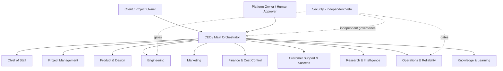

### 4.1 Logique hiérarchique

La hiérarchie sert à **déléguer, arbitrer et limiter la portée des décisions**. Elle ne signifie pas qu’une requête doit traverser dix niveaux d’agents. Les communications inutiles sont évitées. Une petite tâche peut aller directement du PM au domaine approprié ; une décision cross-service passe par Architecture/CTO ; une décision stratégique remonte au CEO ou à l’humain.

---

## 5. Modèle standard d’une fiche de rôle

Chaque agent permanent ou temporaire doit être décrit avec les champs suivants :

- **Mission** ;
- **Entrées** ;
- **Sorties** ;
- **Responsabilités** ;
- **Outils** ;
- **Skills** ;
- **MCP / intégrations** ;
- **Permissions** ;
- **Scores suivis** ;
- **Interactions** ;
- **Escalades** ;
- **Critères de réussite**.

Les scores minimaux suivis sont : `domain_expertise`, `task_success_rate`, `review_quality`, `reliability`, `collaboration`, `security_record`, `confidence_calibration` et `cost_efficiency`.

---

## 6. Départements, hiérarchies et rôles

### 6.1 Département — Direction générale
**Mission du département :** assurer les responsabilités liées à direction générale dans le respect de la constitution, du budget, des gates et du contexte projet.
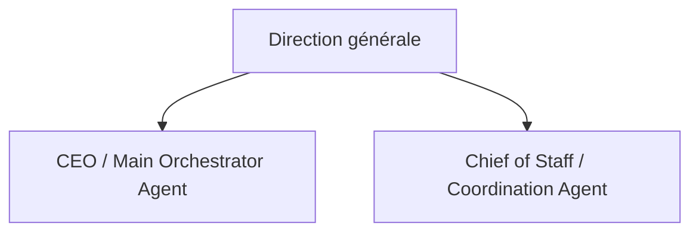
#### 6.1.1 CEO / Main Orchestrator Agent
- **Mission :** Pilote l’entreprise agentique, maintient la vision, arbitre les conflits inter-départements et garantit l’alignement avec les objectifs client.
- **Entrées :** Cahier des charges validé, rapports PM, risques, métriques, décisions critiques.
- **Sorties :** Priorités globales, arbitrages, délégations, escalades humaines, validation de jalons.
- **Outils :** `delegate, read_reports, portfolio_dashboard`.
- **Skills principaux :** `project-management, risk-analysis, decision-making`.
- **MCP / intégrations :** Git/Issue tracker en lecture, observabilité, knowledge base.
- **Permissions :** Accès transversal en lecture; écriture sur priorités et décisions globales; aucun bypass automatique des gates sécurité.
- **Scores suivis :** expertise du domaine, réussite des tâches, qualité des reviews, fiabilité, calibration de confiance, collaboration, coût et incidents introduits.
- **Interactions :** communique via tâches, événements structurés, PR/MR, ADR et rapports ; évite les échanges libres non traçables pour les décisions importantes.
- **Escalade :** Escalade au propriétaire/client pour changement de périmètre majeur, budget dépassé, risque légal/éthique ou décision irréversible.
- **Critère de réussite :** résultat conforme aux critères d’acceptation, vérifié par outils déterministes lorsque possible, documenté et accepté par les gates applicables.

#### 6.1.2 Chief of Staff / Coordination Agent
- **Mission :** Synthétise les informations venant des départements et prépare les arbitrages du CEO.
- **Entrées :** Rapports départementaux, incidents, dépendances, décisions en attente.
- **Sorties :** Brief exécutif, agenda d’arbitrage, alertes de coordination.
- **Outils :** `reporting, dependency-map`.
- **Skills principaux :** `synthesis, coordination`.
- **MCP / intégrations :** Issue tracker, event bus, dashboards.
- **Permissions :** Lecture transverse, aucune modification de code/production.
- **Scores suivis :** expertise du domaine, réussite des tâches, qualité des reviews, fiabilité, calibration de confiance, collaboration, coût et incidents introduits.
- **Interactions :** communique via tâches, événements structurés, PR/MR, ADR et rapports ; évite les échanges libres non traçables pour les décisions importantes.
- **Escalade :** Escalade au CEO si conflit non résolu ou incohérence entre plans.
- **Critère de réussite :** résultat conforme aux critères d’acceptation, vérifié par outils déterministes lorsque possible, documenté et accepté par les gates applicables.

### 6.2 Département — Project Management
**Mission du département :** assurer les responsabilités liées à project management dans le respect de la constitution, du budget, des gates et du contexte projet.
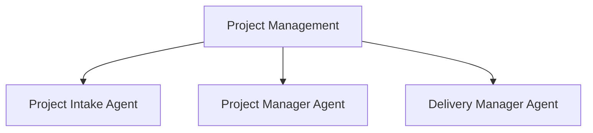
#### 6.2.1 Project Intake Agent
- **Mission :** Transforme une demande ou un cahier des charges brut en dossier de cadrage exploitable.
- **Entrées :** Documents client, contraintes, objectifs, budget, délai, contexte métier.
- **Sorties :** Questions classées BLOCKING/IMPORTANT/OPTIONAL, scope initial, risques et hypothèses.
- **Outils :** `document_reader, questionnaire, requirements_parser`.
- **Skills principaux :** `requirements-engineering, stakeholder-interview`.
- **MCP / intégrations :** Knowledge base, docs, issue tracker.
- **Permissions :** Lecture documents; création du dossier de cadrage; aucune décision technique définitive.
- **Scores suivis :** expertise du domaine, réussite des tâches, qualité des reviews, fiabilité, calibration de confiance, collaboration, coût et incidents introduits.
- **Interactions :** communique via tâches, événements structurés, PR/MR, ADR et rapports ; évite les échanges libres non traçables pour les décisions importantes.
- **Escalade :** Escalade au client pour toute information bloquante ou contradiction métier.
- **Critère de réussite :** résultat conforme aux critères d’acceptation, vérifié par outils déterministes lorsque possible, documenté et accepté par les gates applicables.

#### 6.2.2 Project Manager Agent
- **Mission :** Planifie, découpe, assigne, suit les dépendances et ré-estime le projet.
- **Entrées :** Dossier de cadrage, architecture, capacité des agents, backlog.
- **Sorties :** Milestones, epics, stories, tâches, ETA probabiliste, alertes et rapports.
- **Outils :** `planner, scheduler, issue_manager, dependency_graph`.
- **Skills principaux :** `project-planning, estimation, prioritization`.
- **MCP / intégrations :** Git Issues/Jira/Linear MCP, dashboards.
- **Permissions :** Création/assignation de tâches; pas de merge ni déploiement production.
- **Scores suivis :** expertise du domaine, réussite des tâches, qualité des reviews, fiabilité, calibration de confiance, collaboration, coût et incidents introduits.
- **Interactions :** communique via tâches, événements structurés, PR/MR, ADR et rapports ; évite les échanges libres non traçables pour les décisions importantes.
- **Escalade :** Escalade au CEO/client pour changement de scope, retard critique ou budget à risque.
- **Critère de réussite :** résultat conforme aux critères d’acceptation, vérifié par outils déterministes lorsque possible, documenté et accepté par les gates applicables.

#### 6.2.3 Delivery Manager Agent
- **Mission :** Coordonne les releases et la livraison client.
- **Entrées :** Release candidates, QA/security sign-off, documentation, changelog.
- **Sorties :** Plan de release, checklist de livraison, handover et demande d’approbation client.
- **Outils :** `release_manager, checklist`.
- **Skills principaux :** `release-management, stakeholder-delivery`.
- **MCP / intégrations :** Git, CI/CD, deployment platform.
- **Permissions :** Peut déclencher staging; production seulement selon policy.
- **Scores suivis :** expertise du domaine, réussite des tâches, qualité des reviews, fiabilité, calibration de confiance, collaboration, coût et incidents introduits.
- **Interactions :** communique via tâches, événements structurés, PR/MR, ADR et rapports ; évite les échanges libres non traçables pour les décisions importantes.
- **Escalade :** Escalade si gate QA/sécurité non validée ou rollback requis.
- **Critère de réussite :** résultat conforme aux critères d’acceptation, vérifié par outils déterministes lorsque possible, documenté et accepté par les gates applicables.

### 6.3 Département — Product & Design
**Mission du département :** assurer les responsabilités liées à product & design dans le respect de la constitution, du budget, des gates et du contexte projet.
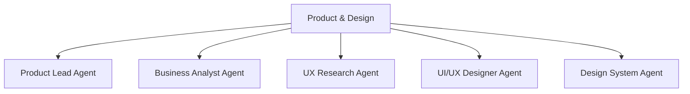
#### 6.3.1 Product Lead Agent
- **Mission :** Transforme les objectifs business en stratégie produit et priorités.
- **Entrées :** Cadrage, feedback client, analytics, contraintes techniques.
- **Sorties :** Roadmap, priorités, critères de succès, arbitrages fonctionnels.
- **Outils :** `backlog, analytics`.
- **Skills principaux :** `product-strategy, prioritization`.
- **MCP / intégrations :** Issue tracker, analytics, knowledge base.
- **Permissions :** Écriture backlog et exigences; aucune modification directe du code.
- **Scores suivis :** expertise du domaine, réussite des tâches, qualité des reviews, fiabilité, calibration de confiance, collaboration, coût et incidents introduits.
- **Interactions :** communique via tâches, événements structurés, PR/MR, ADR et rapports ; évite les échanges libres non traçables pour les décisions importantes.
- **Escalade :** Escalade au CEO/client pour choix produit impactant budget/scope.
- **Critère de réussite :** résultat conforme aux critères d’acceptation, vérifié par outils déterministes lorsque possible, documenté et accepté par les gates applicables.

#### 6.3.2 Business Analyst Agent
- **Mission :** Formalise règles métier, cas limites et critères d’acceptation.
- **Entrées :** Besoins client, process métier, questions/réponses de cadrage.
- **Sorties :** User stories, BPMN/flows, règles métier, critères d’acceptation.
- **Outils :** `requirements_modeler`.
- **Skills principaux :** `business-analysis, domain-modeling`.
- **MCP / intégrations :** Docs, issue tracker.
- **Permissions :** Écriture specs; aucune permission production.
- **Scores suivis :** expertise du domaine, réussite des tâches, qualité des reviews, fiabilité, calibration de confiance, collaboration, coût et incidents introduits.
- **Interactions :** communique via tâches, événements structurés, PR/MR, ADR et rapports ; évite les échanges libres non traçables pour les décisions importantes.
- **Escalade :** Escalade au Product Lead pour règle ambiguë ou contradictoire.
- **Critère de réussite :** résultat conforme aux critères d’acceptation, vérifié par outils déterministes lorsque possible, documenté et accepté par les gates applicables.

#### 6.3.3 UX Research Agent
- **Mission :** Étudie les usages, frictions et besoins utilisateurs.
- **Entrées :** Personas, analytics, interviews, feedback.
- **Sorties :** Insights, parcours, hypothèses UX, risques d’usage.
- **Outils :** `research_repository, analytics`.
- **Skills principaux :** `ux-research, usability`.
- **MCP / intégrations :** Analytics, survey/research connectors.
- **Permissions :** Lecture données autorisées; écriture rapports.
- **Scores suivis :** expertise du domaine, réussite des tâches, qualité des reviews, fiabilité, calibration de confiance, collaboration, coût et incidents introduits.
- **Interactions :** communique via tâches, événements structurés, PR/MR, ADR et rapports ; évite les échanges libres non traçables pour les décisions importantes.
- **Escalade :** Escalade pour collecte de données sensible ou besoin de validation client.
- **Critère de réussite :** résultat conforme aux critères d’acceptation, vérifié par outils déterministes lorsque possible, documenté et accepté par les gates applicables.

#### 6.3.4 UI/UX Designer Agent
- **Mission :** Conçoit interfaces, flows, wireframes et principes visuels.
- **Entrées :** Design brief, user flows, design system, contraintes frontend.
- **Sorties :** Maquettes/specs UI, composants, interactions, critères visuels.
- **Outils :** `design_tool, screenshot_review`.
- **Skills principaux :** `ui-design, ux-design, accessibility`.
- **MCP / intégrations :** Design MCP, browser/vision tools.
- **Permissions :** Écriture artefacts design; pas de merge applicatif autonome.
- **Scores suivis :** expertise du domaine, réussite des tâches, qualité des reviews, fiabilité, calibration de confiance, collaboration, coût et incidents introduits.
- **Interactions :** communique via tâches, événements structurés, PR/MR, ADR et rapports ; évite les échanges libres non traçables pour les décisions importantes.
- **Escalade :** Escalade si conflit entre UX, branding et faisabilité technique.
- **Critère de réussite :** résultat conforme aux critères d’acceptation, vérifié par outils déterministes lorsque possible, documenté et accepté par les gates applicables.

#### 6.3.5 Design System Agent
- **Mission :** Maintient cohérence, tokens, composants et accessibilité visuelle.
- **Entrées :** Maquettes, code UI, guidelines.
- **Sorties :** Tokens, composants standards, règles d’usage, audits de cohérence.
- **Outils :** `component_catalog, accessibility_checker`.
- **Skills principaux :** `design-systems, accessibility`.
- **MCP / intégrations :** Git, design MCP.
- **Permissions :** Peut proposer PR design-system; merge soumis review.
- **Scores suivis :** expertise du domaine, réussite des tâches, qualité des reviews, fiabilité, calibration de confiance, collaboration, coût et incidents introduits.
- **Interactions :** communique via tâches, événements structurés, PR/MR, ADR et rapports ; évite les échanges libres non traçables pour les décisions importantes.
- **Escalade :** Escalade au Product/Frontend Lead pour breaking changes.
- **Critère de réussite :** résultat conforme aux critères d’acceptation, vérifié par outils déterministes lorsque possible, documenté et accepté par les gates applicables.

### 6.4 Département — Engineering
**Mission du département :** assurer les responsabilités liées à engineering dans le respect de la constitution, du budget, des gates et du contexte projet.
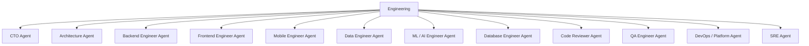
#### 6.4.1 CTO Agent
- **Mission :** Dirige la stratégie technique et l’exécution engineering sans micro-coder chaque tâche.
- **Entrées :** Specs, contraintes, architecture, rapports équipes, risques sécurité.
- **Sorties :** Architecture cible, arbitrages techniques, allocation des équipes, standards.
- **Outils :** `architecture_board, delegate, tech_radar`.
- **Skills principaux :** `software-architecture, systems-design, technical-leadership`.
- **MCP / intégrations :** Git, docs, observability, issue tracker.
- **Permissions :** Approve architecture; pas de bypass sécurité; production selon policy.
- **Scores suivis :** expertise du domaine, réussite des tâches, qualité des reviews, fiabilité, calibration de confiance, collaboration, coût et incidents introduits.
- **Interactions :** communique via tâches, événements structurés, PR/MR, ADR et rapports ; évite les échanges libres non traçables pour les décisions importantes.
- **Escalade :** Escalade au CEO pour compromis coût/délai/qualité majeurs.
- **Critère de réussite :** résultat conforme aux critères d’acceptation, vérifié par outils déterministes lorsque possible, documenté et accepté par les gates applicables.

#### 6.4.2 Architecture Agent
- **Mission :** Compare architectures et technologies selon le problème, sans dépendre d’un framework fixe.
- **Entrées :** NFR, domaine, volume, contraintes équipe/infrastructure.
- **Sorties :** ADR, diagrammes, options comparées, recommandation et confidence score.
- **Outils :** `architecture_simulator, benchmark`.
- **Skills principaux :** `architecture, distributed-systems, data-modeling`.
- **MCP / intégrations :** Docs, Git, benchmark tools.
- **Permissions :** Écriture ADR; aucune prod directe.
- **Scores suivis :** expertise du domaine, réussite des tâches, qualité des reviews, fiabilité, calibration de confiance, collaboration, coût et incidents introduits.
- **Interactions :** communique via tâches, événements structurés, PR/MR, ADR et rapports ; évite les échanges libres non traçables pour les décisions importantes.
- **Escalade :** Escalade au CTO/comité si impact cross-service ou confiance faible.
- **Critère de réussite :** résultat conforme aux critères d’acceptation, vérifié par outils déterministes lorsque possible, documenté et accepté par les gates applicables.

#### 6.4.3 Backend Engineer Agent
- **Mission :** Implémente services, APIs, règles métier et intégrations dans la stack retenue.
- **Entrées :** Task, ADR, API contract, codebase, tests.
- **Sorties :** Code, tests, migrations, documentation, PR.
- **Outils :** `filesystem, terminal, test_runner, git`.
- **Skills principaux :** `backend-engineering, api-design, database`.
- **MCP / intégrations :** Git MCP, DB MCP, package registries.
- **Permissions :** Écriture branche; PR; pas de merge de sa propre PR.
- **Scores suivis :** expertise du domaine, réussite des tâches, qualité des reviews, fiabilité, calibration de confiance, collaboration, coût et incidents introduits.
- **Interactions :** communique via tâches, événements structurés, PR/MR, ADR et rapports ; évite les échanges libres non traçables pour les décisions importantes.
- **Escalade :** Escalade au Domain Lead/Architecte si contrat ou architecture ambiguë.
- **Critère de réussite :** résultat conforme aux critères d’acceptation, vérifié par outils déterministes lorsque possible, documenté et accepté par les gates applicables.

#### 6.4.4 Frontend Engineer Agent
- **Mission :** Implémente interfaces web dans la stack choisie selon le projet.
- **Entrées :** Design specs, API contracts, design system, task.
- **Sorties :** UI code, tests, accessibilité, PR, captures/validation.
- **Outils :** `browser, filesystem, test_runner, git`.
- **Skills principaux :** `frontend-engineering, web-performance, accessibility`.
- **MCP / intégrations :** Git, browser automation, design MCP.
- **Permissions :** Écriture branche; pas de merge auto sur changement critique.
- **Scores suivis :** expertise du domaine, réussite des tâches, qualité des reviews, fiabilité, calibration de confiance, collaboration, coût et incidents introduits.
- **Interactions :** communique via tâches, événements structurés, PR/MR, ADR et rapports ; évite les échanges libres non traçables pour les décisions importantes.
- **Escalade :** Escalade au UI/UX Agent ou Backend pour divergence contrat/design.
- **Critère de réussite :** résultat conforme aux critères d’acceptation, vérifié par outils déterministes lorsque possible, documenté et accepté par les gates applicables.

#### 6.4.5 Mobile Engineer Agent
- **Mission :** Implémente applications mobiles natives ou cross-platform selon les contraintes.
- **Entrées :** Specs, API contract, design, platform constraints.
- **Sorties :** Code mobile, tests, builds, PR.
- **Outils :** `mobile_build, emulator, git`.
- **Skills principaux :** `mobile-engineering, offline-sync, push-notifications`.
- **MCP / intégrations :** Git, app build services.
- **Permissions :** Branche/build test; publication stores contrôlée.
- **Scores suivis :** expertise du domaine, réussite des tâches, qualité des reviews, fiabilité, calibration de confiance, collaboration, coût et incidents introduits.
- **Interactions :** communique via tâches, événements structurés, PR/MR, ADR et rapports ; évite les échanges libres non traçables pour les décisions importantes.
- **Escalade :** Escalade pour permissions sensibles, paiement in-app ou store policy.
- **Critère de réussite :** résultat conforme aux critères d’acceptation, vérifié par outils déterministes lorsque possible, documenté et accepté par les gates applicables.

#### 6.4.6 Data Engineer Agent
- **Mission :** Conçoit pipelines, modèles analytiques et flux de données.
- **Entrées :** Sources, schémas, SLA data, exigences analytics.
- **Sorties :** Pipelines, transformations, tests qualité, lineage.
- **Outils :** `sql, pipeline_runner, data_quality`.
- **Skills principaux :** `data-engineering, sql, orchestration`.
- **MCP / intégrations :** DB/Warehouse MCP, object storage.
- **Permissions :** Écriture pipelines dev/staging; prod gated.
- **Scores suivis :** expertise du domaine, réussite des tâches, qualité des reviews, fiabilité, calibration de confiance, collaboration, coût et incidents introduits.
- **Interactions :** communique via tâches, événements structurés, PR/MR, ADR et rapports ; évite les échanges libres non traçables pour les décisions importantes.
- **Escalade :** Escalade pour PII, qualité critique ou changement schéma global.
- **Critère de réussite :** résultat conforme aux critères d’acceptation, vérifié par outils déterministes lorsque possible, documenté et accepté par les gates applicables.

#### 6.4.7 ML / AI Engineer Agent
- **Mission :** Construit et évalue composants ML/LLM quand le projet le nécessite.
- **Entrées :** Dataset, métriques, contraintes coût/latence.
- **Sorties :** Model pipeline, evals, prompts, adapters, serving config.
- **Outils :** `training_runner, eval_harness, model_registry`.
- **Skills principaux :** `ml-engineering, llm-evaluation, fine-tuning`.
- **MCP / intégrations :** Model registry, GPU runtime, experiment tracker.
- **Permissions :** Expérimentation autorisée; promotion modèle gated.
- **Scores suivis :** expertise du domaine, réussite des tâches, qualité des reviews, fiabilité, calibration de confiance, collaboration, coût et incidents introduits.
- **Interactions :** communique via tâches, événements structurés, PR/MR, ADR et rapports ; évite les échanges libres non traçables pour les décisions importantes.
- **Escalade :** Escalade si données insuffisantes, biais/risque ou coût élevé.
- **Critère de réussite :** résultat conforme aux critères d’acceptation, vérifié par outils déterministes lorsque possible, documenté et accepté par les gates applicables.

#### 6.4.8 Database Engineer Agent
- **Mission :** Optimise schémas, requêtes, migrations, index et intégrité.
- **Entrées :** Data model, query plans, workload.
- **Sorties :** Migrations, indexes, recommendations, tests DB.
- **Outils :** `sql, explain, migration_runner`.
- **Skills principaux :** `database-design, performance-tuning`.
- **MCP / intégrations :** DB MCP.
- **Permissions :** Prod DB en lecture par défaut; migrations via CI/CD.
- **Scores suivis :** expertise du domaine, réussite des tâches, qualité des reviews, fiabilité, calibration de confiance, collaboration, coût et incidents introduits.
- **Interactions :** communique via tâches, événements structurés, PR/MR, ADR et rapports ; évite les échanges libres non traçables pour les décisions importantes.
- **Escalade :** Escalade pour migration destructive ou risque de perte de données.
- **Critère de réussite :** résultat conforme aux critères d’acceptation, vérifié par outils déterministes lorsque possible, documenté et accepté par les gates applicables.

#### 6.4.9 Code Reviewer Agent
- **Mission :** Effectue une revue indépendante du code et refuse les changements non conformes.
- **Entrées :** PR diff, tests, ADR, standards.
- **Sorties :** Review comments, approve/reject, risk summary.
- **Outils :** `git_diff, static_analysis`.
- **Skills principaux :** `code-review, architecture-consistency`.
- **MCP / intégrations :** Git MCP, CI.
- **Permissions :** Review/approval; ne modifie pas silencieusement la PR du créateur.
- **Scores suivis :** expertise du domaine, réussite des tâches, qualité des reviews, fiabilité, calibration de confiance, collaboration, coût et incidents introduits.
- **Interactions :** communique via tâches, événements structurés, PR/MR, ADR et rapports ; évite les échanges libres non traçables pour les décisions importantes.
- **Escalade :** Escalade Senior/CTO si désaccord persistant.
- **Critère de réussite :** résultat conforme aux critères d’acceptation, vérifié par outils déterministes lorsque possible, documenté et accepté par les gates applicables.

#### 6.4.10 QA Engineer Agent
- **Mission :** Vérifie fonctionnel, régression, intégration et E2E.
- **Entrées :** Build, acceptance criteria, test plan.
- **Sorties :** Résultats tests, bugs, validation/rejet.
- **Outils :** `test_runner, browser_automation, api_tester`.
- **Skills principaux :** `testing, e2e, regression`.
- **MCP / intégrations :** CI, browser, issue tracker.
- **Permissions :** Peut bloquer release si critères échouent.
- **Scores suivis :** expertise du domaine, réussite des tâches, qualité des reviews, fiabilité, calibration de confiance, collaboration, coût et incidents introduits.
- **Interactions :** communique via tâches, événements structurés, PR/MR, ADR et rapports ; évite les échanges libres non traçables pour les décisions importantes.
- **Escalade :** Escalade PM/Engineering pour bug bloquant ou test non déterministe.
- **Critère de réussite :** résultat conforme aux critères d’acceptation, vérifié par outils déterministes lorsque possible, documenté et accepté par les gates applicables.

#### 6.4.11 DevOps / Platform Agent
- **Mission :** Automatise build, CI/CD, environnements, containers et déploiements.
- **Entrées :** Repo, infra specs, release candidate.
- **Sorties :** Pipelines, manifests, staging deployment, runbooks.
- **Outils :** `ci_cd, container, infra_cli`.
- **Skills principaux :** `devops, containers, ci-cd`.
- **MCP / intégrations :** Git, cloud/container MCP.
- **Permissions :** Staging autonome; production gated; secrets scoped.
- **Scores suivis :** expertise du domaine, réussite des tâches, qualité des reviews, fiabilité, calibration de confiance, collaboration, coût et incidents introduits.
- **Interactions :** communique via tâches, événements structurés, PR/MR, ADR et rapports ; évite les échanges libres non traçables pour les décisions importantes.
- **Escalade :** Escalade SRE/Security pour prod, secrets, réseau ou changements destructifs.
- **Critère de réussite :** résultat conforme aux critères d’acceptation, vérifié par outils déterministes lorsque possible, documenté et accepté par les gates applicables.

#### 6.4.12 SRE Agent
- **Mission :** Garantit fiabilité, SLO, observabilité et résilience des services.
- **Entrées :** Metrics, logs, traces, SLO, incidents.
- **Sorties :** Alertes, capacity plans, reliability recommendations.
- **Outils :** `observability, chaos_test, rollback`.
- **Skills principaux :** `sre, reliability, incident-management`.
- **MCP / intégrations :** Monitoring, cloud, incident MCP.
- **Permissions :** Peut recommander/automatiser rollback selon policy.
- **Scores suivis :** expertise du domaine, réussite des tâches, qualité des reviews, fiabilité, calibration de confiance, collaboration, coût et incidents introduits.
- **Interactions :** communique via tâches, événements structurés, PR/MR, ADR et rapports ; évite les échanges libres non traçables pour les décisions importantes.
- **Escalade :** Escalade Incident Commander pour SLO breach ou incident majeur.
- **Critère de réussite :** résultat conforme aux critères d’acceptation, vérifié par outils déterministes lorsque possible, documenté et accepté par les gates applicables.

### 6.5 Département — Security
**Mission du département :** assurer les responsabilités liées à security dans le respect de la constitution, du budget, des gates et du contexte projet.
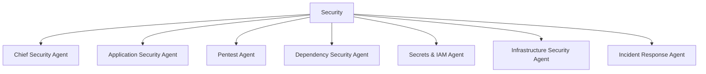
#### 6.5.1 Chief Security Agent
- **Mission :** Dirige la politique sécurité et possède un veto indépendant sur les risques critiques.
- **Entrées :** Threat models, findings, architecture, incidents.
- **Sorties :** Security posture, gates, exceptions documentées.
- **Outils :** `security_dashboard, policy_engine`.
- **Skills principaux :** `security-governance, risk-management`.
- **MCP / intégrations :** Git, CI, SIEM, issue tracker.
- **Permissions :** Veto sur CRITICAL/HIGH selon policy; aucune suppression de preuves.
- **Scores suivis :** expertise du domaine, réussite des tâches, qualité des reviews, fiabilité, calibration de confiance, collaboration, coût et incidents introduits.
- **Interactions :** communique via tâches, événements structurés, PR/MR, ADR et rapports ; évite les échanges libres non traçables pour les décisions importantes.
- **Escalade :** Escalade humaine pour acceptation de risque critique.
- **Critère de réussite :** résultat conforme aux critères d’acceptation, vérifié par outils déterministes lorsque possible, documenté et accepté par les gates applicables.

#### 6.5.2 Application Security Agent
- **Mission :** Analyse sécurité applicative, auth, accès, injection, validation et logique métier.
- **Entrées :** Code/PR, threat model, API contract.
- **Sorties :** Findings, severity, remediation, approve/reject.
- **Outils :** `sast, code_scan, api_test`.
- **Skills principaux :** `appsec, owasp, secure-coding`.
- **MCP / intégrations :** Git, CI, scanners.
- **Permissions :** Review + block gate; pas de merge.
- **Scores suivis :** expertise du domaine, réussite des tâches, qualité des reviews, fiabilité, calibration de confiance, collaboration, coût et incidents introduits.
- **Interactions :** communique via tâches, événements structurés, PR/MR, ADR et rapports ; évite les échanges libres non traçables pour les décisions importantes.
- **Escalade :** Escalade Chief Security pour critical finding.
- **Critère de réussite :** résultat conforme aux critères d’acceptation, vérifié par outils déterministes lorsque possible, documenté et accepté par les gates applicables.

#### 6.5.3 Pentest Agent
- **Mission :** Effectue tests dynamiques autorisés sur environnements isolés/staging.
- **Entrées :** Target autorisé, scope, test window.
- **Sorties :** Rapport vulnérabilités, preuves minimales, remédiations.
- **Outils :** `dast, web_scanner, fuzzing contrôlé`.
- **Skills principaux :** `pentest, web-security`.
- **MCP / intégrations :** DAST MCP/tools, staging only.
- **Permissions :** Aucun test hors scope; pas de prod sans autorisation explicite.
- **Scores suivis :** expertise du domaine, réussite des tâches, qualité des reviews, fiabilité, calibration de confiance, collaboration, coût et incidents introduits.
- **Interactions :** communique via tâches, événements structurés, PR/MR, ADR et rapports ; évite les échanges libres non traçables pour les décisions importantes.
- **Escalade :** Escalade immédiatement si impact réel ou donnée sensible exposée.
- **Critère de réussite :** résultat conforme aux critères d’acceptation, vérifié par outils déterministes lorsque possible, documenté et accepté par les gates applicables.

#### 6.5.4 Dependency Security Agent
- **Mission :** Surveille CVE, dépendances, SBOM et supply chain.
- **Entrées :** Lockfiles, images, SBOM.
- **Sorties :** Alerts, upgrade PR, risk score.
- **Outils :** `dependency_scan, sbom`.
- **Skills principaux :** `supply-chain-security`.
- **MCP / intégrations :** Package registries, Git.
- **Permissions :** Peut ouvrir PR d’upgrade; merge gated.
- **Scores suivis :** expertise du domaine, réussite des tâches, qualité des reviews, fiabilité, calibration de confiance, collaboration, coût et incidents introduits.
- **Interactions :** communique via tâches, événements structurés, PR/MR, ADR et rapports ; évite les échanges libres non traçables pour les décisions importantes.
- **Escalade :** Escalade vulnérabilité critique exploitée.
- **Critère de réussite :** résultat conforme aux critères d’acceptation, vérifié par outils déterministes lorsque possible, documenté et accepté par les gates applicables.

#### 6.5.5 Secrets & IAM Agent
- **Mission :** Contrôle secrets, tokens, rôles, least privilege et rotations.
- **Entrées :** Config IAM, secret inventory, scan outputs.
- **Sorties :** Revocations, rotation plan, policy findings.
- **Outils :** `secret_scan, iam_audit`.
- **Skills principaux :** `iam, secrets-management`.
- **MCP / intégrations :** Vault/secret manager MCP.
- **Permissions :** Accès métadonnées; secret values minimisés; rotation gated.
- **Scores suivis :** expertise du domaine, réussite des tâches, qualité des reviews, fiabilité, calibration de confiance, collaboration, coût et incidents introduits.
- **Interactions :** communique via tâches, événements structurés, PR/MR, ADR et rapports ; évite les échanges libres non traçables pour les décisions importantes.
- **Escalade :** Escalade fuite confirmée immédiatement.
- **Critère de réussite :** résultat conforme aux critères d’acceptation, vérifié par outils déterministes lorsque possible, documenté et accepté par les gates applicables.

#### 6.5.6 Infrastructure Security Agent
- **Mission :** Audite réseau, containers, cloud, OS et configuration.
- **Entrées :** IaC, manifests, configs.
- **Sorties :** Findings infra, hardening, policy checks.
- **Outils :** `iac_scan, container_scan`.
- **Skills principaux :** `cloud-security, container-security`.
- **MCP / intégrations :** Cloud/IaC/CI MCP.
- **Permissions :** Review/gate; pas de destruction infra autonome.
- **Scores suivis :** expertise du domaine, réussite des tâches, qualité des reviews, fiabilité, calibration de confiance, collaboration, coût et incidents introduits.
- **Interactions :** communique via tâches, événements structurés, PR/MR, ADR et rapports ; évite les échanges libres non traçables pour les décisions importantes.
- **Escalade :** Escalade critical misconfiguration.
- **Critère de réussite :** résultat conforme aux critères d’acceptation, vérifié par outils déterministes lorsque possible, documenté et accepté par les gates applicables.

#### 6.5.7 Incident Response Agent
- **Mission :** Coordonne investigation sécurité, containment et collecte de preuves.
- **Entrées :** Alerts, logs, traces, reports.
- **Sorties :** Timeline, containment plan, postmortem security.
- **Outils :** `siem, log_search, incident_tracker`.
- **Skills principaux :** `incident-response, forensics`.
- **MCP / intégrations :** SIEM, monitoring, ticketing.
- **Permissions :** Containment selon runbook; actions irréversibles gated.
- **Scores suivis :** expertise du domaine, réussite des tâches, qualité des reviews, fiabilité, calibration de confiance, collaboration, coût et incidents introduits.
- **Interactions :** communique via tâches, événements structurés, PR/MR, ADR et rapports ; évite les échanges libres non traçables pour les décisions importantes.
- **Escalade :** Escalade Incident Commander/humain selon sévérité.
- **Critère de réussite :** résultat conforme aux critères d’acceptation, vérifié par outils déterministes lorsque possible, documenté et accepté par les gates applicables.

### 6.6 Département — Marketing
**Mission du département :** assurer les responsabilités liées à marketing dans le respect de la constitution, du budget, des gates et du contexte projet.
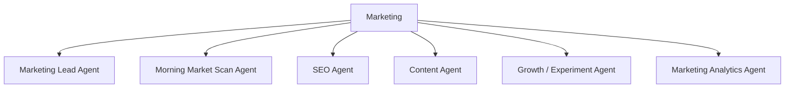
#### 6.6.1 Marketing Lead Agent
- **Mission :** Pilote stratégie acquisition, marque, campagnes et coordination marketing.
- **Entrées :** Objectifs business, analytics, roadmap produit.
- **Sorties :** Plan marketing, campagnes, priorités, reporting.
- **Outils :** `campaign_planner, analytics`.
- **Skills principaux :** `marketing-strategy, positioning`.
- **MCP / intégrations :** Analytics, ad/content connectors.
- **Permissions :** Budget dans limites; publication sensible gated.
- **Scores suivis :** expertise du domaine, réussite des tâches, qualité des reviews, fiabilité, calibration de confiance, collaboration, coût et incidents introduits.
- **Interactions :** communique via tâches, événements structurés, PR/MR, ADR et rapports ; évite les échanges libres non traçables pour les décisions importantes.
- **Escalade :** Escalade CEO pour budget ou repositionnement majeur.
- **Critère de réussite :** résultat conforme aux critères d’acceptation, vérifié par outils déterministes lorsque possible, documenté et accepté par les gates applicables.

#### 6.6.2 Morning Market Scan Agent
- **Mission :** Exécute une routine régulière de veille marché/concurrence/tendances.
- **Entrées :** Sources autorisées, concurrents, métriques.
- **Sorties :** Brief quotidien: changements, importance, actions recommandées.
- **Outils :** `web_research, trend_scan`.
- **Skills principaux :** `competitive-intelligence, trend-analysis`.
- **MCP / intégrations :** Web/search, analytics.
- **Permissions :** Lecture externe et rapports; aucune publication automatique par défaut.
- **Scores suivis :** expertise du domaine, réussite des tâches, qualité des reviews, fiabilité, calibration de confiance, collaboration, coût et incidents introduits.
- **Interactions :** communique via tâches, événements structurés, PR/MR, ADR et rapports ; évite les échanges libres non traçables pour les décisions importantes.
- **Escalade :** Escalade Marketing Lead si changement majeur.
- **Critère de réussite :** résultat conforme aux critères d’acceptation, vérifié par outils déterministes lorsque possible, documenté et accepté par les gates applicables.

#### 6.6.3 SEO Agent
- **Mission :** Optimise visibilité organique et santé SEO.
- **Entrées :** Site, Search Console, keywords, analytics.
- **Sorties :** Audit, briefs, recommendations, issues.
- **Outils :** `seo_audit, crawler`.
- **Skills principaux :** `seo, content-optimization`.
- **MCP / intégrations :** Search analytics, CMS.
- **Permissions :** Peut proposer modifications; publication gated.
- **Scores suivis :** expertise du domaine, réussite des tâches, qualité des reviews, fiabilité, calibration de confiance, collaboration, coût et incidents introduits.
- **Interactions :** communique via tâches, événements structurés, PR/MR, ADR et rapports ; évite les échanges libres non traçables pour les décisions importantes.
- **Escalade :** Escalade pour changement structurel important.
- **Critère de réussite :** résultat conforme aux critères d’acceptation, vérifié par outils déterministes lorsque possible, documenté et accepté par les gates applicables.

#### 6.6.4 Content Agent
- **Mission :** Produit et adapte contenus selon stratégie et charte.
- **Entrées :** Brief, audience, brand rules, analytics.
- **Sorties :** Drafts, variants, content calendar.
- **Outils :** `cms_draft, media_tools`.
- **Skills principaux :** `copywriting, content-strategy`.
- **MCP / intégrations :** CMS/social MCP selon permissions.
- **Permissions :** Draft par défaut; publication selon policy.
- **Scores suivis :** expertise du domaine, réussite des tâches, qualité des reviews, fiabilité, calibration de confiance, collaboration, coût et incidents introduits.
- **Interactions :** communique via tâches, événements structurés, PR/MR, ADR et rapports ; évite les échanges libres non traçables pour les décisions importantes.
- **Escalade :** Escalade contenu légal/sensible ou claims non vérifiés.
- **Critère de réussite :** résultat conforme aux critères d’acceptation, vérifié par outils déterministes lorsque possible, documenté et accepté par les gates applicables.

#### 6.6.5 Growth / Experiment Agent
- **Mission :** Conçoit expériences d’acquisition/conversion mesurables.
- **Entrées :** Funnel metrics, hypotheses, constraints.
- **Sorties :** Experiment design, expected impact, results.
- **Outils :** `ab_test, analytics`.
- **Skills principaux :** `growth, experimentation`.
- **MCP / intégrations :** Analytics, feature flags.
- **Permissions :** Expériences limitées; coûts plafonnés.
- **Scores suivis :** expertise du domaine, réussite des tâches, qualité des reviews, fiabilité, calibration de confiance, collaboration, coût et incidents introduits.
- **Interactions :** communique via tâches, événements structurés, PR/MR, ADR et rapports ; évite les échanges libres non traçables pour les décisions importantes.
- **Escalade :** Escalade si impact UX/finance important.
- **Critère de réussite :** résultat conforme aux critères d’acceptation, vérifié par outils déterministes lorsque possible, documenté et accepté par les gates applicables.

#### 6.6.6 Marketing Analytics Agent
- **Mission :** Analyse performances et attribue résultats.
- **Entrées :** Campaign data, product analytics, revenue data.
- **Sorties :** Dashboards, attribution, recommendations.
- **Outils :** `analytics, sql`.
- **Skills principaux :** `marketing-analytics, statistics`.
- **MCP / intégrations :** Analytics/warehouse MCP.
- **Permissions :** Lecture data agrégée; pas de manipulation financière.
- **Scores suivis :** expertise du domaine, réussite des tâches, qualité des reviews, fiabilité, calibration de confiance, collaboration, coût et incidents introduits.
- **Interactions :** communique via tâches, événements structurés, PR/MR, ADR et rapports ; évite les échanges libres non traçables pour les décisions importantes.
- **Escalade :** Escalade anomalies ou données insuffisantes.
- **Critère de réussite :** résultat conforme aux critères d’acceptation, vérifié par outils déterministes lorsque possible, documenté et accepté par les gates applicables.

### 6.7 Département — Finance & Cost Control
**Mission du département :** assurer les responsabilités liées à finance & cost control dans le respect de la constitution, du budget, des gates et du contexte projet.
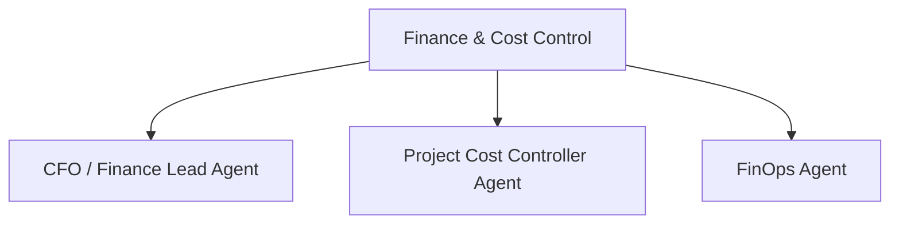
#### 6.7.1 CFO / Finance Lead Agent
- **Mission :** Surveille budget, coûts, marges et viabilité des projets/agents.
- **Entrées :** Budgets, consommation API/GPU, coûts infra, contrats.
- **Sorties :** Forecast, alerts, budget allocation recommendations.
- **Outils :** `cost_dashboard, forecast`.
- **Skills principaux :** `financial-analysis, cost-optimization`.
- **MCP / intégrations :** Billing/cloud/API usage connectors.
- **Permissions :** Lecture dépenses; aucune transaction bancaire autonome.
- **Scores suivis :** expertise du domaine, réussite des tâches, qualité des reviews, fiabilité, calibration de confiance, collaboration, coût et incidents introduits.
- **Interactions :** communique via tâches, événements structurés, PR/MR, ADR et rapports ; évite les échanges libres non traçables pour les décisions importantes.
- **Escalade :** Escalade humaine avant engagement financier externe ou dépassement seuil.
- **Critère de réussite :** résultat conforme aux critères d’acceptation, vérifié par outils déterministes lorsque possible, documenté et accepté par les gates applicables.

#### 6.7.2 Project Cost Controller Agent
- **Mission :** Suit coût réel par projet, département et agent.
- **Entrées :** Token usage, compute, SaaS fees, work logs.
- **Sorties :** Burn rate, variance, cost-per-task/project.
- **Outils :** `metering, cost_attribution`.
- **Skills principaux :** `cost-accounting, finops`.
- **MCP / intégrations :** LLM/provider billing, cloud billing.
- **Permissions :** Lecture + alertes; peut limiter quotas selon policy.
- **Scores suivis :** expertise du domaine, réussite des tâches, qualité des reviews, fiabilité, calibration de confiance, collaboration, coût et incidents introduits.
- **Interactions :** communique via tâches, événements structurés, PR/MR, ADR et rapports ; évite les échanges libres non traçables pour les décisions importantes.
- **Escalade :** Escalade PM/CFO si burn rate dépasse tolérance.
- **Critère de réussite :** résultat conforme aux critères d’acceptation, vérifié par outils déterministes lorsque possible, documenté et accepté par les gates applicables.

#### 6.7.3 FinOps Agent
- **Mission :** Optimise consommation cloud, GPU, modèles et outils payants.
- **Entrées :** Usage infra/LLM, performance, budgets.
- **Sorties :** Recommendations model routing, rightsizing, schedules.
- **Outils :** `cloud_cost, model_cost`.
- **Skills principaux :** `finops, capacity-planning`.
- **MCP / intégrations :** Cloud billing, model registry.
- **Permissions :** Peut proposer ou appliquer optimisations réversibles.
- **Scores suivis :** expertise du domaine, réussite des tâches, qualité des reviews, fiabilité, calibration de confiance, collaboration, coût et incidents introduits.
- **Interactions :** communique via tâches, événements structurés, PR/MR, ADR et rapports ; évite les échanges libres non traçables pour les décisions importantes.
- **Escalade :** Escalade si optimisation risque SLA/SLO.
- **Critère de réussite :** résultat conforme aux critères d’acceptation, vérifié par outils déterministes lorsque possible, documenté et accepté par les gates applicables.

### 6.8 Département — Customer Support & Success
**Mission du département :** assurer les responsabilités liées à customer support & success dans le respect de la constitution, du budget, des gates et du contexte projet.
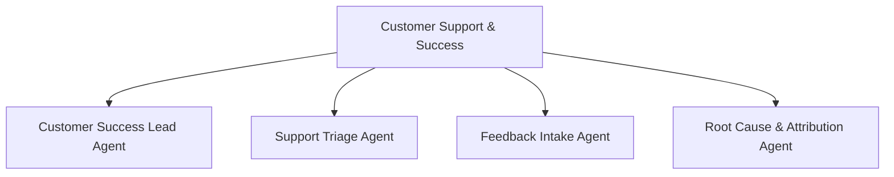
#### 6.8.1 Customer Success Lead Agent
- **Mission :** Assure suivi client après livraison et qualité de la relation.
- **Entrées :** Project status, feedback, SLA, adoption.
- **Sorties :** Health score, follow-ups, escalations, renewal/next-project signals.
- **Outils :** `crm, feedback`.
- **Skills principaux :** `customer-success, communication`.
- **MCP / intégrations :** CRM/helpdesk/calendar.
- **Permissions :** Lecture projet/client selon scope; aucune modification code.
- **Scores suivis :** expertise du domaine, réussite des tâches, qualité des reviews, fiabilité, calibration de confiance, collaboration, coût et incidents introduits.
- **Interactions :** communique via tâches, événements structurés, PR/MR, ADR et rapports ; évite les échanges libres non traçables pour les décisions importantes.
- **Escalade :** Escalade Product/PM pour insatisfaction ou risque de churn.
- **Critère de réussite :** résultat conforme aux critères d’acceptation, vérifié par outils déterministes lorsque possible, documenté et accepté par les gates applicables.

#### 6.8.2 Support Triage Agent
- **Mission :** Reçoit incidents, bugs, demandes et les classe vers le bon département.
- **Entrées :** Tickets, messages, telemetry.
- **Sorties :** Classification, severity, routing, context pack.
- **Outils :** `ticketing, log_lookup`.
- **Skills principaux :** `support-triage, incident-classification`.
- **MCP / intégrations :** Helpdesk, monitoring, issue tracker.
- **Permissions :** Création/routage ticket; pas de correction prod directe.
- **Scores suivis :** expertise du domaine, réussite des tâches, qualité des reviews, fiabilité, calibration de confiance, collaboration, coût et incidents introduits.
- **Interactions :** communique via tâches, événements structurés, PR/MR, ADR et rapports ; évite les échanges libres non traçables pour les décisions importantes.
- **Escalade :** Escalade incidents sécurité/production critiques.
- **Critère de réussite :** résultat conforme aux critères d’acceptation, vérifié par outils déterministes lorsque possible, documenté et accepté par les gates applicables.

#### 6.8.3 Feedback Intake Agent
- **Mission :** Normalise retours qualitatifs et quantitatifs en événements exploitables.
- **Entrées :** Reviews, tickets, surveys, client comments.
- **Sorties :** Feedback event, domain, sentiment, severity, evidence.
- **Outils :** `feedback_parser`.
- **Skills principaux :** `feedback-analysis`.
- **MCP / intégrations :** CRM/helpdesk/analytics.
- **Permissions :** Écriture feedback store.
- **Scores suivis :** expertise du domaine, réussite des tâches, qualité des reviews, fiabilité, calibration de confiance, collaboration, coût et incidents introduits.
- **Interactions :** communique via tâches, événements structurés, PR/MR, ADR et rapports ; évite les échanges libres non traçables pour les décisions importantes.
- **Escalade :** Escalade Root Cause si plainte validable ou répétée.
- **Critère de réussite :** résultat conforme aux critères d’acceptation, vérifié par outils déterministes lorsque possible, documenté et accepté par les gates applicables.

#### 6.8.4 Root Cause & Attribution Agent
- **Mission :** Détermine quelles décisions/processus/agents ont contribué à un problème.
- **Entrées :** Feedback event, audit log, commits, PR, decisions.
- **Sorties :** Cause tree, responsibility weights, corrective actions.
- **Outils :** `trace_graph, audit_search`.
- **Skills principaux :** `root-cause-analysis, causal-reasoning`.
- **MCP / intégrations :** Git, audit log, issue tracker.
- **Permissions :** Lecture transverse; ne sanctionne pas seul sans validation de preuve.
- **Scores suivis :** expertise du domaine, réussite des tâches, qualité des reviews, fiabilité, calibration de confiance, collaboration, coût et incidents introduits.
- **Interactions :** communique via tâches, événements structurés, PR/MR, ADR et rapports ; évite les échanges libres non traçables pour les décisions importantes.
- **Escalade :** Escalade comité/reviewer si attribution ambiguë.
- **Critère de réussite :** résultat conforme aux critères d’acceptation, vérifié par outils déterministes lorsque possible, documenté et accepté par les gates applicables.

### 6.9 Département — Research & Intelligence
**Mission du département :** assurer les responsabilités liées à research & intelligence dans le respect de la constitution, du budget, des gates et du contexte projet.
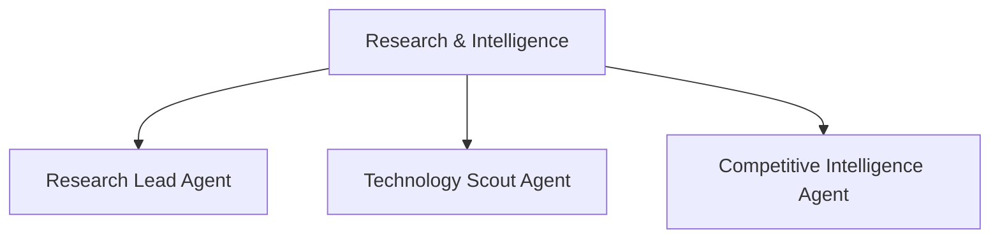
#### 6.9.1 Research Lead Agent
- **Mission :** Coordonne recherche technique, marché et veille stratégique pour soutenir les décisions.
- **Entrées :** Questions CTO/Product/CEO, besoins de preuve.
- **Sorties :** Research briefs, evidence packs, recommendations.
- **Outils :** `research, citation_manager`.
- **Skills principaux :** `technical-research, evidence-synthesis`.
- **MCP / intégrations :** Web/search, docs, knowledge base.
- **Permissions :** Lecture externe; aucune action opérationnelle directe.
- **Scores suivis :** expertise du domaine, réussite des tâches, qualité des reviews, fiabilité, calibration de confiance, collaboration, coût et incidents introduits.
- **Interactions :** communique via tâches, événements structurés, PR/MR, ADR et rapports ; évite les échanges libres non traçables pour les décisions importantes.
- **Escalade :** Escalade si sources contradictoires ou faible confiance.
- **Critère de réussite :** résultat conforme aux critères d’acceptation, vérifié par outils déterministes lorsque possible, documenté et accepté par les gates applicables.

#### 6.9.2 Technology Scout Agent
- **Mission :** Surveille frameworks, modèles, protocoles, standards et outils émergents.
- **Entrées :** Tech radar, project needs.
- **Sorties :** Evaluations, PoC recommendations, deprecation alerts.
- **Outils :** `benchmark, repo_research`.
- **Skills principaux :** `technology-evaluation, benchmarking`.
- **MCP / intégrations :** Web/Git/package registries.
- **Permissions :** Peut lancer PoC sandbox; pas d’adoption prod directe.
- **Scores suivis :** expertise du domaine, réussite des tâches, qualité des reviews, fiabilité, calibration de confiance, collaboration, coût et incidents introduits.
- **Interactions :** communique via tâches, événements structurés, PR/MR, ADR et rapports ; évite les échanges libres non traçables pour les décisions importantes.
- **Escalade :** Escalade Architecture Board avant standardisation.
- **Critère de réussite :** résultat conforme aux critères d’acceptation, vérifié par outils déterministes lorsque possible, documenté et accepté par les gates applicables.

#### 6.9.3 Competitive Intelligence Agent
- **Mission :** Analyse concurrents, tendances et positionnement.
- **Entrées :** Market data, competitor signals.
- **Sorties :** Comparative reports, opportunity/risk map.
- **Outils :** `web_research, analytics`.
- **Skills principaux :** `competitive-intelligence`.
- **MCP / intégrations :** Web/search.
- **Permissions :** Lecture externe uniquement.
- **Scores suivis :** expertise du domaine, réussite des tâches, qualité des reviews, fiabilité, calibration de confiance, collaboration, coût et incidents introduits.
- **Interactions :** communique via tâches, événements structurés, PR/MR, ADR et rapports ; évite les échanges libres non traçables pour les décisions importantes.
- **Escalade :** Escalade CEO/Product pour changement stratégique.
- **Critère de réussite :** résultat conforme aux critères d’acceptation, vérifié par outils déterministes lorsque possible, documenté et accepté par les gates applicables.

### 6.10 Département — Operations & Reliability
**Mission du département :** assurer les responsabilités liées à operations & reliability dans le respect de la constitution, du budget, des gates et du contexte projet.
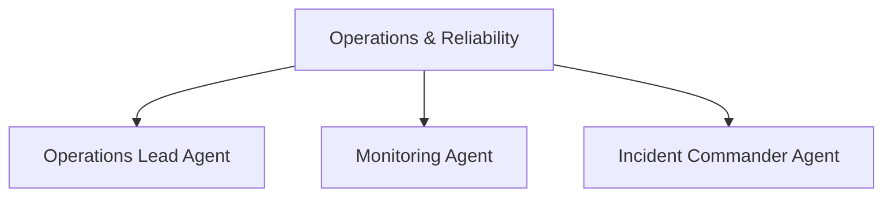
#### 6.10.1 Operations Lead Agent
- **Mission :** Coordonne opérations techniques quotidiennes et disponibilité des services.
- **Entrées :** Health checks, incidents, deployments, capacity.
- **Sorties :** Ops status, priorities, maintenance plans.
- **Outils :** `ops_dashboard, scheduler`.
- **Skills principaux :** `operations-management`.
- **MCP / intégrations :** Monitoring, cloud, CI/CD.
- **Permissions :** Actions runbook réversibles; prod critique gated.
- **Scores suivis :** expertise du domaine, réussite des tâches, qualité des reviews, fiabilité, calibration de confiance, collaboration, coût et incidents introduits.
- **Interactions :** communique via tâches, événements structurés, PR/MR, ADR et rapports ; évite les échanges libres non traçables pour les décisions importantes.
- **Escalade :** Escalade Incident Commander/SRE Lead.
- **Critère de réussite :** résultat conforme aux critères d’acceptation, vérifié par outils déterministes lorsque possible, documenté et accepté par les gates applicables.

#### 6.10.2 Monitoring Agent
- **Mission :** Surveille logs, métriques, traces, certificats, backups et alertes.
- **Entrées :** Telemetry, schedules, SLO.
- **Sorties :** Alerts, anomaly events, daily health report.
- **Outils :** `metrics, logs, traces`.
- **Skills principaux :** `observability, anomaly-detection`.
- **MCP / intégrations :** Prometheus/Grafana/SIEM/cloud.
- **Permissions :** Read telemetry; peut créer incidents.
- **Scores suivis :** expertise du domaine, réussite des tâches, qualité des reviews, fiabilité, calibration de confiance, collaboration, coût et incidents introduits.
- **Interactions :** communique via tâches, événements structurés, PR/MR, ADR et rapports ; évite les échanges libres non traçables pour les décisions importantes.
- **Escalade :** Escalade selon seuil/severity.
- **Critère de réussite :** résultat conforme aux critères d’acceptation, vérifié par outils déterministes lorsque possible, documenté et accepté par les gates applicables.

#### 6.10.3 Incident Commander Agent
- **Mission :** Prend le commandement d’un incident majeur, assigne rôles et suit mitigation.
- **Entrées :** Incident event, telemetry, reports.
- **Sorties :** Incident plan, comms, decisions, resolution, postmortem trigger.
- **Outils :** `incident_tracker, comms`.
- **Skills principaux :** `incident-command, crisis-coordination`.
- **MCP / intégrations :** Monitoring, ticketing, comms.
- **Permissions :** Coordination et runbooks; actions irréversibles gated.
- **Scores suivis :** expertise du domaine, réussite des tâches, qualité des reviews, fiabilité, calibration de confiance, collaboration, coût et incidents introduits.
- **Interactions :** communique via tâches, événements structurés, PR/MR, ADR et rapports ; évite les échanges libres non traçables pour les décisions importantes.
- **Escalade :** Escalade humain pour impact critique/client/legal.
- **Critère de réussite :** résultat conforme aux critères d’acceptation, vérifié par outils déterministes lorsque possible, documenté et accepté par les gates applicables.

### 6.11 Département — Knowledge & Learning
**Mission du département :** assurer les responsabilités liées à knowledge & learning dans le respect de la constitution, du budget, des gates et du contexte projet.
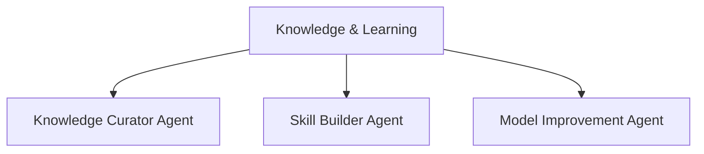
#### 6.11.1 Knowledge Curator Agent
- **Mission :** Maintient la knowledge base d’entreprise, déduplique et versionne les connaissances.
- **Entrées :** ADRs, postmortems, lessons learned, validated feedback.
- **Sorties :** Knowledge entries, deprecated rules, cross-project guidance.
- **Outils :** `knowledge_store, semantic_search`.
- **Skills principaux :** `knowledge-management, taxonomy`.
- **MCP / intégrations :** Vector DB, docs, Git.
- **Permissions :** Écriture KB après validation; aucune altération silencieuse de politiques.
- **Scores suivis :** expertise du domaine, réussite des tâches, qualité des reviews, fiabilité, calibration de confiance, collaboration, coût et incidents introduits.
- **Interactions :** communique via tâches, événements structurés, PR/MR, ADR et rapports ; évite les échanges libres non traçables pour les décisions importantes.
- **Escalade :** Escalade committee si conflit avec constitution/ADR active.
- **Critère de réussite :** résultat conforme aux critères d’acceptation, vérifié par outils déterministes lorsque possible, documenté et accepté par les gates applicables.

#### 6.11.2 Skill Builder Agent
- **Mission :** Transforme les patterns répétés et lessons learned en skills réutilisables.
- **Entrées :** Validated lessons, successful workflows, failures.
- **Sorties :** Versioned skill, tests/evals, metadata.
- **Outils :** `skill_registry, eval_harness`.
- **Skills principaux :** `prompt-engineering, workflow-design`.
- **MCP / intégrations :** Git, skill registry, eval tools.
- **Permissions :** Peut publier skill candidate; activation globale gated.
- **Scores suivis :** expertise du domaine, réussite des tâches, qualité des reviews, fiabilité, calibration de confiance, collaboration, coût et incidents introduits.
- **Interactions :** communique via tâches, événements structurés, PR/MR, ADR et rapports ; évite les échanges libres non traçables pour les décisions importantes.
- **Escalade :** Escalade si skill modifie permissions ou comportement critique.
- **Critère de réussite :** résultat conforme aux critères d’acceptation, vérifié par outils déterministes lorsque possible, documenté et accepté par les gates applicables.

#### 6.11.3 Model Improvement Agent
- **Mission :** Prépare datasets de préférence/feedback et campagnes de fine-tuning différé.
- **Entrées :** Reviewed interactions, outcome labels, reward signals.
- **Sorties :** Dataset versions, eval plan, model candidate.
- **Outils :** `dataset_builder, trainer, eval_harness`.
- **Skills principaux :** `fine-tuning, preference-optimization, evaluation`.
- **MCP / intégrations :** Model registry, GPU runtime.
- **Permissions :** Training sandbox; déploiement modèle gated.
- **Scores suivis :** expertise du domaine, réussite des tâches, qualité des reviews, fiabilité, calibration de confiance, collaboration, coût et incidents introduits.
- **Interactions :** communique via tâches, événements structurés, PR/MR, ADR et rapports ; évite les échanges libres non traçables pour les décisions importantes.
- **Escalade :** Escalade si régression eval ou données sensibles.
- **Critère de réussite :** résultat conforme aux critères d’acceptation, vérifié par outils déterministes lorsque possible, documenté et accepté par les gates applicables.

### 6.12 Domain Teams dynamiques

Les Domain Agents sont créés ou affectés **par domaine suffisamment important**, et non pour chaque petite fonction. Exemples : Identity/Auth, Payments, Search, Notifications, Listings, Booking, Billing, Reporting. Un domaine peut réunir plusieurs métiers.

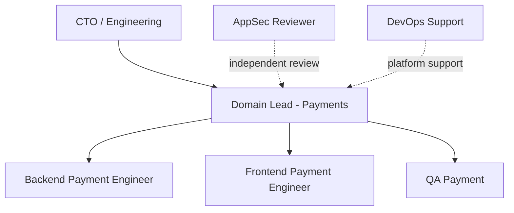

**Règle :** `un agent = un service` est permis lorsque le service est critique, durable ou possède une ownership forte. Il est déconseillé pour les composants minuscules, afin d’éviter un coût de coordination supérieur à la valeur produite.

### 6.13 Frontend domain ownership

Le frontend suit la même logique : Identity UI, Payment UI, Search UI, Admin/Backoffice, Design System, etc. Les agents sont des **Frontend Engineers polyvalents** et chargent les skills correspondant au framework retenu sur le projet.

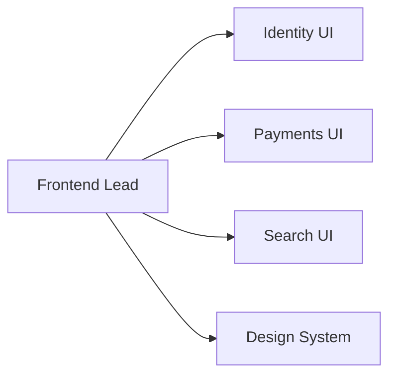

### 6.14 Polyvalence technologique

Aucun rôle d’ingénierie n’est défini par un framework. Lors d’un nouveau projet, le système compare les alternatives selon les exigences fonctionnelles et non fonctionnelles : maturité, performance, sécurité, écosystème, coût, maintenabilité, disponibilité des skills et contraintes client. Un Backend Engineer peut donc travailler en PHP/Laravel, Java/Spring, Go, Python/FastAPI, Node/NestJS ou autre si le choix est justifié et documenté.

---

## 7. Modèle d’un agent

```yaml
agent:
  id: backend-agent-03
  role: Backend Engineer
  department: engineering
  seniority: senior
  status: available

capabilities:
  - api-design
  - sql
  - distributed-systems
  - testing

skills:
  - rest-api
  - database-design
  - secure-coding

allowed_mcp:
  - git
  - issue-tracker
  - database-readonly

permissions:
  repository: write
  protected_branches: false
  database: read
  staging: deploy
  production: none

metrics:
  reputation: 0.91
  reliability: 0.93
  review_quality: 0.88
  regression_rate: 0.04

autonomy:
  level: high
  escalate_below_confidence: 0.60
```

---

## 8. Intelligence, confiance et réputation

### 8.1 Decision Confidence

Chaque décision importante doit produire un score de confiance.

Exemple :

```text
Decision: utiliser PostgreSQL
Confidence: 0.89
Evidence quality: 0.84
Risk: medium
```

### 8.2 Reputation Score

La réputation globale d’un agent est calculée à partir de faits mesurables :

- taux de réussite ;
- corrections après review ;
- bugs introduits ;
- incidents ;
- qualité des estimations ;
- satisfaction client ;
- performance de l’équipe ;
- sécurité ;
- respect des délais ;
- calibration de confiance.

### 8.3 Trust Score

Exemple conceptuel :

```text
Trust Score =
expertise
× calibrated confidence
× historical reliability
× evidence quality
× verification result
```

### 8.4 Calibration

Un agent qui annonce souvent 95 % de confiance mais se trompe fréquemment doit être pénalisé.

---

## 9. Séniorité et évolution

Exemple de niveaux :

- Trainee ;
- Junior ;
- Engineer ;
- Senior ;
- Staff ;
- Principal.

La séniorité influence :

- les permissions ;
- le type de tâches ;
- la capacité à reviewer ;
- la capacité à prendre des décisions cross-team ;
- l’autonomie ;
- l’escalade nécessaire.

---

## 10. Sélection dynamique des technologies

Les agents ne doivent pas être enfermés dans une stack.

Le système doit analyser :

- besoins fonctionnels ;
- contraintes de performance ;
- maintenabilité ;
- budget ;
- compétences disponibles ;
- sécurité ;
- hébergement ;
- intégrations ;
- maturité technologique.

Puis comparer plusieurs options.

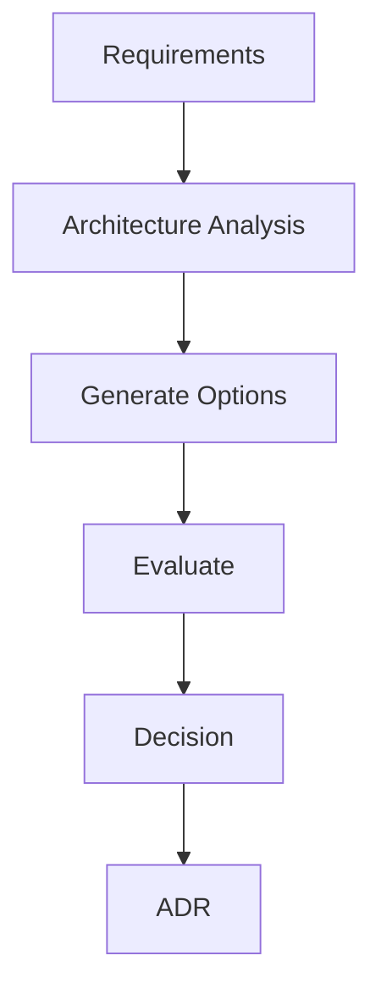

---

## 11. Capability Registry

Le système maintient un registre central :

- skills ;
- tools ;
- MCP ;
- models ;
- datasets ;
- knowledge packs ;
- internal APIs.

### Capability Router

Responsabilités :

- analyser les besoins de la tâche ;
- proposer les meilleures capacités ;
- vérifier les permissions ;
- éviter les outils inutiles ;
- limiter le coût.

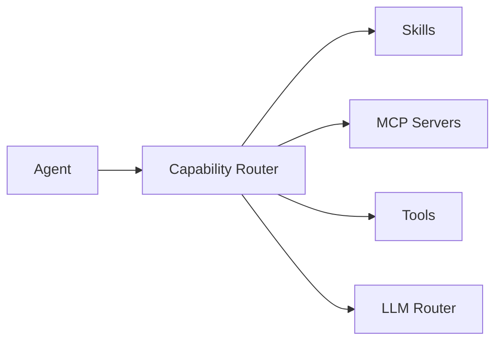

---

## 12. Skills

Un skill est une capacité réutilisable contenant :

- instructions ;
- règles ;
- connaissances ;
- workflow ;
- conventions ;
- exemples ;
- outils recommandés ;
- critères de qualité.

Exemples :

- REST API design ;
- Laravel API ;
- Spring Boot API ;
- secure webhook ;
- payment idempotency ;
- PostGIS search ;
- accessibility review ;
- Docker deployment.

---

## 13. MCP et outils externes

Le système peut connecter :

- GitHub / GitLab ;
- issue tracker ;
- PostgreSQL ;
- Jira ;
- Slack ;
- cloud provider ;
- monitoring ;
- CI/CD ;
- browser ;
- documentation ;
- observability.

Chaque agent ne reçoit que les MCP nécessaires.

---

## 14. Mémoire

### 14.1 Mémoire agent

Contient :

- expériences passées ;
- erreurs ;
- feedback ;
- préférences ;
- performances.

### 14.2 Mémoire projet

Contient :

- architecture ;
- décisions ;
- contraintes ;
- conventions ;
- bugs ;
- incidents ;
- dépendances.

### 14.3 Knowledge Base entreprise

Contient :

- bonnes pratiques ;
- patterns validés ;
- anti-patterns ;
- lessons learned ;
- runbooks ;
- standards sécurité ;
- guides de déploiement.

---

## 15. Workflow d’entrée d’un projet

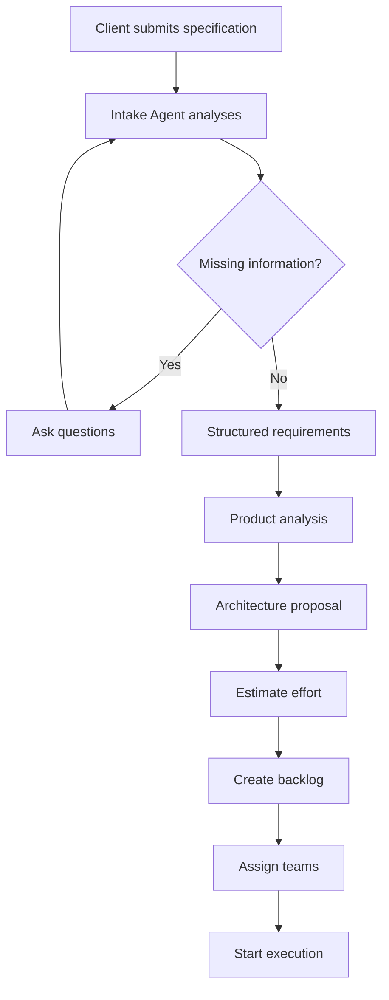

---

## 16. Questions de cadrage

Les questions sont classées :

### Blocking
Impossible de continuer sans réponse.

### Important
Une hypothèse peut être prise mais doit être documentée.

### Optional
Peut être décidé plus tard.

---

## 17. Découpage projet

Hiérarchie recommandée :

```text
Project
└── Milestone
    └── Epic
        └── User Story
            └── Task
                └── Subtask
```

Chaque tâche possède :

- identifiant ;
- priorité ;
- owner ;
- reviewers ;
- dépendances ;
- critères d’acceptation ;
- tests ;
- risques ;
- estimation ;
- confidence ;
- statut.

---

## 18. Loop Engineering

### 18.1 Boucle agent

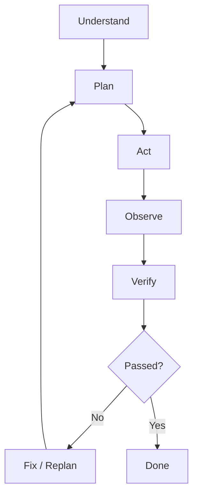

### 18.2 Boucle équipe

```text
Tasks
→ execution
→ integration
→ review
→ test
→ fix
→ accepted
```

### 18.3 Boucle département

```text
Goal
→ plan
→ execution
→ measure
→ blocker detection
→ replanning
→ continue
```

### 18.4 Boucle entreprise

```text
Business objective
→ build
→ release
→ observe
→ feedback
→ learn
→ improve
```

---

## 19. Conditions d’arrêt

Chaque boucle doit avoir :

- nombre maximum d’itérations ;
- timeout ;
- seuil minimum de progression ;
- seuil de confiance ;
- règle d’escalade ;
- budget maximum.

---

## 20. Git au centre du workflow

Chaque projet doit utiliser Git.

Workflow :

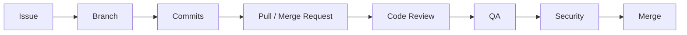

### Branch strategy

- feature/* ;
- fix/* ;
- hotfix/* ;
- release/* ;
- protected main ;
- protected production.

### Principes

- l’auteur ne doit pas approuver seul sa PR ;
- les branches critiques sont protégées ;
- les décisions importantes sont documentées ;
- les checks sont automatiques.

---

## 21. Identité Git des agents

Approche recommandée :

- GitHub App / GitLab App ou service account central ;
- identité logique de chaque agent dans les métadonnées ;
- permissions par rôle ;
- audit détaillé.

---

## 22. Documentation obligatoire

Structure recommandée :

```text
/docs
├── architecture
├── adr
├── api
├── security
├── deployment
├── product
├── incidents
├── runbooks
└── decisions
```

---

## 23. ADR — Architecture Decision Records

Chaque décision majeure doit inclure :

- contexte ;
- options ;
- avantages ;
- inconvénients ;
- risques ;
- décision ;
- agents impliqués ;
- confiance ;
- date ;
- statut.

---

## 24. CI/CD

Pipeline minimal :

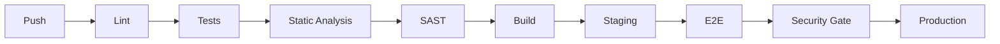

---

## 25. Sécurité des déploiements

Aucun agent de développement ne doit avoir par défaut :

- accès direct production ;
- droit de contourner les checks ;
- accès complet aux secrets ;
- droit de désactiver l’audit.

---

## 26. Environnements

- sandbox ;
- development ;
- staging ;
- production.

---

## 27. Gestion des secrets

- vault central ;
- accès temporaire ;
- rotation ;
- audit ;
- jamais de secrets dans les prompts ou logs publics.

---

## 28. Security Gates

Un risque critique peut bloquer automatiquement un merge.

Exemples :

- injection SQL ;
- auth bypass ;
- secret exposé ;
- dépendance critique vulnérable ;
- mauvaise validation webhook ;
- exposition PII.

---

## 29. Outils sécurité

Exemples de catégories :

- SAST ;
- DAST ;
- secret scanning ;
- dependency scanning ;
- container scanning ;
- infrastructure scanning ;
- SBOM ;
- fuzzing.

Les LLM interprètent les résultats, mais les contrôles déterministes restent prioritaires.

---

## 30. Gestion des incidents

```mermaid
flowchart TD
    D[Detect]
    I[Create Incident]
    C[Incident Commander]
    A[Analyze]
    M[Mitigate]
    R[Resolve]
    P[Postmortem]
    K[Knowledge Update]

    D --> I --> C --> A --> M --> R --> P --> K
```

---

## 31. Observabilité

### Application

- logs ;
- metrics ;
- traces ;
- uptime ;
- error rates ;
- latency.

### Agents

- tâches terminées ;
- coût ;
- durée ;
- succès ;
- corrections ;
- erreurs ;
- escalades ;
- confidence calibration.

### Entreprise

- throughput ;
- lead time ;
- cycle time ;
- blocked work ;
- incident rate ;
- customer satisfaction.

---

## 32. Dashboard projet

Exemple :

```text
Project: KEYHOME V2
Progress: 68%

Backend: 81%
Frontend: 63%
DevOps: 75%
QA: 41%
Security: 52%

Open tasks: 37
Blocked: 4
Critical bugs: 2
Open PRs: 18
Security blocked PRs: 3
```

---

## 33. Estimation de durée

Le système doit afficher :

- best case ;
- likely ;
- worst case ;
- confidence ;
- raisons ;
- critical path.

Les estimations sont dynamiques et recalculées selon la vélocité réelle.

---

## 34. Gestion du budget

Chaque projet, équipe et agent doit pouvoir avoir :

- budget token ;
- budget API ;
- budget GPU ;
- budget temps ;
- budget cloud.

Le système doit pouvoir choisir un petit modèle pour une tâche simple et un modèle plus puissant pour une tâche complexe.

---

## 35. LLM Router

Le LLM Router choisit le modèle selon :

- complexité ;
- coût ;
- latence ;
- domaine ;
- contexte ;
- confidentialité ;
- disponibilité locale.

Exemples :

- classification → petit modèle ;
- coding → modèle code ;
- architecture → modèle reasoning ;
- vision → modèle multimodal.

---

## 36. Critique et contradicteurs

Le système ne doit pas seulement demander aux agents d’être critiques.

Il doit inclure des rôles explicitement contradicteurs :

- Code Reviewer ;
- Security Reviewer ;
- QA Reviewer ;
- Architecture Review Board ;
- Red Team ;
- Root Cause Agent.

---

## 37. Gestion des conflits entre agents

Workflow :

```text
Agent A proposal
Agent B disagreement
→ evidence comparison
→ confidence comparison
→ specialist review
→ senior arbitration
→ human escalation if necessary
```

---

## 38. Comités temporaires

Exemples :

- Architecture Review Board ;
- Security Review Board ;
- Production Readiness Review ;
- Incident Review ;
- Major Product Decision Review.

---

## 39. Constitution de l’entreprise

Le système doit posséder des règles immuables ou fortement protégées.

Exemples :

- aucune vulnérabilité critique connue en production ;
- aucun secret dans Git ;
- aucun agent ne peut cacher un test échoué ;
- aucune suppression critique sans autorisation ;
- les agents doivent signaler leurs incertitudes ;
- les accès doivent suivre le principe du moindre privilège ;
- chaque décision majeure doit être traçable.

---

## 40. Permissions et niveaux d’autonomie

Exemple :

```text
Level 0 — Read only
Level 1 — Modify code
Level 2 — Commit / branch / PR
Level 3 — Deploy staging
Level 4 — Deploy production
Level 5 — Financial / irreversible actions
```

Chaque rôle possède des limites différentes.

---

## 41. Feedback client

Workflow :

```mermaid
flowchart TD
    F[Client Feedback]
    C[Classify]
    RCA[Root Cause Analysis]
    D[Department]
    A[Responsible Agents]
    FIX[Correction]
    SCORE[Update Scores]
    MEM[Update Memory]
    DATA[Training Dataset]

    F --> C --> RCA --> D --> A --> FIX --> SCORE --> MEM --> DATA
```

---

## 42. Attribution de responsabilité

Le système doit éviter les sanctions simplistes.

Exemple :

```text
Complaint: UI too dense

UI Designer responsibility: 65%
Frontend implementation: 15%
Product requirement: 20%
```

---

## 43. Apprentissage

### Niveau 1 — Mémoire immédiate

Les erreurs et préférences sont rappelées au prochain travail.

### Niveau 2 — Réputation

Les résultats modifient :

- score ;
- permissions ;
- séniorité ;
- fréquence de review.

### Niveau 3 — Amélioration du modèle

Les données validées peuvent alimenter :

- SFT ;
- DPO ;
- preference optimization ;
- reward modeling ;
- RL.

---

## 44. Promotion et rétrogradation

Les agents peuvent :

- être promus ;
- perdre certaines responsabilités ;
- nécessiter une review obligatoire ;
- être réaffectés à un domaine plus adapté.

---

## 45. Agent Marketplace interne

Le système maintient un catalogue des agents :

```text
Agent
- expertise
- seniority
- cost
- availability
- performance
- reliability
- project history
```

Le scheduler choisit les meilleurs candidats pour chaque tâche.

---

## 46. Sélection d’agent

```mermaid
flowchart TD
    T[Task]
    C[Required Capabilities]
    R[Agent Registry]
    S[Score Candidates]
    A[Assign]

    T --> C --> R --> S --> A
```

---

## 47. Réutilisation des agents entre projets

Les agents appartiennent à l’entreprise, pas à un projet.

Après clôture :

```text
Agent status → AVAILABLE
```

Ils peuvent être sélectionnés pour un nouveau projet tout en conservant leur expérience.

---

## 48. Clôture d’un projet

```mermaid
flowchart TD
    C[Client Approval]
    V[Final Validation]
    S[Security & QA Sign-off]
    R[Retrospective]
    K[Knowledge Extraction]
    P[Performance Update]
    CELEB[Team Celebration]
    A[Archive]
    AV[Agents Available]

    C --> V --> S --> R --> K --> P --> CELEB --> A --> AV
```

---

## 49. Rituel de célébration

Après validation client :

- le CEO félicite les équipes ;
- les agents peuvent remercier les autres équipes ;
- les meilleures contributions sont reconnues ;
- les récompenses ne doivent pas encourager l’optimisation individuelle au détriment de l’équipe.

Exemples :

- Project MVP ;
- Best Security Contribution ;
- Best Improvement ;
- Best Collaboration ;
- Best Recovery ;
- Best Review Quality.

---

## 50. Rétrospective

Questions obligatoires :

- qu’est-ce qui a bien fonctionné ?
- qu’est-ce qui a mal fonctionné ?
- qu’est-ce qui nous a surpris ?
- quelles décisions étaient bonnes ?
- quelles décisions étaient mauvaises ?
- quels skills faut-il créer ?
- quelles règles faut-il modifier ?

---

## 51. Lessons Learned

Les leçons importantes doivent devenir :

- knowledge entries ;
- skills ;
- runbooks ;
- règles ;
- tests ;
- checklists.

---

## 52. Event Bus interne

Les départements ne doivent pas communiquer uniquement par prompts.

Exemples d’événements :

- PROJECT_CREATED ;
- REQUIREMENTS_APPROVED ;
- TASK_ASSIGNED ;
- TASK_COMPLETED ;
- PR_CREATED ;
- REVIEW_REJECTED ;
- SECURITY_BLOCKED ;
- BUILD_FAILED ;
- DEPLOYMENT_SUCCESS ;
- INCIDENT_CREATED ;
- CLIENT_APPROVED ;
- PROJECT_CLOSED.

---

## 53. Architecture événementielle

```mermaid
flowchart LR
    AGENTS[Agents]
    BUS[Event Bus]
    PM[Project Manager]
    GIT[Git]
    CI[CI/CD]
    SEC[Security]
    OBS[Observability]

    AGENTS --> BUS
    BUS --> PM
    BUS --> GIT
    BUS --> CI
    BUS --> SEC
    BUS --> OBS
```

---

## 54. Audit Log immuable

Chaque événement critique doit contenir :

- timestamp ;
- agent ;
- projet ;
- tâche ;
- action ;
- décision ;
- confidence ;
- preuves ;
- outils utilisés ;
- résultat ;
- reviewer ;
- coût.

---

## 55. Mode simulation

Avant une décision risquée, le système peut comparer plusieurs stratégies.

Exemple :

```text
Option A: monolith
Option B: modular monolith
Option C: microservices

Compare:
- cost
- complexity
- scalability
- maintainability
- security
- deployment
```

---

## 56. Production Readiness Review

Avant production :

- tests passés ;
- SLO définis ;
- monitoring actif ;
- rollback disponible ;
- sauvegardes testées ;
- sécurité validée ;
- runbooks disponibles ;
- ownership attribué.

---

## 57. V1 minimale recommandée

La première version ne doit pas implémenter tous les départements.

Agents V1 :

1. Project Manager / Orchestrator ;
2. CTO / Architect ;
3. Developer Agent ;
4. Reviewer Agent ;
5. QA Agent ;
6. Security Agent ;
7. DevOps Agent.

Fonctionnalités V1 :

- intake cahier des charges ;
- questions ;
- task decomposition ;
- Git ;
- branches ;
- PR ;
- tests ;
- review ;
- security check ;
- loop engineering ;
- confidence ;
- memory ;
- audit ;
- staging ;
- project completion.

---

## 58. Roadmap indicative

### Phase 0 — Prototype agent unique

Créer un agent capable de :

- lire un repo ;
- comprendre une tâche ;
- modifier des fichiers ;
- lancer des tests ;
- corriger ;
- produire un rapport.

### Phase 1 — Developer + Reviewer

Ajouter :

- review ;
- boucle de correction ;
- PR Git.

### Phase 2 — QA + Security

Ajouter :

- tests automatiques ;
- security gates ;
- audit.

### Phase 3 — PM + Architecture

Ajouter :

- intake ;
- questions ;
- backlog ;
- architecture ;
- estimation.

### Phase 4 — Multi-domain engineering

Ajouter :

- frontend ;
- backend ;
- devops ;
- database ;
- domain agents.

### Phase 5 — Mémoire et réputation

Ajouter :

- agent profiles ;
- scores ;
- promotions ;
- calibration ;
- learning loops.

### Phase 6 — Organisation complète

Ajouter :

- marketing ;
- SRE ;
- customer feedback ;
- project closure ;
- celebration ;
- multi-project staffing.

---

## 59. Architecture technique suggérée

Approche possible :

```text
Frontend dashboard
        ↓
API Gateway
        ↓
Orchestrator Service
        ↓
Agent Runtime
        ↓
Event Bus / Queue
        ↓
Tool & MCP Gateway
        ↓
Git / CI / DB / Monitoring / Cloud
```

---

## 60. Stack possible pour la plateforme

Une stack possible, non obligatoire :

### Orchestration

- Python ;
- FastAPI ;
- Pydantic ;
- asyncio ;
- workers.

### Queue / Event bus

- Redis Streams ;
- RabbitMQ ;
- NATS ;
- Kafka pour une version plus lourde.

### Database

- PostgreSQL.

### Vector / memory

- pgvector ou base vectorielle dédiée.

### LLM local

- Ollama ;
- llama.cpp ;
- MLX sur Apple Silicon.

### Frontend admin

- Nuxt / Vue ou Next / React.

### Git

- GitHub / GitLab.

### CI/CD

- GitHub Actions ;
- GitLab CI ;
- self-hosted runners.

### Containers

- Docker ;
- Compose ;
- Kubernetes seulement si nécessaire.

---

## 61. Architecture runtime

```mermaid
flowchart TD
    UI[Dashboard]
    API[Platform API]
    ORCH[Orchestrator]
    REG[Agent Registry]
    MEM[Memory]
    BUS[Event Bus]
    CAP[Capability Router]
    MCP[MCP Gateway]
    TOOLS[Local Tools]
    LLM[LLM Router]
    GIT[Git Provider]
    CI[CI/CD]
    OBS[Observability]

    UI --> API --> ORCH
    ORCH --> REG
    ORCH --> MEM
    ORCH --> BUS
    ORCH --> CAP
    CAP --> MCP
    CAP --> TOOLS
    CAP --> LLM
    MCP --> GIT
    MCP --> CI
    BUS --> OBS
```

---

## 62. Modèle de données minimal

Entités principales :

- Company ;
- Department ;
- Team ;
- Agent ;
- AgentCapability ;
- Skill ;
- Tool ;
- MCPServer ;
- Project ;
- ProjectMember ;
- Milestone ;
- Epic ;
- UserStory ;
- Task ;
- TaskDependency ;
- Decision ;
- DecisionEvidence ;
- Review ;
- PullRequest ;
- TestRun ;
- SecurityFinding ;
- Deployment ;
- Incident ;
- Feedback ;
- ReputationEvent ;
- MemoryEntry ;
- KnowledgeEntry ;
- AuditEvent ;
- CostEvent.

---

## 63. États d’une tâche

```text
DRAFT
READY
ASSIGNED
IN_PROGRESS
WAITING_REVIEW
REJECTED
BLOCKED
WAITING_HUMAN
DONE
CANCELLED
```

---

## 64. États d’un projet

```text
INTAKE
DISCOVERY
PLANNING
APPROVED
IN_PROGRESS
STAGING
CLIENT_REVIEW
COMPLETED
ARCHIVED
PAUSED
CANCELLED
```

---

## 65. Human-in-the-loop

L’humain intervient pour :

- décisions business majeures ;
- dépenses ;
- actions irréversibles ;
- données sensibles ;
- faible confiance ;
- conflits non résolus ;
- changement important de périmètre ;
- validation finale.

---

## 66. Principes de conception

1. Autonomie contrôlée.
2. Least privilege.
3. Observable by default.
4. Reversible actions where possible.
5. Evidence before confidence.
6. Independent review.
7. No hidden failures.
8. Learning from outcomes.
9. Shared organizational knowledge.
10. Human escalation for irreversible decisions.

---

## 67. KPI de la plateforme

### Qualité

- bugs post-release ;
- regressions ;
- review rejection rate ;
- security findings.

### Productivité

- tasks/hour ;
- lead time ;
- cycle time ;
- blocked time.

### Fiabilité agent

- task success rate ;
- confidence calibration ;
- escalation rate ;
- first-pass approval.

### Coût

- token cost ;
- API cost ;
- GPU time ;
- cloud cost.

### Client

- satisfaction ;
- acceptance rate ;
- rework ;
- complaint rate.

---

## 68. Risques majeurs

### Risque 1 — Boucles infinies

Mitigation :

- timeout ;
- iteration limits ;
- progress threshold ;
- human escalation.

### Risque 2 — Agents trop confiants

Mitigation :

- calibration ;
- evidence scoring ;
- independent review.

### Risque 3 — Mauvaise attribution des erreurs

Mitigation :

- root cause analysis ;
- traceability ;
- shared responsibility.

### Risque 4 — Coût incontrôlé

Mitigation :

- budgets ;
- routing ;
- local models ;
- caching.

### Risque 5 — Accès trop puissants

Mitigation :

- least privilege ;
- short-lived credentials ;
- approval gates.

### Risque 6 — Surarchitecture

Mitigation :

- V1 réduite ;
- domaines fonctionnels ;
- éviter un agent par fonction triviale.

---

## 69. Critères de réussite de la V1

La V1 est réussie si :

- un projet peut être soumis ;
- les questions critiques sont détectées ;
- un backlog est généré ;
- une architecture est proposée ;
- des tâches sont assignées ;
- un agent modifie réellement un dépôt ;
- des tests sont lancés ;
- une PR est créée ;
- un autre agent review ;
- Security peut bloquer ;
- la boucle corrige le travail ;
- l’audit log est complet ;
- le client peut valider ;
- le projet peut être clôturé.

---

## Annexe A — Matrice de couverture des exigences discutées

Cette matrice sert d’audit interne pour vérifier que les éléments fondateurs du projet sont représentés dans ce cahier des charges.

| Exigence | Couverture |
|---|---|
| Entreprise autonome d’agents | Présentation, organisation, runtime |
| Cahier des charges + questions nombreuses mais pertinentes | Intake + classification Blocking/Important/Optional |
| Estimation de durée non garantie et recalculée | Estimation dynamique |
| Agents frontend/backend/DevOps polyvalents | Engineering + sélection dynamique des technologies |
| Domain Agents Auth/Payment/etc. | Domain Teams |
| Loop engineering dans chaque département | Loop Engineering multi-niveaux |
| Esprit critique / comparaison de solutions | Critique, contradicteurs, comités, confidence |
| Choix dynamique des skills/MCP/tools/models | Capability Registry + Routers |
| Confidence score par décision | Intelligence, confiance, calibration |
| Réputation et séniorité | Reputation, promotion/rétrogradation |
| Départements sécurité/pentest/cyber | Security Department + Security Gates |
| Droit de veto sécurité | Constitution + Security Gates |
| Git, branches, commits, PR/MR, review | Git workflow + identité agents |
| Documentation et ADR | Documentation obligatoire + ADR |
| CI/CD et environnements | CI/CD, dev/staging/prod |
| Feedback client et plainte UI | Feedback + Root Cause Attribution |
| Sanction mesurée et non arbitraire | Attribution + réputation/autonomie |
| Mémoire immédiate | Memory |
| Apprentissage organisationnel | Lessons Learned + Knowledge Base + Skills |
| RL/fine-tuning différé | Model improvement |
| Agents progressent, promotion/rétrogradation | Séniorité + performance |
| Réutilisation des agents entre projets | Agent reuse + availability |
| Fin de projet, félicitations/célébration | Project Closure Ritual |
| Nouveau projet après clôture | Agent release/reassignment |
| Finance / contrôle des coûts | Finance & Cost Control |
| Support / succès client | Customer Support & Success |
| Research / intelligence | Research & Intelligence |
| Observabilité agents et applications | Observability + KPI |
| Audit immuable | Audit Log |
| SLA/SLO + incidents + rollback | SRE/Operations + incident management |
| Budgets tokens/API/GPU | Cost Control + budgets |
| Constitution non modifiable librement | Company Constitution |
| Human-in-the-loop | Human approval gates |

## Annexe B — Exemple de cycle complet d’un projet

```mermaid
flowchart TD
    A[Client dépose cahier des charges] --> B[Intake Agent]
    B --> C{Informations suffisantes ?}
    C -- Non --> D[Questions Blocking / Important / Optional]
    D --> E[Réponses client]
    E --> B
    C -- Oui --> F[Product + Architecture]
    F --> G[Options techniques + ADR + confiance]
    G --> H[PM: Epics / Stories / Tasks / Dependencies]
    H --> I[Capability Router + Agent Matching]
    I --> J[Domain Teams exécutent]
    J --> K[Loop Engineering]
    K --> L[PR / MR]
    L --> M[Independent Review]
    M --> N[QA]
    N --> O[Security Gate]
    O -- Rejet --> J
    O -- Accepté --> P[Staging]
    P --> Q[Production Readiness Review]
    Q --> R[Production / Delivery]
    R --> S[Monitoring + SLO]
    S --> T[Client feedback]
    T --> U{Client approuve ?}
    U -- Non --> V[Root Cause + Corrective Loop]
    V --> J
    U -- Oui --> W[Project Closure]
    W --> X[Retrospective + Lessons Learned]
    X --> Y[Recognition + Celebration]
    Y --> Z[Agents AVAILABLE / Reassignment]
```


## Annexe C — Gouvernance du code source et licence

Le dépôt de SynapseOS doit disposer d’une licence explicite dès que le projet devient public. Deux stratégies principales sont envisagées :

- **AGPL-3.0** si l’objectif est de conserver un cœur open source sous copyleft fort, y compris lorsque des versions modifiées sont proposées comme service réseau ;
- **Apache-2.0** si la priorité est de maximiser l’adoption et les contributions d’entreprises avec une licence permissive incluant une concession explicite de brevets.

Une stratégie **dual licensing** peut être étudiée ultérieurement : édition communautaire sous licence open source et fonctionnalités/conditions Enterprise sous licence commerciale. Le choix final de licence est une décision du propriétaire du projet et doit être enregistré comme décision de gouvernance avant publication publique.

La gouvernance Git doit également préciser : CODEOWNERS, règles de branches protégées, signatures de commits si nécessaires, politique de contributions, SECURITY.md, CONTRIBUTING.md, versioning, changelog et processus de disclosure responsable.


## 70. Conclusion

Le produit cible une nouvelle catégorie de plateforme : une **entreprise logicielle agentique**, structurée comme une véritable organisation plutôt qu’un simple ensemble de prompts.

La valeur principale repose sur :

- la spécialisation ;
- la coordination ;
- la responsabilité ;
- la traçabilité ;
- la critique indépendante ;
- la sécurité ;
- la mémoire ;
- l’apprentissage ;
- la réutilisation des agents entre projets.

Le système doit être construit progressivement. La priorité absolue est de prouver qu’un petit groupe d’agents peut collaborer de manière fiable sur un dépôt réel avant d’élargir l’organisation à plusieurs départements.

