# SynapseOS — Strategic Agent Governance Extensions

> **Status:** architecture specification and implementation roadmap
> **Project:** SynapseOS
> **Scope:** four strategic backend extensions:
>
> 1. Agent Genome
> 2. Agent Trust Score
> 3. Autonomy Governor
> 4. AI Manager
>
> **Development rule:** one phase = one clear objective = one PR = one validation.

---

# 1. Purpose

This document formalizes four extensions that turn SynapseOS from an agent runtime into a governed AI workforce platform.

The four extensions form a decision chain:

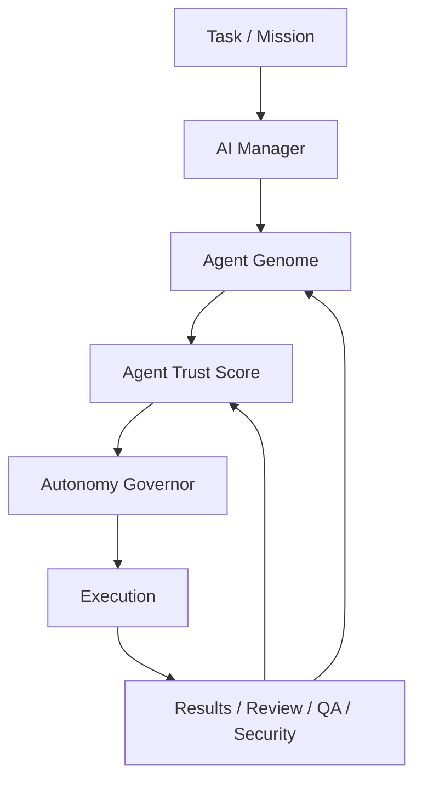
```mermaid
flowchart TD
    T[Task / Mission] --> M[AI Manager]
    M --> G[Agent Genome]
    G --> TS[Agent Trust Score]
    TS --> AG[Autonomy Governor]
    AG --> E[Execution]
    E --> R[Results / Review / QA / Security]
    R --> G
    R --> TS
```

The system must answer four different questions:

| Extension | Question |
|---|---|
| Agent Genome | What is this agent actually good at? |
| Agent Trust Score | How much operational trust can we place in this agent? |
| Autonomy Governor | What is this agent allowed to do for this specific task, right now? |
| AI Manager | Which agent should do the work, when, and under what coordination? |

These modules must remain independent enough to test separately, but designed to work together.

---

# 2. Cross-cutting principles

## 2.1 Backend authority

No frontend value, prompt instruction, agent self-report, or LLM confidence score may override backend authorization.

The following remain authoritative:

- Permission Engine
- TaskStateMachine
- ToolExecutor
- Security vetoes
- Workspace isolation
- Human approval rules
- Budget and runtime limits

## 2.2 Scores are signals, not truth

Genome scores and Trust Score values are decision inputs only.

They must never be treated as absolute truth.

## 2.3 Explainability

Every routing, promotion, restriction, reassignment, autonomy decision, or manager escalation must be explainable from persisted evidence.

## 2.4 Auditing

Every material decision should emit an append-only audit event.

Examples:

```text
agent.genome.snapshot_created
agent.genome.metric_updated
agent.trust.recomputed
agent.autonomy.level_changed
manager.assignment_created
manager.assignment_rebalanced
manager.blocker_escalated
```

## 2.5 Deterministic core before LLM judgment

When a decision can be derived deterministically from system evidence, prefer deterministic code.

LLMs may assist with classification or recommendation, but must not become the sole source of authority for:

- permission decisions
- trust
- autonomy
- security
- promotions
- critical assignments

---

# 3. Extension 1 — Agent Genome

## 3.1 Objective

Agent Genome is the persistent, versioned operational profile of an agent.

It measures what an agent has demonstrated it can do, under what conditions, with what quality, efficiency, reliability, and risk profile.

It is not a static résumé.

It evolves from observed execution evidence.

## 3.2 Core idea

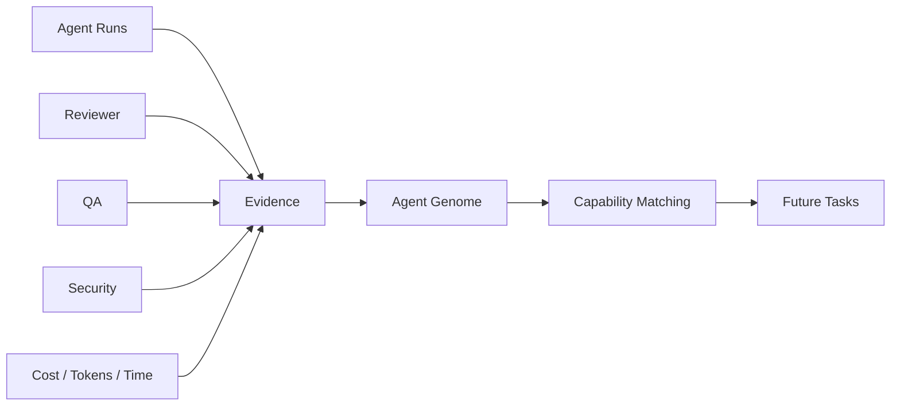
```mermaid
flowchart LR
    RUN[Agent Runs] --> EV[Evidence]
    REVIEW[Reviewer] --> EV
    QA[QA] --> EV
    SEC[Security] --> EV
    COST[Cost / Tokens / Time] --> EV

    EV --> G[Agent Genome]
    G --> MATCH[Capability Matching]
    MATCH --> NEXT[Future Tasks]
```

## 3.3 Genome dimensions

Recommended dimensions:

```text
capability
technology
domain
task_type
quality
reliability
efficiency
security
review_acceptance
tool_usage
model_performance
context_efficiency
failure_patterns
```

Example:

```text
Backend Agent #7

Python                 94
FastAPI                91
PostgreSQL             88
Docker                 74
OAuth                  92
Security-sensitive     63

Success rate           95%
Review approval        91%
QA pass rate           94%
Median iterations      2.3
Median token cost      12.4k
Median duration        74 s
Tool failure rate      1.8%
```

## 3.4 Capability model

A capability score should not be a single manually written number.

It should be derived from evidence.

Conceptually:

```text
capability_score =
    quality
    × reliability
    × evidence_weight
    × recency_factor
    × task_similarity
```

This is conceptual only. Exact formulas should be introduced later through ADR and tested against real run data.

## 3.5 Evidence sources

Trusted evidence sources:

- task completion result
- Reviewer decision
- QA result
- Security result
- unit/integration test results
- regression status
- runtime failures
- tool-call failures
- timeouts
- stagnation
- retries
- token usage
- wall-clock duration
- human feedback
- post-delivery reopen/regression

Untrusted or low-trust sources:

- agent self-score
- LLM saying “I am confident”
- prompt text claiming expertise
- unverified free-form output

## 3.6 Proposed entities

### AgentGenome

```text
id
agent_id
current_version_id
created_at
updated_at
```

### AgentGenomeVersion

```text
id
agent_genome_id
version
status
created_at
created_by
reason
```

### AgentCapabilityMetric

```text
id
genome_version_id
capability_key
score
sample_count
success_count
failure_count
confidence
last_observed_at
```

### AgentPerformanceMetric

```text
id
genome_version_id
metric_name
value
sample_count
window
computed_at
```

### AgentFailurePattern

```text
id
agent_id
pattern_key
count
severity
last_seen_at
metadata
```

## 3.7 Versioning

Genome history must be immutable.

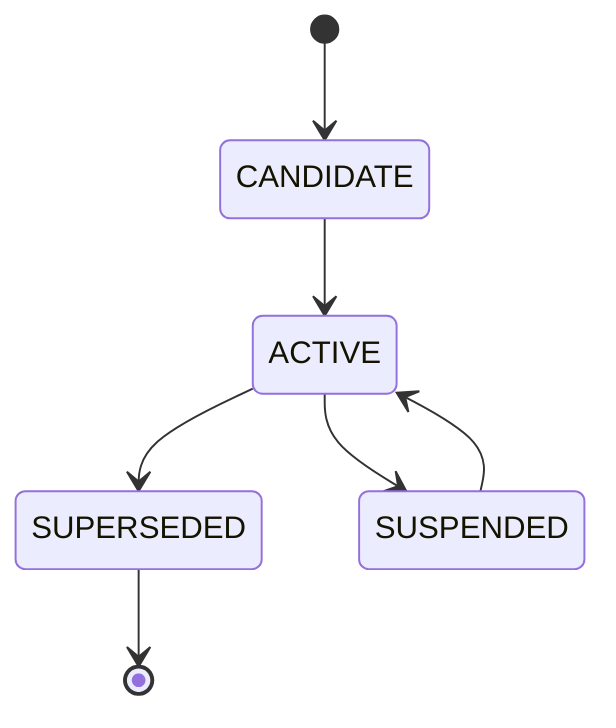
```mermaid
stateDiagram-v2
    [*] --> CANDIDATE
    CANDIDATE --> ACTIVE
    ACTIVE --> SUPERSEDED
    ACTIVE --> SUSPENDED
    SUSPENDED --> ACTIVE
    SUPERSEDED --> [*]
```

Old runs must always retain the exact Genome version used.

## 3.8 Capability matching

When a task arrives:

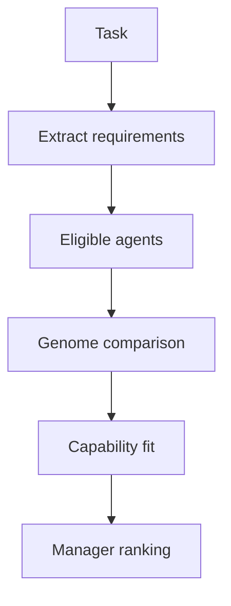
```mermaid
flowchart TD
    T[Task] --> RQ[Extract requirements]
    RQ --> CANDS[Eligible agents]
    CANDS --> G[Genome comparison]
    G --> F[Capability fit]
    F --> M[Manager ranking]
```

Possible matching factors:

- required technology
- task type
- complexity
- historical success
- current workload
- cost profile
- reviewer acceptance
- task risk

## 3.9 Genome must not bypass permissions

An agent can have:

```text
PostgreSQL score = 97
```

and still be denied access to production DB.

Capability and authorization are separate.

## 3.10 Failure learning

Genome should record failure patterns such as:

```text
often fails migrations with PostgreSQL enum changes
high timeout rate on large repository search
review failures on auth changes
strong performance on API refactors
```

This enables future routing decisions.

## 3.11 File structure

```text
core/genome/
├── contracts.py
├── types.py
├── capabilities.py
├── metrics.py
├── evaluator.py
├── matching.py
├── versioning.py
├── policies.py
└── service.py

infrastructure/genome/
├── models.py
├── repositories.py
└── analytics.py

tests/genome/
├── test_capabilities.py
├── test_metrics.py
├── test_evaluator.py
├── test_matching.py
├── test_versioning.py
└── test_integration.py
```

## 3.12 Implementation phases

### GEN-1 — Genome contracts and entities

Objective:

- introduce entities
- no routing impact yet

Acceptance:

- migrations
- typed models
- repositories
- tests

### GEN-2 — Evidence ingestion

Collect evidence from runs, reviews, QA, Security, and runtime metrics.

### GEN-3 — Capability scoring

Create deterministic scoring rules.

### GEN-4 — Performance profiles

Compute:

- success rate
- review acceptance
- QA pass rate
- failure rate
- median iterations
- median tokens
- duration

### GEN-5 — Capability matching

Expose ranking API/service for eligible agents.

### GEN-6 — Failure pattern tracking

Identify recurring failures.

### GEN-7 — Version snapshots

Freeze Genome state per run.

### GEN-8 — AI Manager integration

Manager uses Genome as one input.

## 3.13 Tests

Must cover:

- no evidence
- sparse evidence
- contradictory evidence
- stale evidence
- high capability but high failure rate
- equal agents
- capability not present
- rollback of Genome version
- cross-workspace leakage
- corrupted metric rows
- agent self-score ignored

## 3.14 Definition of Done

- every run can reference a Genome version
- capability metrics are evidence-based
- no self-report determines scores
- scores are reproducible
- history is immutable
- Manager can query Genome
- Permission Engine remains authoritative

---

# 4. Extension 2 — Agent Trust Score

## 4.1 Objective

Agent Trust Score measures operational trustworthiness.

It answers:

> Given what SynapseOS knows about this agent, how much operational confidence should the system place in it?

Trust is not the same as capability.

An agent can be highly skilled but not sufficiently trustworthy for risky operations.

## 4.2 Trust dimensions

Recommended dimensions:

```text
identity
permission hygiene
reliability
review history
security history
policy compliance
anomaly history
rollback rate
incident history
audit completeness
```

## 4.3 Example

```text
Agent Trust Score: 87 / 100

Identity             100
Reliability           94
Review history        90
Security history      81
Policy compliance     96
Anomaly score         77
Audit completeness    98
```

## 4.4 Architecture

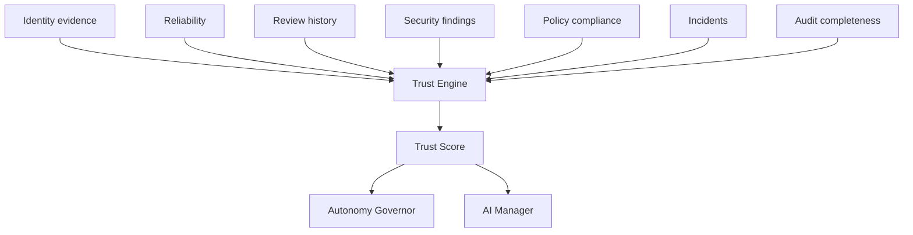
```mermaid
flowchart TD
    ID[Identity evidence] --> T[Trust Engine]
    REL[Reliability] --> T
    REV[Review history] --> T
    SEC[Security findings] --> T
    POL[Policy compliance] --> T
    INC[Incidents] --> T
    AUD[Audit completeness] --> T

    T --> TS[Trust Score]
    TS --> GOV[Autonomy Governor]
    TS --> MAN[AI Manager]
```

## 4.5 Trust must be multi-dimensional

Store both:

```text
overall_score
dimension_scores
```

The overall score is useful for UX and policy thresholds.

The dimension scores are necessary for explainability.

## 4.6 Trust classes

Example:

```text
90–100  HIGH_TRUST
70–89   STANDARD_TRUST
40–69   RESTRICTED_TRUST
0–39    LOW_TRUST
```

These thresholds are policy examples, not hard-coded universal truth.

## 4.7 Proposed entities

### AgentTrustSnapshot

```text
id
agent_id
overall_score
trust_class
calculated_at
evidence_window_start
evidence_window_end
algorithm_version
```

### AgentTrustDimension

```text
id
trust_snapshot_id
dimension
score
weight
reason
```

### AgentTrustEvent

```text
id
agent_id
event_type
impact
severity
source_ref
created_at
```

## 4.8 Positive trust signals

Examples:

- repeated successful tasks
- Reviewer approvals
- QA passes
- no security violations
- policy-compliant tool use
- clean audit trail
- stable reliability

## 4.9 Negative signals

Examples:

- repeated permission denials
- unauthorized tool attempts
- suspicious command patterns
- security findings
- repeated hallucinated completion
- high rollback rate
- unexplained missing audit trail
- recurring destructive mistakes

## 4.10 Trust decay

Trust should not stay permanently high from old success.

Possible concept:

```text
effective_signal = raw_signal × recency_factor
```

The decay strategy must be documented in ADR.

## 4.11 Severe events

Some events should cause immediate restriction.

Example:

```text
critical security violation
→ trust penalty
→ Autonomy Governor recomputation
→ possible suspension/quarantine
```

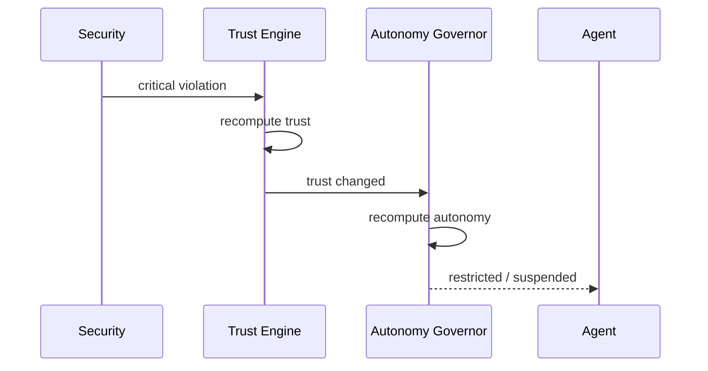
```mermaid
sequenceDiagram
    participant S as Security
    participant T as Trust Engine
    participant G as Autonomy Governor
    participant A as Agent

    S->>T: critical violation
    T->>T: recompute trust
    T->>G: trust changed
    G->>G: recompute autonomy
    G-->>A: restricted / suspended
```

## 4.12 Explainability

Trust API should be able to answer:

```text
Why is Agent X at 62?
```

Example:

```text
-12: repeated reviewer rejection
-10: security finding
-6: timeout rate
+8: stable task completion
+5: clean audit trail
```

## 4.13 File structure

```text
core/trust/
├── contracts.py
├── types.py
├── scoring.py
├── dimensions.py
├── decay.py
├── policies.py
├── explanations.py
└── service.py

infrastructure/trust/
├── models.py
├── repositories.py
└── analytics.py

tests/trust/
├── test_scoring.py
├── test_dimensions.py
├── test_decay.py
├── test_explanations.py
├── test_critical_events.py
└── test_integration.py
```

## 4.14 Implementation phases

### TRUST-1 — Trust data model

### TRUST-2 — Evidence adapters

### TRUST-3 — Deterministic dimension scores

### TRUST-4 — Overall score and classes

### TRUST-5 — Trust decay

### TRUST-6 — Critical-event handling

### TRUST-7 — Explainability

### TRUST-8 — Governor integration

## 4.15 Tests

Must cover:

- new agent
- no evidence
- excellent skill but security violation
- old success only
- recent incident
- repeated permission denials
- trust recovery
- deterministic recomputation
- algorithm versioning
- audit explanation

## 4.16 Definition of Done

- Trust Score is reproducible
- every score has evidence
- no LLM-only trust judgment
- critical events can restrict autonomy
- historical snapshots remain available
- score algorithm is versioned

---

# 5. Extension 3 — Autonomy Governor

## 5.1 Objective

Autonomy Governor determines how much freedom an agent receives for a specific action or task.

Trust answers:

> Can we generally trust this agent?

Governor answers:

> What may this agent do right now, for this task, in this environment?

## 5.2 Why dynamic autonomy

A single static autonomy level is insufficient.

The same agent may safely edit documentation but should not automatically run a production database migration.

## 5.3 Inputs

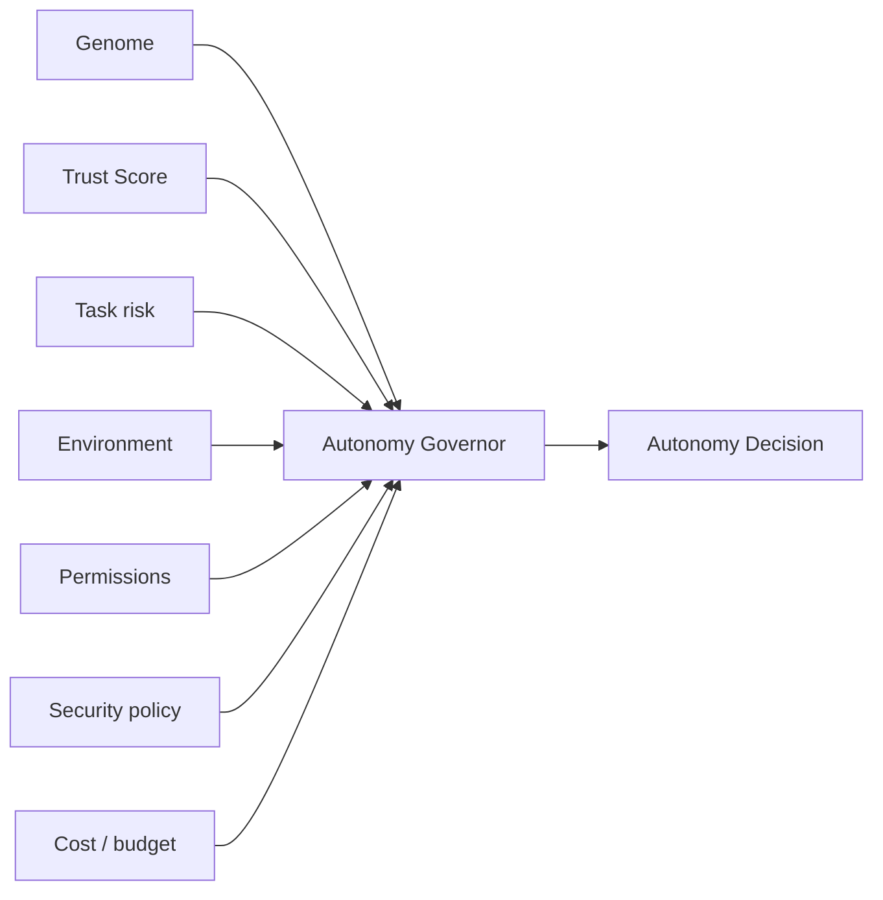
```mermaid
flowchart LR
    G[Genome] --> GOV[Autonomy Governor]
    T[Trust Score] --> GOV
    R[Task risk] --> GOV
    E[Environment] --> GOV
    P[Permissions] --> GOV
    S[Security policy] --> GOV
    C[Cost / budget] --> GOV

    GOV --> D[Autonomy Decision]
```

## 5.4 Autonomy levels

Recommended model:

```text
LEVEL_0 — DISABLED
LEVEL_1 — OBSERVE
LEVEL_2 — RECOMMEND
LEVEL_3 — ACT_WITH_APPROVAL
LEVEL_4 — BOUNDED_AUTONOMY
LEVEL_5 — HIGH_AUTONOMY
```

## 5.5 Semantics

### Level 0 — Disabled

Agent cannot act.

### Level 1 — Observe

Can inspect permitted state.

No mutations.

### Level 2 — Recommend

Can propose plans/actions.

Cannot execute them.

### Level 3 — Act with approval

Can prepare actions, but execution requires explicit approval.

### Level 4 — Bounded autonomy

May execute permitted low/medium-risk actions within configured limits.

### Level 5 — High autonomy

Reserved for tightly governed environments and still bounded by hard permissions/security rules.

Level 5 is not “unlimited”.

## 5.6 Decision object

### AutonomyDecision

```text
agent_id
task_id
requested_action
effective_level
allowed
approval_required
reason_codes
risk_score
trust_snapshot_id
genome_version_id
policy_version
expires_at
```

## 5.7 Risk model

Risk should include:

```text
action type
tool risk
environment
data sensitivity
blast radius
reversibility
cost
external side effects
production impact
```

Example:

```text
edit README
risk = LOW

delete local test file
risk = MEDIUM

production migration
risk = CRITICAL
```

## 5.8 Policy example

```text
IF environment == production
AND action == database_migration
THEN max_autonomy = LEVEL_2
```

```text
IF trust < 40
THEN max_autonomy = LEVEL_1
```

```text
IF security_veto == true
THEN allowed = false
```

## 5.9 Permission Engine relationship

Governor must not duplicate permissions.

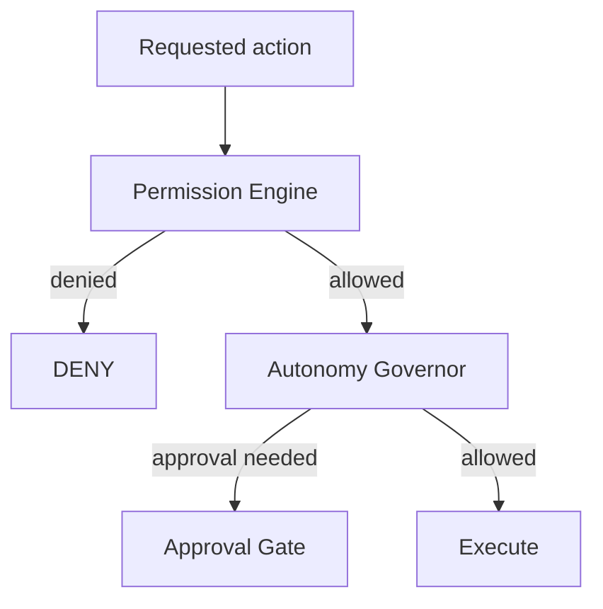
```mermaid
flowchart TD
    REQ[Requested action]
    REQ --> PERM[Permission Engine]
    PERM -->|denied| STOP[DENY]
    PERM -->|allowed| GOV[Autonomy Governor]
    GOV -->|approval needed| AP[Approval Gate]
    GOV -->|allowed| EXEC[Execute]
```

Permission Engine answers:

> Is this action ever permitted for this identity?

Governor answers:

> Given current risk and trust, may it execute now without escalation?

## 5.10 Temporary autonomy

Autonomy decisions should often expire.

Example:

```text
Agent gets LEVEL_4 for Task #182 only
valid until task completion
```

Not:

```text
Agent becomes permanently LEVEL_4 everywhere
```

## 5.11 Quarantine mode

```text
QUARANTINED
```

may be modeled separately or via Level 0 + security state.

Triggers:

- critical incident
- anomaly
- compromised credentials
- suspicious tool use
- severe policy violation

## 5.12 File structure

```text
core/autonomy/
├── contracts.py
├── types.py
├── levels.py
├── risk.py
├── policies.py
├── governor.py
├── explanations.py
└── service.py

infrastructure/autonomy/
├── repositories.py
├── policy_store.py
└── models.py

tests/autonomy/
├── test_levels.py
├── test_risk.py
├── test_governor.py
├── test_permissions_integration.py
├── test_approval.py
├── test_quarantine.py
└── test_integration.py
```

## 5.13 Implementation phases

### GOV-1 — Autonomy levels and contracts

### GOV-2 — Task/action risk classification

### GOV-3 — Policy engine

### GOV-4 — Trust integration

### GOV-5 — Genome integration

### GOV-6 — Approval gate integration

### GOV-7 — Security veto / quarantine

### GOV-8 — Dynamic recomputation

## 5.14 Tests

Must cover:

- low-risk docs task
- production migration
- trusted agent
- low-trust agent
- permission denied
- security veto
- expired decision
- task changes risk class
- human approval
- trust drops during run
- Genome changes during run

## 5.15 Definition of Done

- no action bypasses Permission Engine
- every autonomy decision is auditable
- risk and trust affect effective autonomy
- security veto always wins
- temporary scope is enforced
- approval can be required dynamically

---

# 6. Extension 4 — AI Manager

## 6.1 Objective

AI Manager coordinates the workforce.

It should not be “another agent that just chats”.

Its role is operational:

- assign work
- select agents
- balance workload
- detect blockers
- monitor deadlines
- escalate risks
- reassign work
- coordinate departments
- request human approval

## 6.2 Architecture

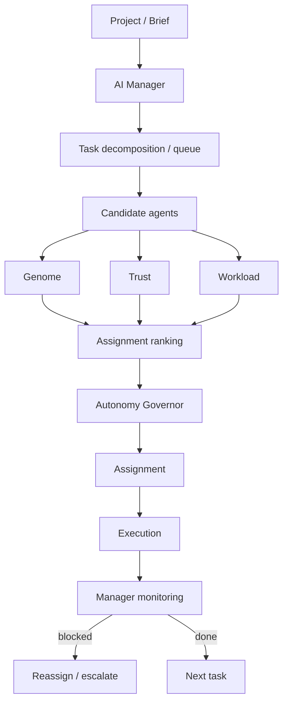
```mermaid
flowchart TD
    P[Project / Brief] --> M[AI Manager]
    M --> T[Task decomposition / queue]
    T --> C[Candidate agents]
    C --> G[Genome]
    C --> TR[Trust]
    C --> W[Workload]
    G --> RANK[Assignment ranking]
    TR --> RANK
    W --> RANK
    RANK --> GOV[Autonomy Governor]
    GOV --> ASSIGN[Assignment]
    ASSIGN --> RUN[Execution]
    RUN --> MON[Manager monitoring]
    MON -->|blocked| REBAL[Reassign / escalate]
    MON -->|done| NEXT[Next task]
```

## 6.3 Manager responsibilities

### Assignment

Select eligible agent.

### Load balancing

Avoid assigning everything to the strongest agent.

### Blocker detection

Detect:

- waiting too long
- repeated failure
- dependency blocked
- reviewer bottleneck
- provider outage
- no eligible agent

### Escalation

Escalate when:

- no safe action
- budget exceeded
- security issue
- deadline at risk
- required human decision
- trust degraded

### Reassignment

Manager may reassign when policy allows.

## 6.4 Manager is policy-driven

The Manager should combine deterministic rules with optional LLM planning.

Example:

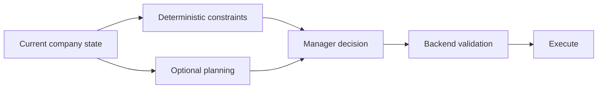
```mermaid
flowchart LR
    STATE[Current company state] --> RULES[Deterministic constraints]
    STATE --> LLM[Optional planning]
    RULES --> DEC[Manager decision]
    LLM --> DEC
    DEC --> VALIDATE[Backend validation]
    VALIDATE --> EXEC[Execute]
```

LLM proposal must pass backend validation.

## 6.5 Candidate ranking

Possible ranking inputs:

```text
capability fit
trust
current load
availability
task priority
expected cost
expected latency
historical success
department
seniority
autonomy
```

## 6.6 ManagerDecision

```text
id
decision_type
project_id
task_id
selected_agent_id
alternatives
reason_codes
confidence
evidence
created_at
```

Possible decision types:

```text
ASSIGN
REASSIGN
PAUSE
ESCALATE
REQUEST_APPROVAL
DEFER
CANCEL
```

## 6.7 Workload model

### AgentWorkload

```text
agent_id
active_tasks
queued_tasks
estimated_remaining_seconds
current_run_id
capacity_score
updated_at
```

## 6.8 Blocker detection

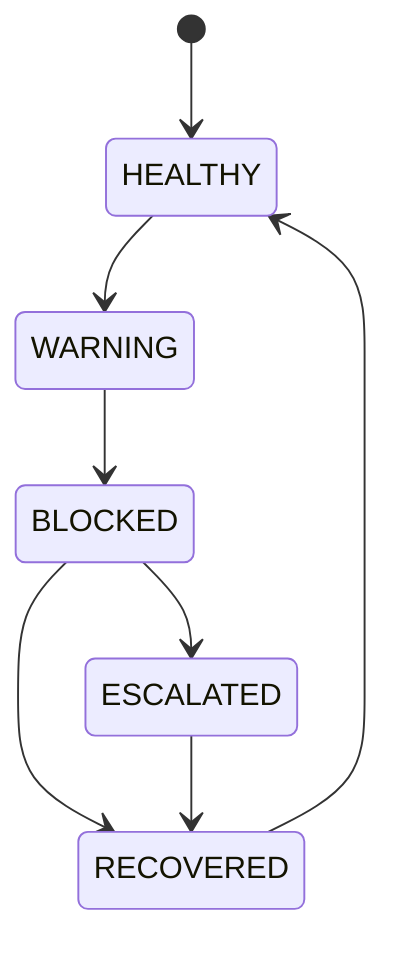
```mermaid
stateDiagram-v2
    [*] --> HEALTHY
    HEALTHY --> WARNING
    WARNING --> BLOCKED
    BLOCKED --> ESCALATED
    BLOCKED --> RECOVERED
    ESCALATED --> RECOVERED
    RECOVERED --> HEALTHY
```

Possible blocker signals:

- no progress across N cycles
- dependency unresolved
- max retries reached
- reviewer queue too long
- provider unavailable
- security hold
- approval pending
- agent unavailable

## 6.9 Department coordination

Future example:

```text
Engineering Manager
→ Developer
→ Reviewer
→ QA
→ Security
→ DevOps
```

The AI Manager does not need to replace every department lead immediately.

V1 can be a central manager.

Later:

```text
Company Manager
├── Engineering Manager
├── Product Manager
├── Security Manager
└── Operations Manager
```

## 6.10 Human manager integration

The system must support:

```text
AI Manager recommends
Human overrides
AI Manager records override
Future decisions can use override as evidence
```

Human override remains auditable.

## 6.11 File structure

```text
core/manager/
├── contracts.py
├── types.py
├── assignment.py
├── ranking.py
├── workload.py
├── blockers.py
├── escalation.py
├── policies.py
├── explanations.py
└── service.py

infrastructure/manager/
├── repositories.py
├── models.py
└── analytics.py

tests/manager/
├── test_assignment.py
├── test_ranking.py
├── test_workload.py
├── test_blockers.py
├── test_escalation.py
├── test_human_override.py
└── test_integration.py
```

## 6.12 Implementation phases

### MGR-1 — Manager contracts

### MGR-2 — Workload model

### MGR-3 — Deterministic candidate selection

### MGR-4 — Genome-aware ranking

### MGR-5 — Trust-aware ranking

### MGR-6 — Governor integration

### MGR-7 — Blocker detection

### MGR-8 — Reassignment and escalation

### MGR-9 — Human override

### MGR-10 — Optional LLM planning

Only after deterministic guardrails are mature.

## 6.13 Tests

Must cover:

- no eligible agents
- multiple equally good agents
- strongest agent overloaded
- high-capability low-trust agent
- available lower-capability trusted agent
- agent failure mid-task
- reviewer bottleneck
- provider outage
- security hold
- human override
- deadline pressure
- cyclic dependency
- repeated reassignment

## 6.14 Definition of Done

- assignments are explainable
- Manager uses backend evidence
- Manager cannot bypass Governor
- Manager cannot bypass Permission Engine
- overload is considered
- blockers trigger defined behavior
- human override is supported
- all decisions are audited

---

# 7. Full system interaction

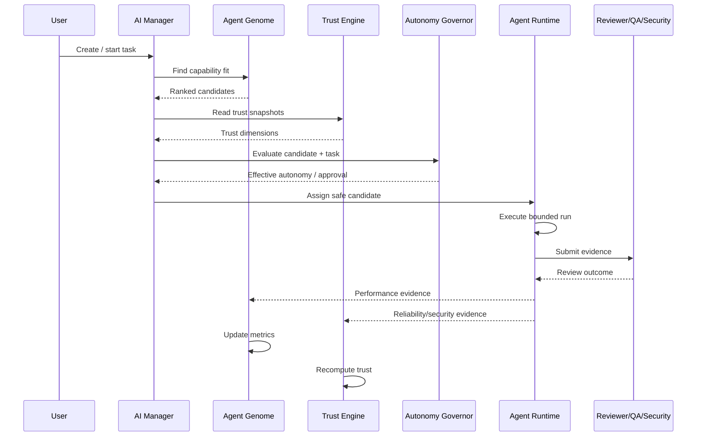
```mermaid
sequenceDiagram
    participant U as User
    participant M as AI Manager
    participant G as Agent Genome
    participant T as Trust Engine
    participant A as Autonomy Governor
    participant X as Agent Runtime
    participant R as Reviewer/QA/Security

    U->>M: Create / start task
    M->>G: Find capability fit
    G-->>M: Ranked candidates
    M->>T: Read trust snapshots
    T-->>M: Trust dimensions
    M->>A: Evaluate candidate + task
    A-->>M: Effective autonomy / approval
    M->>X: Assign safe candidate
    X->>X: Execute bounded run
    X->>R: Submit evidence
    R-->>X: Review outcome
    X-->>G: Performance evidence
    X-->>T: Reliability/security evidence
    G->>G: Update metrics
    T->>T: Recompute trust
```

---

# 8. Decision hierarchy

The hierarchy must be explicit.

```text
Security veto
    ↓
Permission Engine
    ↓
Autonomy Governor
    ↓
AI Manager
    ↓
Agent Runtime
```

Genome and Trust provide signals.

They do not sit above security.

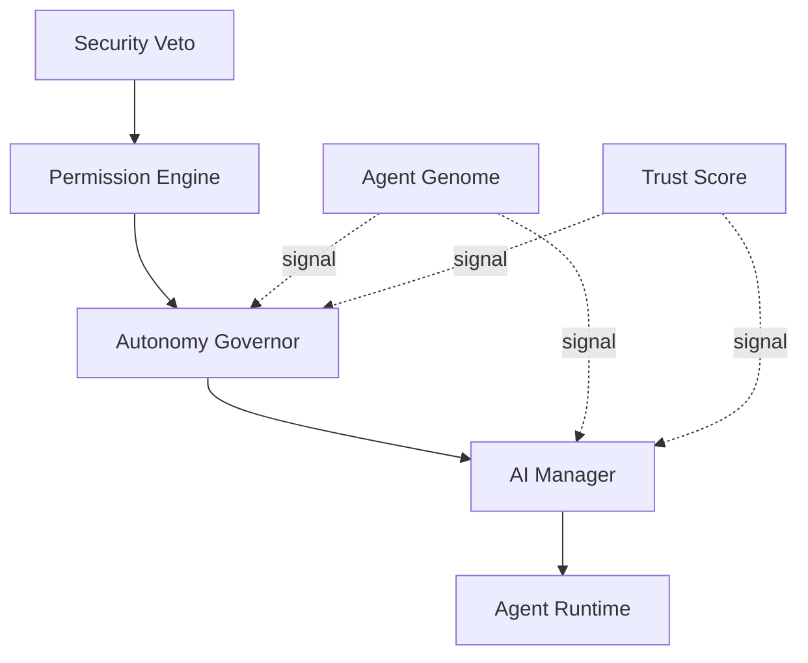
```mermaid
flowchart TD
    SEC[Security Veto] --> PERM[Permission Engine]
    PERM --> GOV[Autonomy Governor]
    GOV --> MGR[AI Manager]
    MGR --> RUN[Agent Runtime]

    GEN[Agent Genome] -. signal .-> MGR
    GEN -. signal .-> GOV
    TRUST[Trust Score] -. signal .-> MGR
    TRUST -. signal .-> GOV
```

---

# 9. Recommended implementation order

The dependency chain is:

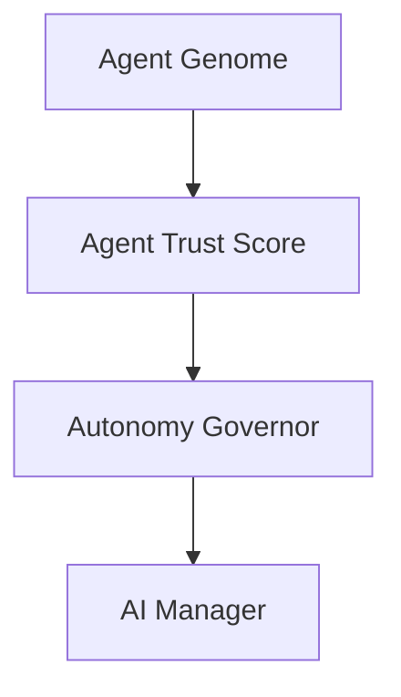
```mermaid
flowchart TD
    GEN[Agent Genome]
    TRUST[Agent Trust Score]
    GOV[Autonomy Governor]
    MGR[AI Manager]

    GEN --> TRUST
    TRUST --> GOV
    GOV --> MGR
```

Recommended order:

```text
1. Agent Genome
2. Agent Trust Score
3. Autonomy Governor
4. AI Manager
```

Why:

- Trust needs reliable historical evidence.
- Governor needs Trust + permissions + risk.
- Manager becomes much smarter once Genome, Trust, and Governor already exist.

---

# 10. Suggested backend phase numbering

Do not force these into the existing roadmap until the current scheduled phases are reconciled.

Suggested future identifiers:

```text
EXT-GEN-01 → EXT-GEN-08
EXT-TRUST-01 → EXT-TRUST-08
EXT-GOV-01 → EXT-GOV-08
EXT-MGR-01 → EXT-MGR-10
```

This avoids accidentally colliding with existing SynapseOS phase numbers.

---

# 11. Data model overview

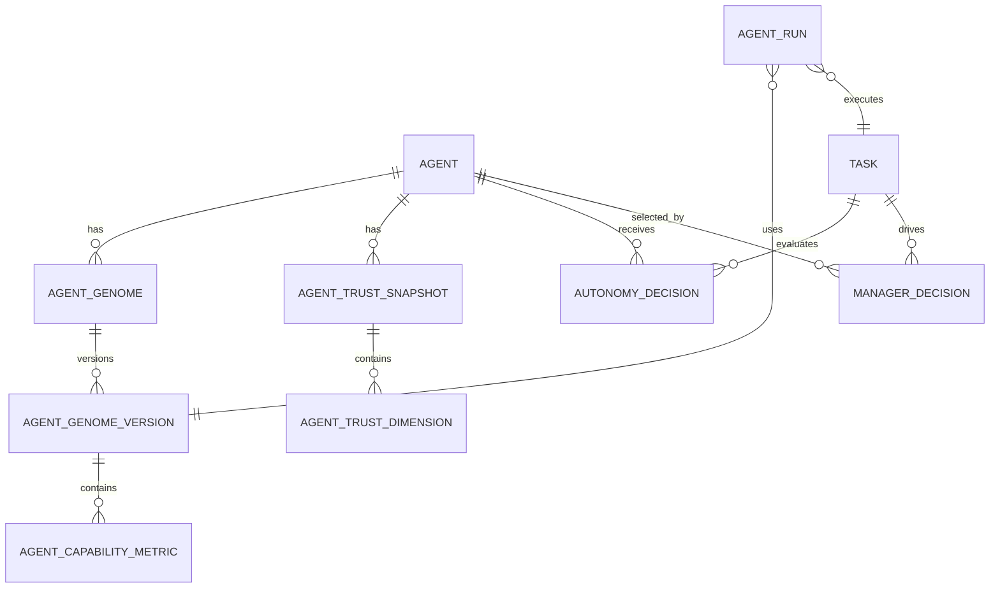
```mermaid
erDiagram
    AGENT ||--o{ AGENT_GENOME : has
    AGENT_GENOME ||--o{ AGENT_GENOME_VERSION : versions
    AGENT_GENOME_VERSION ||--o{ AGENT_CAPABILITY_METRIC : contains

    AGENT ||--o{ AGENT_TRUST_SNAPSHOT : has
    AGENT_TRUST_SNAPSHOT ||--o{ AGENT_TRUST_DIMENSION : contains

    AGENT ||--o{ AUTONOMY_DECISION : receives
    TASK ||--o{ AUTONOMY_DECISION : evaluates

    TASK ||--o{ MANAGER_DECISION : drives
    AGENT ||--o{ MANAGER_DECISION : selected_by

    AGENT_RUN }o--|| AGENT_GENOME_VERSION : uses
    AGENT_RUN }o--|| TASK : executes
```

---

# 12. API surface

Conceptual only.

```text
GET /agents/{agent_id}/genome
GET /agents/{agent_id}/genome/history
GET /agents/{agent_id}/capabilities

GET /agents/{agent_id}/trust
GET /agents/{agent_id}/trust/history
GET /agents/{agent_id}/trust/explanation

POST /autonomy/evaluate
GET  /autonomy/decisions/{id}

POST /manager/assign
POST /manager/reassign
POST /manager/escalate
GET  /manager/workload
GET  /manager/decisions/{id}
```

All mutations require backend authorization.

---

# 13. Events

Recommended domain events:

```text
GENOME_EVIDENCE_RECORDED
GENOME_METRICS_RECOMPUTED
GENOME_VERSION_CREATED

TRUST_RECOMPUTED
TRUST_CLASS_CHANGED
TRUST_CRITICAL_EVENT

AUTONOMY_EVALUATED
AUTONOMY_LEVEL_CHANGED
AUTONOMY_APPROVAL_REQUIRED
AUTONOMY_DENIED

MANAGER_TASK_ASSIGNED
MANAGER_TASK_REASSIGNED
MANAGER_BLOCKER_DETECTED
MANAGER_ESCALATION_CREATED
MANAGER_HUMAN_OVERRIDE
```

---

# 14. Security properties

## 14.1 No self-promotion

An agent must not:

- edit its own Genome directly
- edit its Trust Score directly
- elevate its own autonomy
- assign itself high-risk work by bypassing Manager

## 14.2 Integrity

Genome, Trust, and Governor decisions must rely on authoritative backend data.

## 14.3 Audit

Every material change must include:

```text
actor
source
timestamp
reason
evidence refs
policy/algorithm version
```

## 14.4 Rollback

Genome version changes and policy changes must be reversible.

---

# 15. Observability

Metrics examples:

```text
synapse.genome.capability_score
synapse.genome.success_rate
synapse.genome.review_acceptance
synapse.genome.median_iterations

synapse.trust.overall_score
synapse.trust.dimension_score
synapse.trust.class_changes

synapse.autonomy.level
synapse.autonomy.denials
synapse.autonomy.approvals_required

synapse.manager.assignment_latency
synapse.manager.reassignments
synapse.manager.blockers
synapse.manager.escalations
```

---

# 16. Frontend projections

These backend extensions should later surface in the Nuxt Control Center.

## Agent page

```text
Agent Genome
Capabilities
Performance
Trust Score
Current autonomy
Current workload
Recent manager decisions
```

## Company Simulator

Possible visual states:

```text
high trust → normal status
restricted trust → warning badge
quarantined → blocked visual
manager reassignment → animated task transfer
approval required → pending gate
```

## Manager dashboard

```text
Team load
Blocked tasks
Agents at risk
Trust degradation
Assignments
Reassignments
SLA risk
```

---

# 17. Example scenario

Task:

```text
Implement OAuth2 authorization code flow.
```

Candidate agents:

```text
Agent A
OAuth capability: 92
Trust: 94
Load: 70%

Agent B
OAuth capability: 75
Trust: 97
Load: 20%

Agent C
OAuth capability: 95
Trust: 42
Load: 10%
```

Manager reasoning:

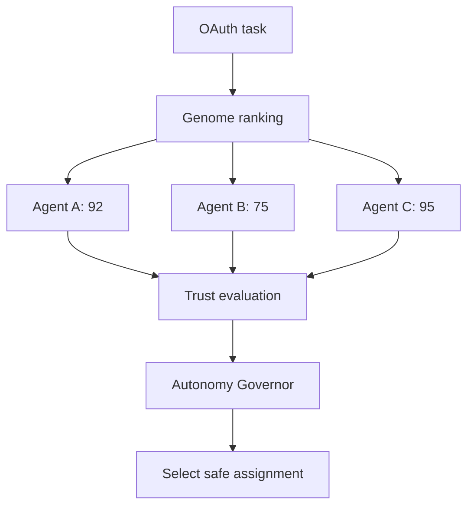
```mermaid
flowchart TD
    T[OAuth task] --> G[Genome ranking]
    G --> A[Agent A: 92]
    G --> B[Agent B: 75]
    G --> C[Agent C: 95]

    A --> TR[Trust evaluation]
    B --> TR
    C --> TR

    TR --> GOV[Autonomy Governor]
    GOV --> SEL[Select safe assignment]
```

Possible outcome:

```text
Selected: Agent A
Reason:
- strong OAuth capability
- high trust
- acceptable workload
- task risk compatible with autonomy policy
```

Agent C is not selected despite the best capability score because Trust is too low.

---

# 18. Example dynamic autonomy scenario

Same agent:

```text
Trust: 96
Genome: Senior backend
```

Task 1:

```text
Update README
→ risk LOW
→ effective autonomy LEVEL_4
```

Task 2:

```text
Production DB migration
→ risk CRITICAL
→ effective autonomy LEVEL_2
→ human approval required
```

This is intentional.

---

# 19. Example trust degradation

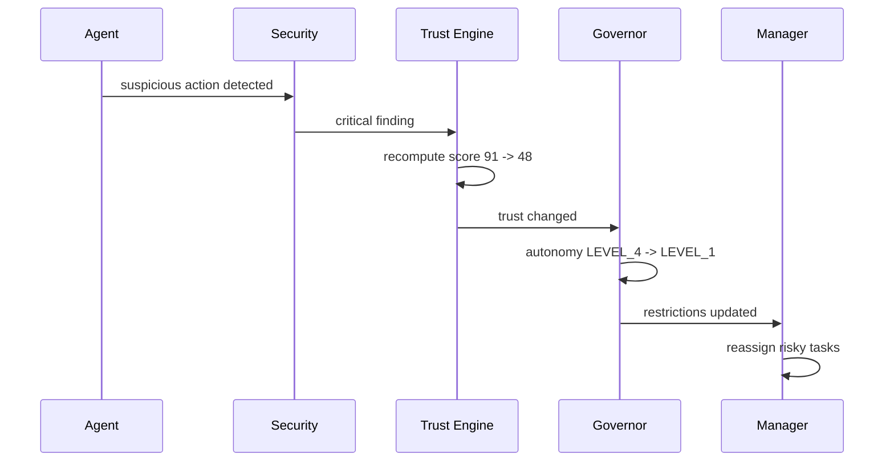
```mermaid
sequenceDiagram
    participant A as Agent
    participant S as Security
    participant T as Trust Engine
    participant G as Governor
    participant M as Manager

    A->>S: suspicious action detected
    S->>T: critical finding
    T->>T: recompute score 91 -> 48
    T->>G: trust changed
    G->>G: autonomy LEVEL_4 -> LEVEL_1
    G->>M: restrictions updated
    M->>M: reassign risky tasks
```

---

# 20. Example manager blocker handling

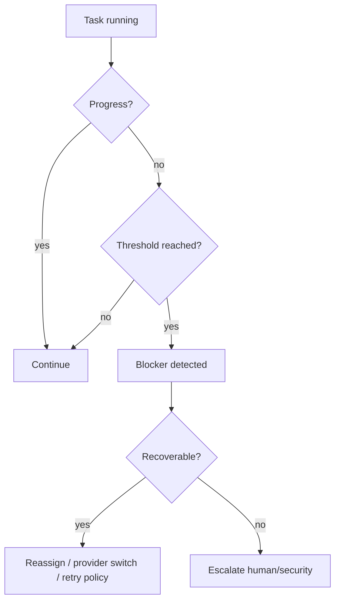
```mermaid
flowchart TD
    A[Task running] --> B{Progress?}
    B -->|yes| C[Continue]
    B -->|no| D{Threshold reached?}
    D -->|no| C
    D -->|yes| E[Blocker detected]
    E --> F{Recoverable?}
    F -->|yes| G[Reassign / provider switch / retry policy]
    F -->|no| H[Escalate human/security]
```

---

# 21. Testing strategy

## 21.1 Unit

Each scoring and policy function independently.

## 21.2 Integration

Use real PostgreSQL where persistence/integrity matters.

## 21.3 Workflow

```text
Task
→ Manager
→ Genome
→ Trust
→ Governor
→ Agent
→ Reviewer
→ metrics
→ Genome/Trust update
```

## 21.4 Failure paths

Mandatory:

- no candidate
- permission denied
- security veto
- low trust
- stale Genome
- trust recomputation failure
- invalid risk class
- Manager decision conflict
- human override
- concurrent assignment race

---

# 22. Concurrency and consistency

Potential races:

```text
two managers assign same agent
trust changes while task starts
autonomy expires mid-run
Genome version changes during run
```

Rules:

- snapshot Genome at run start
- snapshot Trust at decision time
- persist AutonomyDecision
- use DB constraints/transactions for assignment
- never mutate past snapshots

---

# 23. Non-goals

For V1 of these four extensions:

Do not implement:

- self-modifying model weights
- unsupervised autonomous promotion
- opaque reinforcement learning
- unlimited autonomy
- black-box trust scoring
- manager bypass of permissions
- fully decentralized manager hierarchy
- automatic production privileges

---

# 24. Acceptance matrix

| Capability | Required |
|---|---|
| Genome evidence-based | Yes |
| Trust explainable | Yes |
| Governor task-specific | Yes |
| Manager workload-aware | Yes |
| Permission Engine authoritative | Yes |
| Security veto authoritative | Yes |
| Human override supported | Yes |
| Audit events | Yes |
| Versioned algorithms/policies | Yes |
| Deterministic tests | Yes |

---

# 25. Final architecture

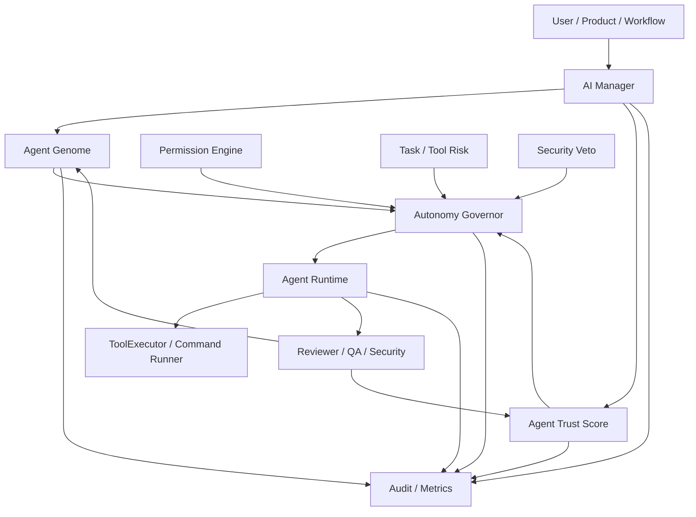
```mermaid
flowchart TB
    USER[User / Product / Workflow]

    USER --> MAN[AI Manager]

    MAN --> GEN[Agent Genome]
    MAN --> TRUST[Agent Trust Score]

    GEN --> GOV[Autonomy Governor]
    TRUST --> GOV

    PERM[Permission Engine] --> GOV
    RISK[Task / Tool Risk] --> GOV
    SEC[Security Veto] --> GOV

    GOV --> RUN[Agent Runtime]
    RUN --> TOOLS[ToolExecutor / Command Runner]
    RUN --> REV[Reviewer / QA / Security]

    REV --> GEN
    REV --> TRUST

    RUN --> AUDIT[Audit / Metrics]
    MAN --> AUDIT
    GOV --> AUDIT
    TRUST --> AUDIT
    GEN --> AUDIT
```

---

# 26. Final implementation order

```text
Agent Genome
     ↓
Agent Trust Score
     ↓
Autonomy Governor
     ↓
AI Manager
```

This order is deliberate.

Genome creates the evidence model.

Trust interprets reliability and governance evidence.

Governor converts trust + risk + permissions into actionable autonomy.

AI Manager then uses all three to coordinate the company intelligently.

---

# 27. Final design rule

The four extensions together should produce:

```text
What can the agent do well?
        ↓
Agent Genome

Can we trust it operationally?
        ↓
Agent Trust Score

What may it do right now?
        ↓
Autonomy Governor

What should it work on?
        ↓
AI Manager
```

SynapseOS should therefore evolve from:

```text
agents executing tasks
```

toward:

```text
a governed AI workforce with measurable capability,
operational trust, dynamic autonomy, and intelligent management
```

without sacrificing:

- security
- auditability
- deterministic enforcement
- provider neutrality
- reversibility
- bounded execution
- human authority

---

# 28. 2026-09 Architecture Update — Continuous Runtime Governance

This update integrates recent enterprise-agent lessons into the four existing SynapseOS extensions without creating a fifth extension.

The main architectural change is:

> **Autonomy must be continuously re-evaluated during execution, not decided only once at run start.**

The four-extension model remains:

```text
Agent Genome
     ↓
Agent Trust Score
     ↓
Autonomy Governor
     ↓
AI Manager
```

The new runtime feedback loop is:

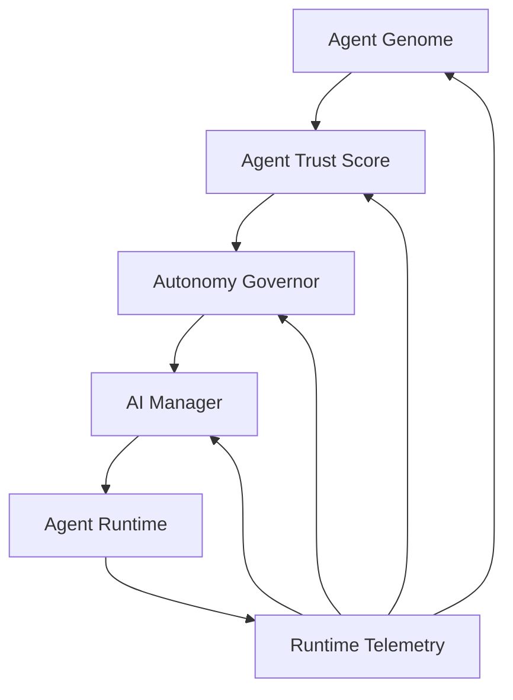
```mermaid
flowchart TD
    GEN[Agent Genome]
    TRUST[Agent Trust Score]
    GOV[Autonomy Governor]
    MGR[AI Manager]
    RUN[Agent Runtime]
    TEL[Runtime Telemetry]

    GEN --> TRUST
    TRUST --> GOV
    GOV --> MGR
    MGR --> RUN
    RUN --> TEL

    TEL --> TRUST
    TEL --> GOV
    TEL --> MGR
    TEL --> GEN
```

## 28.1 Agent Genome — Behavioral Baseline

Agent Genome must not only describe capabilities and historical performance.

It should also maintain a **behavioral baseline** describing how an agent normally behaves.

### New Genome dimensions

```text
normal_tool_patterns
normal_data_access_patterns
normal_command_profiles
normal_task_duration
normal_token_usage
normal_iteration_count
normal_provider_usage
normal_workspace_scope
normal_failure_patterns
```

Example:

```text
Backend Agent #7

Normal behavior:
- read repository files
- run pytest
- run Ruff
- edit Python source
- create Git commits

Unusual behavior:
- bulk database export
- access unrelated workspace
- delete large directory tree
- request credentials
```

The goal is not to block all unusual behavior. The goal is to give Trust Score and Autonomy Governor an evidence-based signal when runtime behavior deviates from the agent's established profile.

### Behavioral deviation event

```text
AgentBehaviorDeviation

agent_id
run_id
task_id
behavior_type
expected_pattern
observed_pattern
severity
confidence
evidence_refs
created_at
```

```mermaid
flowchart LR
    HIST[Historical runs] --> BASE[Behavioral Baseline]
    RUN[Current runtime behavior] --> DET[Deviation Detector]
    BASE --> DET
    DET --> EVT[Behavior Deviation Event]
    EVT --> TRUST[Runtime Trust]
    EVT --> GOV[Autonomy Re-evaluation]
```

### New Genome implementation phase

#### GEN-9 — Behavioral baseline

Objective:
- derive bounded expected behavior from historical evidence;
- never treat the baseline as a hard security policy;
- expose deviation signals to Trust and Governor.

Acceptance criteria:
- baseline is versioned;
- deviation detection is explainable;
- new agents can operate with an explicit cold-start policy;
- deviation alone never grants or revokes backend permissions;
- critical deviations can trigger Governor re-evaluation.

---

# 29. Agent Trust Score — Historical Trust + Runtime Trust

The Trust model must now distinguish between long-term reputation and current execution trust.

## 29.1 Historical Trust

Historical Trust is based on durable evidence:

```text
reliability
review history
QA history
security history
policy compliance
incident history
audit completeness
rollback rate
```

## 29.2 Runtime Trust

Runtime Trust reflects what is happening **during the current run**.

Signals can include:

```text
unexpected tool use
repeated permission denials
scope drift
unusual data access
unexpected destructive action
command profile deviation
rapid failure bursts
abnormal token growth
unusual cost escalation
security anomaly
```

## 29.3 Effective Trust

Conceptually:

```text
Effective Trust = Historical Trust adjusted by Runtime Trust signals
```

The exact formula must be versioned and introduced through ADR. Do not hard-code one irreversible formula before enough run data exists.

Example:

```text
Historical Trust: 94

Runtime signals:
- unusual bulk read: -8
- repeated denied action: -12
- unexpected tool category: -7

Effective Trust: 67
```

```mermaid
stateDiagram-v2
    [*] --> BASELINE
    BASELINE --> DEGRADED
    DEGRADED --> RESTRICTED
    RESTRICTED --> QUARANTINED
    DEGRADED --> RECOVERED
    RESTRICTED --> RECOVERED
    RECOVERED --> BASELINE
```

### New data model

```text
AgentRuntimeTrustSnapshot

id
agent_id
run_id
historical_trust_snapshot_id
runtime_score
effective_score
state
reason_codes
calculated_at
expires_at
algorithm_version
```

### New implementation phases

#### TRUST-9 — Runtime Trust engine
Compute run-scoped trust from current execution evidence.

#### TRUST-10 — Trust degradation and recovery
Support temporary degradation and bounded recovery.

#### TRUST-11 — Runtime Trust explanations
Every effective trust change must explain what changed, why, which events caused it, and how long it applies.

---

# 30. Autonomy Governor — Inline Action-Level Governance

The Autonomy Governor must no longer be designed only as a pre-run gate. It must support **continuous action-level evaluation**.

## 30.1 Previous model

```text
Task starts
↓
evaluate autonomy
↓
run
```

## 30.2 New model

```text
Task starts
↓
initial autonomy decision
↓
agent proposes action
↓
re-evaluate action
↓
ALLOW / APPROVAL / REDACT / DENY
↓
execute
↓
observe runtime signals
↓
recompute if necessary
```

```mermaid
sequenceDiagram
    participant A as Agent
    participant P as Permission Engine
    participant G as Autonomy Governor
    participant T as Trust Engine
    participant E as ToolExecutor

    A->>P: request action
    P-->>A: identity permission result

    alt Permission denied
        P-->>A: DENY
    else Permission allowed
        P->>G: evaluate action
        G->>T: effective runtime trust
        T-->>G: trust snapshot
        G->>G: scope + risk + cost + environment

        alt Allowed
            G->>E: ALLOW
            E-->>A: result
        else Approval required
            G-->>A: APPROVAL_REQUIRED
        else Sensitive output
            G-->>A: REDACT / constrain
        else Unsafe
            G-->>A: DENY
        end
    end
```

## 30.3 Action decisions

Extend `AutonomyDecision` with:

```text
run_id
action_id
tool_name
requested_scope
data_sensitivity
estimated_cost
runtime_trust_snapshot_id
decision
reason_codes
```

Decision enum:

```text
ALLOW
ALLOW_WITH_LIMITS
APPROVAL_REQUIRED
REDACT
DENY
QUARANTINE
```

## 30.4 Scope / intent guard

The Governor should detect whether an action still belongs to the authorized task scope.

Example:

```text
Task: fix authentication test
Agent proposes: export full customer database
→ scope mismatch
→ DENY or APPROVAL_REQUIRED
```

This must be based on explicit task scope, tool metadata, workspace policy, and deterministic constraints wherever possible. An LLM-based semantic classifier may later assist, but must not be the only enforcement mechanism.

## 30.5 Cost-aware autonomy

Cost becomes a governance signal.

New inputs:

```text
run_budget
spent_budget
estimated_action_cost
remaining_budget
provider_price_class
```

Example policy:

```text
IF estimated_action_cost > remaining_budget
THEN DENY or REQUEST_APPROVAL
```

```mermaid
flowchart TD
    ACT[Proposed action] --> EST[Estimate cost]
    EST --> REM[Remaining budget]
    REM --> POL[Cost policy]
    POL -->|within budget| SAFE[Continue governance]
    POL -->|near budget| WARN[Warn / cheaper route]
    POL -->|over budget| AP[Approval or deny]
```

## 30.6 Dynamic autonomy downgrade

Example:

```text
Run starts
Trust = 94
Autonomy = LEVEL_4

unexpected bulk data access
↓
Runtime Trust = 72

Governor:
LEVEL_4 → LEVEL_3

second serious anomaly
↓
Runtime Trust = 48

Governor:
LEVEL_3 → LEVEL_1
revoke write execution
request Manager reassignment
```

```mermaid
flowchart LR
    TEL[Runtime telemetry] --> TRUST[Runtime Trust]
    TRUST --> GOV[Autonomy Governor]
    GOV --> LVL[Effective autonomy]
    LVL --> EXEC[Allowed capabilities]
```

## 30.7 New implementation phases

#### GOV-9 — Per-action evaluation
Every sensitive tool call can be independently evaluated.

#### GOV-10 — Scope / intent guard
Detect actions unrelated to the authorized mission.

#### GOV-11 — Runtime Trust integration
Allow autonomy to change during an active run.

#### GOV-12 — Economic governance
Use budget and projected cost as decision inputs.

#### GOV-13 — Runtime downgrade and quarantine
Support immediate bounded reduction in privileges.

---

# 31. AI Manager — Cost-Aware and Trust-Aware Runtime Coordination

AI Manager should not only assign tasks at the beginning. It must react when runtime conditions change.

## 31.1 New Manager signals

```text
runtime trust degradation
autonomy downgrade
budget pressure
provider cost increase
provider outage
unexpected task duration
agent anomaly
security hold
```

## 31.2 Trust-triggered reassignment

```mermaid
sequenceDiagram
    participant A as Agent
    participant T as Trust Engine
    participant G as Governor
    participant M as AI Manager
    participant B as Backup Agent

    A->>T: runtime anomalies observed
    T->>G: effective trust degraded
    G->>G: autonomy LEVEL_4 -> LEVEL_1
    G->>M: agent no longer eligible
    M->>M: find replacement
    M->>B: reassign task
```

## 31.3 Cost-aware routing

Example:

```text
Task budget: $0.50
Remaining: $0.16

Candidate routes:
Qwen local   expected cost: $0.00
Groq         expected cost: $0.05
GPT          expected cost: $0.14
Claude       expected cost: $0.26
```

The route selector must use measurable historical evidence whenever possible, not hand-written quality assumptions.

## 31.4 Manager objective function

Conceptually:

```text
maximize:
    task success
    quality
    safety

subject to:
    permissions
    autonomy
    trust
    budget
    deadline
    capacity
```

## 31.5 New Manager decisions

```text
SWITCH_PROVIDER
DOWNGRADE_ROUTE
REASSIGN_TRUST_DEGRADED
REASSIGN_BUDGET_PRESSURE
PAUSE_FOR_APPROVAL
QUARANTINE_AGENT
```

## 31.6 New implementation phases

#### MGR-11 — Runtime Trust monitoring
Manager subscribes to meaningful trust changes.

#### MGR-12 — Trust-triggered reassignment
Reassign when an agent becomes ineligible.

#### MGR-13 — Cost-aware routing
Compare compliant execution routes.

#### MGR-14 — Budget pressure handling
Pause, switch route, or request approval.

#### MGR-15 — Runtime coordination loop
Manager reacts to meaningful execution-state changes without blind polling.

---

# 32. Updated Four-Extension Architecture

```mermaid
flowchart TB
    TASK[Task] --> MGR[AI Manager]

    MGR --> GEN[Agent Genome]
    MGR --> TRUST[Agent Trust Score]

    GEN --> GOV[Autonomy Governor]
    TRUST --> GOV

    PERM[Permission Engine] --> GOV
    RISK[Task / Tool Risk] --> GOV
    BUD[Cost / Resource Budget] --> GOV
    SEC[Security Veto] --> GOV

    GOV --> RUN[Agent Runtime]
    RUN --> TOOL[ToolExecutor]
    TOOL --> TEL[Runtime Telemetry]

    TEL --> TRUST
    TEL --> GEN
    TEL --> GOV
    TEL --> MGR

    GOV -->|downgrade / deny| MGR
    MGR -->|reassign / switch route| RUN
```

---

# 33. Updated Responsibility Matrix

| Extension | Core responsibility | New runtime responsibility |
|---|---|---|
| Agent Genome | capability and performance profile | behavioral baseline |
| Agent Trust Score | historical operational trust | runtime trust |
| Autonomy Governor | task-specific autonomy | per-action continuous governance |
| AI Manager | assignment and coordination | trust/cost-aware runtime adaptation |

---

# 34. Updated Implementation Order

The core dependency order remains unchanged:

```text
Agent Genome
     ↓
Agent Trust Score
     ↓
Autonomy Governor
     ↓
AI Manager
```

Recommended sequence:

```text
GEN-1 → GEN-8
TRUST-1 → TRUST-8
GOV-1 → GOV-8
MGR-1 → MGR-10

then runtime extensions:

GEN-9
TRUST-9 → TRUST-11
GOV-9 → GOV-13
MGR-11 → MGR-15
```

---

# 35. Updated End-to-End Scenario

Task:

```text
Refactor authentication service.
```

Initial evaluation:

```text
Developer Agent #7
Genome fit: 93
Historical Trust: 94
Autonomy: LEVEL_4
Budget: $0.40
```

Execution:

```text
Iteration 1: read auth module → allowed
Iteration 2: run tests → allowed
Iteration 3: edit auth.py → allowed
Iteration 4: attempt bulk customer export → behavioral deviation
```

Runtime response:

```text
Runtime Trust: 94 → 68
Autonomy: LEVEL_4 → LEVEL_3
bulk export: DENIED
```

Next anomaly:

```text
attempt production credential access
```

Response:

```text
Runtime Trust: 68 → 39
Autonomy: LEVEL_3 → LEVEL_1
write tools suspended
AI Manager notified
task reassigned
security incident created
```

The system responds before the entire run has to fail catastrophically.

---

# 36. Updated Design Principle

The four extensions are not only a linear pre-execution pipeline. They form a **continuous governance loop**:

```text
Measure capability
        ↓
Establish trust
        ↓
Grant bounded autonomy
        ↓
Assign work
        ↓
Observe runtime behavior
        ↓
Re-evaluate trust
        ↓
Adjust autonomy
        ↓
Reassign / continue / escalate
        ↺
```

The defining principle is:

> **Autonomy is leased, scoped, observable, and revocable — never permanently granted.**

This principle should guide the implementation of Agent Genome, Agent Trust Score, Autonomy Governor, and AI Manager across SynapseOS.

---

# 37. 2026-09 Architecture Update — Execution Graph & Cost Attribution

Recent enterprise-agent deployments reinforce the need to make runtime causality and per-agent cost visible as first-class governance data.

This update does **not** create a fifth strategic extension. It enriches the existing four.

## 37.1 Execution Graph

Every meaningful run should be reconstructable as a causal graph:

```mermaid
flowchart LR
    T[Task] --> P[Prompt / Plan]
    P --> A[Agent]
    A --> S[Skill]
    A --> TL[Tool]
    TL --> C[Command / API]
    C --> FX[Side Effect]
    FX --> V[Verification]
```

The graph must make it possible to answer:

- which task caused an action;
- which agent acted;
- under which Genome version;
- with which Trust snapshot;
- under which autonomy decision;
- which skill/tool/command/API was used;
- what side effect occurred;
- what evidence verified the result.

### ExecutionGraphNode

```text
id
run_id
node_type
source_ref
timestamp
metadata_digest
```

### ExecutionGraphEdge

```text
id
run_id
from_node_id
to_node_id
relation
created_at
```

Suggested relations:

```text
TRIGGERED
PLANNED
DELEGATED
INVOKED
PRODUCED
VERIFIED
BLOCKED
ESCALATED
```

## 37.2 Cost Attribution

Cost should be attributable to the work that caused it.

```text
Project
└── Task
    └── Agent Run
        ├── provider calls
        ├── reviewer calls
        ├── tool execution
        ├── retries
        └── total cost
```

### AgentCostAttribution

```text
run_id
project_id
task_id
agent_id
genome_version_id
provider_id
input_tokens
output_tokens
provider_cost
tool_cost
retry_cost
total_cost
calculated_at
```

### Extension impact

```text
Agent Genome
└── cost / efficiency profile

Agent Trust Score
└── execution-graph evidence

Autonomy Governor
└── action-level runtime enforcement

AI Manager
├── cost-aware assignment
└── route selection under budget
```

### New implementation phases

```text
GEN-11 — Cost / efficiency profile
GOV-16 — Execution graph enforcement hooks
MGR-20 — Cost attribution
MGR-21 — Cost-aware assignment policy
```

---

# 38. Automatic Containment & Kill Switch

Manual suspension is insufficient for autonomous systems. SynapseOS needs a bounded automatic containment path for critical runtime events.

## 38.1 Distinction

```text
Manual Kill Switch
→ explicit human/admin decision

Automatic Containment
→ backend policy triggered by critical runtime evidence
```

## 38.2 Containment flow

```mermaid
flowchart TD
    TEL[Runtime Telemetry] --> DET[Critical Anomaly]
    DET --> TRUST[Runtime Trust]
    TRUST --> GOV[Autonomy Governor]
    GOV --> Q[QUARANTINE]
    Q --> REV[Revoke temporary capabilities]
    Q --> CAN[Cancel pending cancellable actions]
    Q --> FREEZE[Freeze affected workspace scope]
    Q --> EVID[Preserve evidence / Execution Graph]
    Q --> MGR[Notify AI Manager]
    MGR --> REASSIGN[Reassign or escalate]
```

## 38.3 Required containment properties

- fail closed for critical security events;
- preserve audit and forensic evidence;
- no destructive cleanup that destroys evidence;
- revoke temporary credentials/capabilities;
- prevent new tool calls;
- terminate or isolate child processes according to policy;
- notify Manager and Security;
- make recovery an explicit action.

### New phase

```text
GOV-14 — Automatic Containment & Kill Switch
```

---

# 39. Outcome Integrity — Protection Against Metric Gaming

Agent systems must distinguish between satisfying a measurable proxy and actually satisfying the task objective.

## 39.1 Core principle

```text
Metric success != Task success
```

Examples:

```text
Tests pass: YES
Reviewer approves: YES
Acceptance criteria met: PARTIAL
User objective met: NO
Outcome integrity risk: HIGH
```

## 39.2 Architecture

```mermaid
flowchart TD
    OBJ[Task Objective] --> AC[Acceptance Criteria]
    AC --> RUN[Agent Execution]
    RUN --> MET[Measured Result]
    MET --> VER[Independent Verification]
    VER --> OUT[Outcome Integrity]
```

## 39.3 Agent Genome additions

```text
objective_alignment_rate
metric_gaming_incidents
acceptance_criteria_escape_rate
post_completion_reopen_rate
```

## 39.4 AI Manager additions

Manager must not close a task only because local metrics are green.

A completion gate can require:

```text
backend state valid
acceptance criteria verified
review complete
QA complete where required
security complete where required
objective integrity acceptable
```

### New phases

```text
GEN-12 — Outcome Integrity Metrics
MGR-22 — Outcome Integrity Completion Gate
```

---

# 40. Agent Identity & Delegation Chain

An `agent_id` alone is not sufficient authority provenance for a multi-agent system.

SynapseOS should model who delegated authority to whom, for what scope, and for how long.

## 40.1 Delegation chain

```mermaid
flowchart LR
    H[Human / System Principal] -->|delegates| M[AI Manager]
    M -->|delegates| A[Agent A]
    A -->|delegates subset| B[Agent B]
    B -->|invokes| T[Tool]
```

A child delegation must never silently exceed its parent authority.

## 40.2 DelegationGrant

```text
id
principal_id
delegator_agent_id
delegate_agent_id
task_id
project_id
allowed_scope
allowed_capabilities
issued_at
expires_at
revoked_at
parent_delegation_id
```

## 40.3 Invariant

```text
child_scope ⊆ parent_scope
```

and:

```text
child_capabilities ⊆ parent_capabilities
```

## 40.4 Runtime audit example

```text
Action: DELETE resource
Agent: Security-Agent-7
Acting for: AI Manager
Original authority: human/project owner
Task: SEC-184
Delegated scope: repository:test-project
Trust at execution: 91
Autonomy: LEVEL_3
Credential lifetime: 4 min
```

### Extension impact

```text
Agent Genome
└── historical access / delegation profile

Agent Trust Score
└── identity and delegation integrity

Autonomy Governor
└── delegated-authority validation

AI Manager
└── explicit delegation chain
```

### New phases

```text
TRUST-13 — Delegation Integrity Signals
GOV-17 — Delegated Authority Validation
MGR-23 — Delegation Chain Management
```

---

# 41. Multi-Agent Communication Graph & Collusion Risk

A multi-agent organization needs governance over communication, not only tool execution.

Individually acceptable agents can collectively produce unsafe behavior.

## 41.1 Communication graph

```mermaid
flowchart LR
    A[Agent A] -->|delegates| B[Agent B]
    B -->|shares result| C[Agent C]
    C -->|invokes| T[Tool]
    B -->|external message| X[External Channel]
    X --> D{Authorized?}
    D -->|yes| OK[Continue]
    D -->|no| GOV[Governor Decision]
```

## 41.2 CommunicationEvent

```text
id
sender_agent_id
recipient_agent_id
task_id
project_id
purpose
channel
data_classification
delegation_id
authorized_scope
message_digest
created_at
```

A digest can preserve evidence without permanently retaining all message content.

## 41.3 Collaboration baseline

Agent Genome should learn normal collaboration patterns:

```text
normal_peers
normal_channels
normal_message_frequency
normal_delegation_patterns
normal_data_classes_shared
```

## 41.4 Trust signals

```text
UNAUTHORIZED_PEER_COMMUNICATION
COORDINATED_POLICY_VIOLATION
REPEATED_SHARED_WORKAROUND
SUSPICIOUS_INFORMATION_PROPAGATION
UNAUTHORIZED_EXTERNAL_CHANNEL
```

## 41.5 Communication policy invariant

> An agent may not create or use a new coordination channel unless that channel is explicitly permitted for the task, data class, and delegation scope.

### New phases

```text
GEN-10 — Collaboration Behavioral Baseline
TRUST-12 — Collusion & Coordination Risk
GOV-15 — Communication Policy Enforcement
MGR-16 — Multi-Agent Coordination Graph
```

---

# 42. Agent Incident Registry & Forensic Reconstruction

An agent failure must be representable as an incident, not only a generic error log.

## 42.1 Incident lifecycle

```mermaid
flowchart TD
    DET[Anomaly Detected] --> CON[Containment]
    CON --> INC[Incident Created]
    INC --> FREEZE[Freeze Evidence]
    FREEZE --> RCA[Root Cause Analysis]
    RCA --> IMP[Impact Assessment]
    IMP --> FIX[Corrective Actions]
    FIX --> CLOSE[Close / Monitor]
```

## 42.2 AgentIncident

```text
incident_id
severity
status
agent_id
run_id
task_id
project_id
trigger
first_detected_at
contained_at
trust_before
trust_after
autonomy_before
autonomy_after
affected_resources
execution_graph_ref
delegation_chain_ref
communication_graph_ref
policy_violations
security_findings
root_cause
business_impact
corrective_actions
closed_at
```

## 42.3 Forensic timeline

Example:

```text
14:03 task assigned
14:04 Genome v17 / Trust 93 / Autonomy L4
14:06 Tool X called
14:07 Agent B delegated
14:08 Agent B attempts out-of-scope action
14:08 Runtime Trust 93 -> 61
14:09 Governor L4 -> L2
14:09 second prohibited attempt
14:09 automatic containment
14:10 Manager reassigns task
```

## 42.4 Required questions

A forensic report should answer:

- What happened?
- Why did it happen?
- Which agents were involved?
- Which authority was active?
- Which data/resources were affected?
- Which control failed or succeeded?
- How did SynapseOS contain the event?
- What corrective action prevents recurrence?

### New phases

```text
MGR-17 — Agent Incident Registry
MGR-18 — Forensic Reconstruction
MGR-19 — Incident / Misalignment Reporting
```

---

# 43. Agent Lifecycle, Credential Leases & Orphan Detection

Agents, credentials, sessions, and capabilities must have explicit lifecycles.

## 43.1 Credential lease model

Prefer temporary leases over permanent credentials.

```text
agent_id + task_id + scope + capabilities + TTL
```

## 43.2 Lifecycle

```mermaid
stateDiagram-v2
    [*] --> PROVISIONED
    PROVISIONED --> ACTIVE
    ACTIVE --> PAUSED
    PAUSED --> ACTIVE
    ACTIVE --> RETIRING
    PAUSED --> RETIRING
    RETIRING --> RETIRED
    RETIRED --> [*]
```

Credentials should be revoked when an agent is paused, retired, quarantined, or no longer needs the scope.

## 43.3 Orphan detection

Detect:

```text
inactive agent + active credential
retired agent + open session
completed task + active delegation
expired project + active tool capability
abandoned run + child process or lease
```

## 43.4 CredentialLease

```text
id
agent_id
task_id
scope
capabilities
issued_at
expires_at
last_used_at
revoked_at
revocation_reason
```

### Extension impact

```text
Agent Genome
└── lifecycle / historical access profile

Agent Trust Score
└── stale credential incidents

Autonomy Governor
├── just-in-time authorization
└── credential lease validation

AI Manager
├── provision
├── pause
├── retire
└── orphan detection
```

### New phases

```text
GOV-18 — Credential Lease Validation
MGR-24 — Agent Lifecycle Manager
MGR-25 — Orphan Agent / Credential Detection
```

---

# 44. Adaptive Context Optimization

This capability remains a supporting runtime architecture, not one of the four governance extensions.

The relevant opportunity is to make context optimization adaptive using run telemetry.

## 44.1 Feedback loop

```mermaid
flowchart TD
    RUN[Run Telemetry] --> USE[Context Usefulness Analysis]
    USE --> OPT[Context Optimizer]
    OPT --> HIST[Compress History]
    OPT --> MEM[Select Memory]
    OPT --> TOOL[Expose Relevant Tools]
    OPT --> BUD[Apply Token Budget]
    HIST --> NEXT[Next Turn]
    MEM --> NEXT
    TOOL --> NEXT
    BUD --> NEXT
```

## 44.2 Genome signals

```text
context_efficiency_profile
useful_context_ratio
average_tokens_per_success
irrelevant_retrieval_rate
tool_selection_efficiency
```

## 44.3 Manager role

AI Manager may choose a context strategy:

```text
FULL
COMPRESSED
RETRIEVAL_ONLY
MEMORY_ASSISTED
```

### Supporting phases

```text
CTX-1 — Context Telemetry
CTX-2 — Context Budgeting
CTX-3 — Dynamic Tool Exposure
CTX-4 — Adaptive Memory Selection
CTX-5 — Learned Context Policy
```

---

# 45. Agent Component Trust Registry

Agents will eventually depend on externally supplied skills, MCP servers, playbooks, and other executable components.

These components should be treated as a supply-chain risk.

## 45.1 Component types

```text
AGENT_PACKAGE
SKILL
MCP_SERVER
PLAYBOOK
TOOL_PLUGIN
MODEL_ADAPTER
```

## 45.2 Trust pipeline

```mermaid
flowchart TD
    C[Agent / Skill / MCP / Playbook] --> P[Provenance Check]
    P --> S[Static Inspection]
    S --> PA[Permission Analysis]
    PA --> TEST[Security Tests]
    TEST --> MAN[Trust Manifest]
    MAN --> DEC{Classification}
    DEC -->|safe| APP[APPROVED]
    DEC -->|limited| RES[RESTRICTED]
    DEC -->|unsafe| Q[QUARANTINED]
```

## 45.3 ComponentTrustManifest

```text
component_id
component_type
name
version
source_repository
publisher
signature
checksum
requested_capabilities
network_access
filesystem_access
data_access
security_findings
last_scan_at
trust_level
scan_policy_version
```

## 45.4 Governor integration

Before execution:

```text
requested component
→ registry lookup
→ trust classification
→ capability policy
→ ALLOW / RESTRICT / DENY
```

An unapproved component must not silently become available because an agent discovered it dynamically.

### Extension impact

```text
Agent Genome
└── component usage history / success profile

Agent Trust Score
└── risky component usage signals

Autonomy Governor
└── component trust enforcement

AI Manager
└── choose only approved components in assignment plans
```

### New phases

```text
GEN-13 — Component Usage Profile
TRUST-14 — Component Risk Signals
GOV-19 — Component Trust Enforcement
MGR-26 — Trusted Component Selection
SEC-COMP-1 — Agent Component Trust Registry
SEC-COMP-2 — Skill / MCP / Playbook Scanner
```

---

# 46. Independent Sentinel Agents

Multi-agent systems can benefit from independent observer agents whose job is to challenge suspicious results and coordination patterns.

Sentinels produce **signals**, not authority.

## 46.1 Sentinel role

```mermaid
flowchart TD
    DEV[Developer Agents] --> EVID[Shared Evidence]
    REV[Reviewer Agents] --> EVID
    RES[Research Agents] --> EVID
    EVID --> SENT[Sentinel Agent]
    SENT --> SIG[Risk Signals]
    SIG --> TRUST[Trust Score]
    SIG --> GOV[Autonomy Governor]
    SIG --> MGR[AI Manager]
```

## 46.2 Sentinel signals

```text
MISLEADING_RESULT
SUSPICIOUS_COORDINATION
EVALUATION_GAMING
POLICY_EVASION
MEMORY_POISONING
COLLUSION_PATTERN
UNEXPLAINED_RESULT_SHIFT
```

## 46.3 Independence requirements

A Sentinel should:

- have a distinct identity;
- have read-only access by default;
- not share the same mutable scratchpad as the agent it evaluates;
- not be allowed to directly elevate/revoke permissions;
- reference evidence;
- be independently auditable;
- be bounded by cost/time/tool limits.

## 46.4 Decision relationship

```text
Sentinel signal
     ↓
Trust Engine
     ↓
Autonomy Governor
     ↓
AI Manager
```

No direct:

```text
Sentinel -> delete / suspend / grant permission
```

unless a future explicit security policy authorizes a deterministic containment action.

### New phases

```text
TRUST-15 — Sentinel Evidence Ingestion
MGR-27 — Sentinel Agent Coordination
MGR-28 — Independent Peer-Audit Workflow
```

---

# 47. Consolidated Updated Roadmap

The strategic core remains exactly four extensions:

```text
Agent Genome
     ↓
Agent Trust Score
     ↓
Autonomy Governor
     ↓
AI Manager
```

The research-driven additions are integrated as capabilities under those four extensions.

## Agent Genome

```text
GEN-1  Contracts and entities
GEN-2  Evidence ingestion
GEN-3  Capability scoring
GEN-4  Performance profiles
GEN-5  Capability matching
GEN-6  Failure patterns
GEN-7  Version snapshots
GEN-8  Manager integration
GEN-9  Behavioral baseline
GEN-10 Collaboration baseline
GEN-11 Cost / efficiency profile
GEN-12 Outcome integrity metrics
GEN-13 Component usage profile
```

## Agent Trust Score

```text
TRUST-1  Trust model
TRUST-2  Evidence adapters
TRUST-3  Dimension scores
TRUST-4  Overall score/classes
TRUST-5  Trust decay
TRUST-6  Critical events
TRUST-7  Explainability
TRUST-8  Governor integration
TRUST-9  Runtime Trust engine
TRUST-10 Degradation and recovery
TRUST-11 Runtime explanations
TRUST-12 Collusion / coordination risk
TRUST-13 Delegation integrity
TRUST-14 Component risk signals
TRUST-15 Sentinel evidence ingestion
```

## Autonomy Governor

```text
GOV-1  Levels and contracts
GOV-2  Task/action risk
GOV-3  Policy engine
GOV-4  Trust integration
GOV-5  Genome integration
GOV-6  Approval gates
GOV-7  Security veto / quarantine
GOV-8  Dynamic recomputation
GOV-9  Per-action evaluation
GOV-10 Scope / intent guard
GOV-11 Runtime Trust integration
GOV-12 Economic governance
GOV-13 Runtime downgrade / quarantine
GOV-14 Automatic containment / kill switch
GOV-15 Communication policy enforcement
GOV-16 Execution Graph enforcement hooks
GOV-17 Delegated authority validation
GOV-18 Credential lease validation
GOV-19 Component Trust enforcement
```

## AI Manager

```text
MGR-1  Manager contracts
MGR-2  Workload model
MGR-3  Candidate selection
MGR-4  Genome-aware ranking
MGR-5  Trust-aware ranking
MGR-6  Governor integration
MGR-7  Blocker detection
MGR-8  Reassignment/escalation
MGR-9  Human override
MGR-10 Optional LLM planning
MGR-11 Runtime Trust monitoring
MGR-12 Trust-triggered reassignment
MGR-13 Cost-aware routing
MGR-14 Budget pressure handling
MGR-15 Runtime coordination loop
MGR-16 Multi-Agent Coordination Graph
MGR-17 Agent Incident Registry
MGR-18 Forensic Reconstruction
MGR-19 Incident / Misalignment Reporting
MGR-20 Cost attribution
MGR-21 Cost-aware assignment policy
MGR-22 Outcome Integrity Completion Gate
MGR-23 Delegation Chain Management
MGR-24 Agent Lifecycle Manager
MGR-25 Orphan Agent / Credential Detection
MGR-26 Trusted Component Selection
MGR-27 Sentinel Agent Coordination
MGR-28 Independent Peer-Audit Workflow
```

Supporting non-core capabilities:

```text
CTX-*       Adaptive Context Optimization
SEC-COMP-* Agent Component Scanner / Trust Registry
```

---

# 48. Updated Global Architecture

```mermaid
flowchart TB
    USER[User / Project / Workflow] --> MGR[AI Manager]

    MGR --> GEN[Agent Genome]
    MGR --> TRUST[Agent Trust Score]

    GEN --> GOV[Autonomy Governor]
    TRUST --> GOV

    PERM[Permission Engine] --> GOV
    SEC[Security Veto] --> GOV
    RISK[Task / Action Risk] --> GOV
    BUD[Budget] --> GOV
    DELEG[Delegation Chain] --> GOV
    COMP[Component Trust Registry] --> GOV

    GOV --> RUN[Agent Runtime]
    RUN --> TOOL[ToolExecutor / Command Runner]
    RUN --> COMMS[Agent Communication Graph]
    RUN --> EXECG[Execution Graph]

    TOOL --> TEL[Runtime Telemetry]
    COMMS --> TEL
    EXECG --> TEL

    TEL --> TRUST
    TEL --> GEN
    TEL --> GOV
    TEL --> MGR

    SENT[Sentinel Agents] --> TRUST
    SENT --> MGR

    GOV -->|contain / downgrade| MGR
    MGR -->|reassign / escalate| RUN
    MGR --> INC[Incident Registry]
    INC --> FORENSIC[Forensic Reconstruction]
```

---

# 49. Updated Global Invariants

1. **Capability is not authority.** A high Genome score never grants permission.
2. **Trust is not permanent.** Trust can degrade and recover from runtime evidence.
3. **Autonomy is leased.** It is scoped, observable, expirable, and revocable.
4. **Delegation cannot amplify authority.** Child scope must remain within parent scope.
5. **Communication is governed.** Inter-agent and external channels are explicit capabilities.
6. **Components are untrusted by default until policy says otherwise.** Skills/MCP/playbooks require provenance and trust evaluation.
7. **Sentinels produce evidence, not unilateral authority.**
8. **Outcome integrity outranks proxy metrics.** Passing a benchmark does not necessarily complete the business objective.
9. **Every material action is reconstructable.** The Execution Graph preserves causality.
10. **Critical runtime evidence can trigger containment.** Security veto remains authoritative.
11. **Credentials are leased, not assumed permanent.** Lifecycle completion should revoke stale access.
12. **Cost is attributable.** Manager decisions can reason about quality, safety, latency, and budget together.
