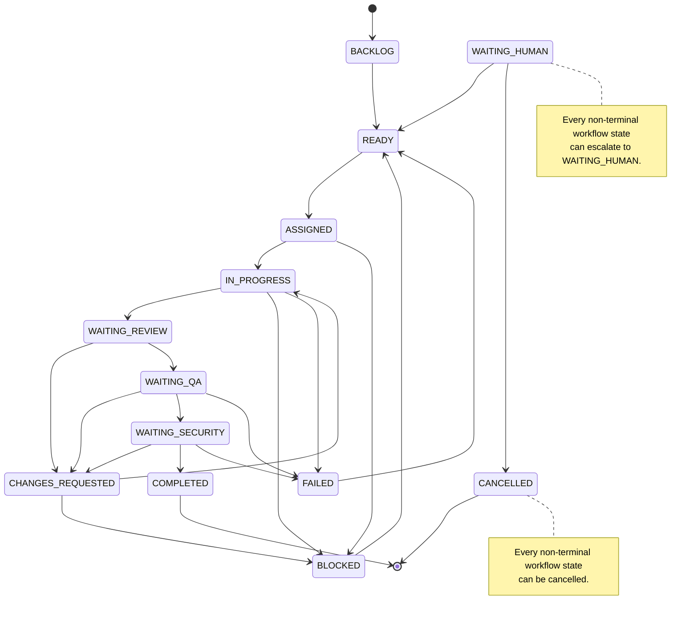

# Task State Machine

Phase 3 requires every persisted task-status change to pass through `TaskStateMachine`. The state
machine validates the directed edge, requires a traceable actor and reason, changes the task, and
stages one append-only audit event in the same transaction. It never commits the transaction.

## State Diagram



Every non-terminal state other than `WAITING_HUMAN` also permits transitions to
`WAITING_HUMAN` and `CANCELLED`. `WAITING_HUMAN` resumes through `READY`, never directly through a
later delivery gate. `COMPLETED` and `CANCELLED` are terminal.

## Transition Table

| Current state | Allowed target states |
| --- | --- |
| `BACKLOG` | `READY`, `WAITING_HUMAN`, `CANCELLED` |
| `READY` | `ASSIGNED`, `WAITING_HUMAN`, `CANCELLED` |
| `ASSIGNED` | `IN_PROGRESS`, `BLOCKED`, `WAITING_HUMAN`, `CANCELLED` |
| `IN_PROGRESS` | `WAITING_REVIEW`, `BLOCKED`, `FAILED`, `WAITING_HUMAN`, `CANCELLED` |
| `WAITING_REVIEW` | `CHANGES_REQUESTED`, `WAITING_QA`, `WAITING_HUMAN`, `CANCELLED` |
| `CHANGES_REQUESTED` | `IN_PROGRESS`, `BLOCKED`, `WAITING_HUMAN`, `CANCELLED` |
| `WAITING_QA` | `CHANGES_REQUESTED`, `WAITING_SECURITY`, `FAILED`, `WAITING_HUMAN`, `CANCELLED` |
| `WAITING_SECURITY` | `CHANGES_REQUESTED`, `COMPLETED`, `FAILED`, `WAITING_HUMAN`, `CANCELLED` |
| `BLOCKED` | `READY`, `WAITING_HUMAN`, `CANCELLED` |
| `WAITING_HUMAN` | `READY`, `CANCELLED` |
| `FAILED` | `READY`, `WAITING_HUMAN`, `CANCELLED` |
| `COMPLETED` | None (terminal) |
| `CANCELLED` | None (terminal) |

## Usage

```python
machine = TaskStateMachine(session)
event = machine.transition(
    task,
    TaskStatus.READY,
    actor_type=AuditActorType.HUMAN,
    actor_id="project-owner-1",
    reason="Requirements and acceptance criteria are complete",
    metadata={"review": "intake"},
)
session.commit()
```

The caller owns commit and rollback. If the transaction rolls back, both the status change and
audit event roll back.

## Audit Event

Accepted transitions stage an `AuditEvent` with:

- `event_type`: `TASK_STATUS_CHANGED`
- `action`: `transition_task_status`
- `result`: `SUCCEEDED`
- project and task identifiers
- actor type and identifier
- `from_status`, `to_status`, required `reason`, and copied `metadata` in `data`

Invalid transitions do not produce audit events because no change occurred.

## Enforcement Boundary

The global SQLAlchemy flush guard rejects direct changes to the status of a persisted `Task`.
Changing other task fields remains allowed. New tasks may receive their initial `BACKLOG` status.

This guarantee exists at the application layer. Direct SQL and privileged database clients can
bypass it. Database triggers and dedicated PostgreSQL permissions are deferred to a later phase.
